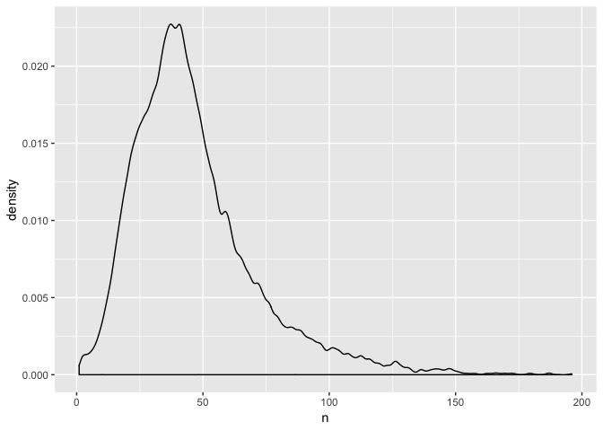
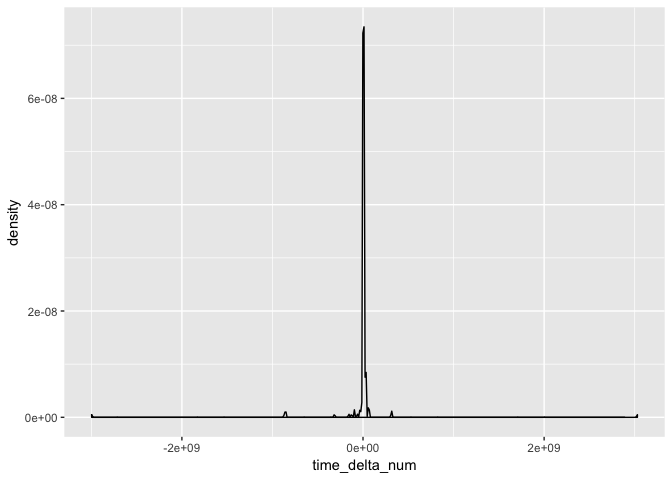

Medications
================
Laura Cosgrove
11/15/2018

``` r
knitr::opts_chunk$set(echo = TRUE)
library(tidyverse)
```

    ## ── Attaching packages ────────────────────────────────────────────────────────────────────── tidyverse 1.2.1 ──

    ## ✔ ggplot2 3.1.0           ✔ purrr   0.2.5      
    ## ✔ tibble  1.4.2           ✔ dplyr   0.7.99.9000
    ## ✔ tidyr   0.8.2           ✔ stringr 1.3.1      
    ## ✔ readr   1.1.1           ✔ forcats 0.3.0

    ## ── Conflicts ───────────────────────────────────────────────────────────────────────── tidyverse_conflicts() ──
    ## ✖ dplyr::filter() masks stats::filter()
    ## ✖ dplyr::lag()    masks stats::lag()

``` r
devtools::install_github("tidyverse/dplyr")
```

    ## Skipping install of 'dplyr' from a github remote, the SHA1 (e177d27d) has not changed since last install.
    ##   Use `force = TRUE` to force installation

``` r
library(dplyr)
library(readr)
library(lubridate)
```

    ## 
    ## Attaching package: 'lubridate'

    ## The following object is masked from 'package:base':
    ## 
    ##     date

``` r
library(scales)
```

    ## 
    ## Attaching package: 'scales'

    ## The following object is masked from 'package:purrr':
    ## 
    ##     discard

    ## The following object is masked from 'package:readr':
    ## 
    ##     col_factor

\`\`\`

MIMIC prescriptions description
-------------------------------

``` r
prescriptions_data <- read_csv("./database/data/PRESCRIPTIONS.csv.gz")
```

    ## Parsed with column specification:
    ## cols(
    ##   ROW_ID = col_integer(),
    ##   SUBJECT_ID = col_integer(),
    ##   HADM_ID = col_integer(),
    ##   ICUSTAY_ID = col_integer(),
    ##   STARTDATE = col_datetime(format = ""),
    ##   ENDDATE = col_datetime(format = ""),
    ##   DRUG_TYPE = col_character(),
    ##   DRUG = col_character(),
    ##   DRUG_NAME_POE = col_character(),
    ##   DRUG_NAME_GENERIC = col_character(),
    ##   FORMULARY_DRUG_CD = col_character(),
    ##   GSN = col_character(),
    ##   NDC = col_character(),
    ##   PROD_STRENGTH = col_character(),
    ##   DOSE_VAL_RX = col_character(),
    ##   DOSE_UNIT_RX = col_character(),
    ##   FORM_VAL_DISP = col_character(),
    ##   FORM_UNIT_DISP = col_character(),
    ##   ROUTE = col_character()
    ## )

``` r
prescriptions_data = prescriptions_data %>% 
  janitor::clean_names() %>% 
  mutate(drug_type = factor(drug_type), dose_val_rx = as.integer(dose_val_rx),
          time_delta = as.duration(startdate %--% enddate),
          time_delta_num = as.numeric(time_delta))
```

    ## Warning: NAs introduced by coercion

What is the distribution of medications prescribed per person?

``` r
#Plot distribution of total medications prescribed per person
prescriptions_data %>% 
  group_by(subject_id) %>% 
  add_tally() %>% 
  select(n, subject_id) %>% 
  distinct(subject_id, .keep_all = TRUE) %>% 
  ggplot(aes(x = n)) +
  geom_density()
```


``` r
#Plot distribution of distinct medications prescribed per person (with drug type not equal to an additive)

prescriptions_data %>%
  filter(drug_type == "MAIN") %>% 
  group_by(subject_id) %>% 
  distinct(subject_id, drug, .keep_all = TRUE) %>% 
  add_tally() %>% 
  ggplot(aes(x = n)) +
  geom_density()
```



``` r
#What's the most commonly-administered drug per person?
prescriptions_data %>%
  filter(drug_type == "MAIN") %>% 
  group_by(drug) %>% 
  add_tally() %>% 
  distinct(drug, .keep_all = TRUE) %>% 
  select(n, drug, drug_type, formulary_drug_cd) %>% 
  arrange(desc(n)) %>% 
  head(n = 20L) %>% 
  knitr::kable()
```

|       n| drug                       | drug\_type | formulary\_drug\_cd |
|-------:|:---------------------------|:-----------|:--------------------|
|  187859| Potassium Chloride         | MAIN       | MICROK10            |
|  143468| Insulin                    | MAIN       | INSULIN             |
|  133122| Furosemide                 | MAIN       | FURO20              |
|   90370| Magnesium Sulfate          | MAIN       | MAGS1I              |
|   83392| Sodium Chloride 0.9% Flush | MAIN       | NACLFLUSH           |
|   78771| Acetaminophen              | MAIN       | ACET650R            |
|   73990| Metoprolol                 | MAIN       | METO50              |
|   62159| Morphine Sulfate           | MAIN       | MORP2I              |
|   59824| Metoprolol Tartrate        | MAIN       | METO25              |
|   55352| Lorazepam                  | MAIN       | LORA2I              |
|   52072| Heparin                    | MAIN       | HEPA5I              |
|   51365| Calcium Gluconate          | MAIN       | CALG1I              |
|   45694| Docusate Sodium            | MAIN       | DOCU100             |
|   42636| Vancomycin                 | MAIN       | VANC1F              |
|   41075| Bisacodyl                  | MAIN       | BISA10R             |
|   39678| Warfarin                   | MAIN       | WARF5               |
|   37673| HYDROmorphone (Dilaudid)   | MAIN       | HYDR2I              |
|   37658| Heparin Sodium             | MAIN       | HEPAPREMIX          |
|   34462| Propofol                   | MAIN       | PROP100IG           |
|   33587| Pantoprazole               | MAIN       | PANT40              |

``` r
#Are some drugs prescribed for longer periods of time compared to others?


#Plot distribution of prescription length
prescriptions_data %>% 
  distinct(time_delta_num) %>% 
  ggplot(aes(x = time_delta_num)) +
  geom_density()
```

    ## Warning: Removed 1 rows containing non-finite values (stat_density).



``` r
prescriptions_data %>% 
  arrange(time_delta) %>% 
  select(time_delta) 
```

    ## # A tibble: 4,156,450 x 1
    ##    time_delta                
    ##    <S4: Duration>            
    ##  1 2996524800s (~94.95 years)
    ##  2 2996524800s (~94.95 years)
    ##  3 867456000s (~27.49 years) 
    ##  4 867456000s (~27.49 years) 
    ##  5 856656000s (~27.15 years) 
    ##  6 856656000s (~27.15 years) 
    ##  7 853286400s (~27.04 years) 
    ##  8 853286400s (~27.04 years) 
    ##  9 315705600s (~10 years)    
    ## 10 157766400s (~5 years)     
    ## # ... with 4,156,440 more rows

``` r
prescriptions_data %>% 
  arrange(desc(time_delta)) %>% 
  select(time_delta) 
```

    ## # A tibble: 4,156,450 x 1
    ##    time_delta                
    ##    <S4: Duration>            
    ##  1 3029961600s (~96.01 years)
    ##  2 315705600s (~10 years)    
    ##  3 315705600s (~10 years)    
    ##  4 315532800s (~10 years)    
    ##  5 63417600s (~2.01 years)   
    ##  6 63331200s (~2.01 years)   
    ##  7 63331200s (~2.01 years)   
    ##  8 63331200s (~2.01 years)   
    ##  9 63331200s (~2.01 years)   
    ## 10 63158400s (~2 years)      
    ## # ... with 4,156,440 more rows

Since the data was collected only over ~11 years, we can safely eliminate some of the largest durations..

I'm having trouble right now because dplyr filter has some known issues with period and interval objects from lubridate. <https://community.rstudio.com/t/dplyr-filter-issue-with-intervals-from-lubridate/9456/2>. Hence all this weird code.

This is broken, will take another approach soon.. Scratch that, it magically worked.

``` r
prescriptions_data_time = prescriptions_data %>% 
  mutate(time_period = as.period(startdate %--% enddate),
        year_delta = year(time_period),
        year_delta_num = as.integer(year_delta)) %>% 
  filter(year_delta_num < 10 & year_delta_num > -10) %>% 
  select(time_delta, year_delta, startdate, enddate, drug, drug_type, formulary_drug_cd, subject_id)

#Look at if type of drugs are more commonly prescribed for larger amounts of time
#maybe a heatmap with drugs on an axis and time_delta on another axis, with instances prescribed as fill


#Look at if duration drug is prescribed changes over time

#prescriptions_data_time %>% 
# mutate(startdate = as.Date(startdate, "%m-%d-%y")) %>% 
# ggplot(aes(x = startdate, y = as.numeric(time_delta))) +
#    geom_point() +
#    scale_x_date(labels = date_format("%b/%y")) 
```

``` r
#output_data <- read_csv("./database/data/OUTPUTEVENTS.csv.gz")
#caregivers_data = read_csv("./database/data/CAREGIVERS.csv.gz")
#cpt_events_data = read_csv("./database/data/CPTEVENTS.csv.gz")
#services_data = read_csv("./database/data/CPTEVENTS.csv.gz")
#transfers_data = read_csv("./database/data/TRANSFERS.csv.gz")
```
