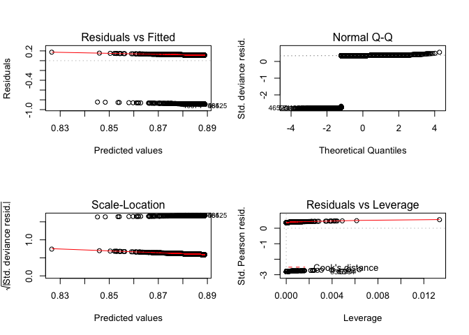

data\_wrangling
================
Francis
11/10/2018

After consideration, the `admissions.csv` database seems really interesting. It is useful to analyze the connection between mutiple factors and death.

``` r
library(tidyverse)
```

    ## ── Attaching packages ─────────────────────────────────────────────────────────────────────── tidyverse 1.2.1 ──

    ## ✔ ggplot2 3.1.0     ✔ purrr   0.2.5
    ## ✔ tibble  1.4.2     ✔ dplyr   0.7.8
    ## ✔ tidyr   0.8.2     ✔ stringr 1.3.1
    ## ✔ readr   1.2.1     ✔ forcats 0.3.0

    ## ── Conflicts ────────────────────────────────────────────────────────────────────────── tidyverse_conflicts() ──
    ## ✖ dplyr::filter() masks stats::filter()
    ## ✖ dplyr::lag()    masks stats::lag()

``` r
library(devtools)
library(readr)
library(lubridate)
```

    ## 
    ## Attaching package: 'lubridate'

    ## The following object is masked from 'package:base':
    ## 
    ##     date

``` r
library(broom)
```

MIMIC3
======

### Import data

``` r
admissions <- 
  read_csv("./database/data/admissions.csv") %>% 
  janitor::clean_names()
```

    ## Parsed with column specification:
    ## cols(
    ##   ROW_ID = col_double(),
    ##   SUBJECT_ID = col_double(),
    ##   HADM_ID = col_double(),
    ##   ADMITTIME = col_datetime(format = ""),
    ##   DISCHTIME = col_datetime(format = ""),
    ##   DEATHTIME = col_datetime(format = ""),
    ##   ADMISSION_TYPE = col_character(),
    ##   ADMISSION_LOCATION = col_character(),
    ##   DISCHARGE_LOCATION = col_character(),
    ##   INSURANCE = col_character(),
    ##   LANGUAGE = col_character(),
    ##   RELIGION = col_character(),
    ##   MARITAL_STATUS = col_character(),
    ##   ETHNICITY = col_character(),
    ##   EDREGTIME = col_datetime(format = ""),
    ##   EDOUTTIME = col_datetime(format = ""),
    ##   DIAGNOSIS = col_character(),
    ##   HOSPITAL_EXPIRE_FLAG = col_double(),
    ##   HAS_CHARTEVENTS_DATA = col_double()
    ## )

``` r
names(admissions)
```

    ##  [1] "row_id"               "subject_id"           "hadm_id"             
    ##  [4] "admittime"            "dischtime"            "deathtime"           
    ##  [7] "admission_type"       "admission_location"   "discharge_location"  
    ## [10] "insurance"            "language"             "religion"            
    ## [13] "marital_status"       "ethnicity"            "edregtime"           
    ## [16] "edouttime"            "diagnosis"            "hospital_expire_flag"
    ## [19] "has_chartevents_data"

``` r
# The year should be delt with to become normal. The discharge time means the time when the patient leave the hospital.


# see types
class(admissions$admittime)
```

    ## [1] "POSIXct" "POSIXt"

``` r
class(admissions$dischtime)
```

    ## [1] "POSIXct" "POSIXt"

``` r
class(admissions$deathtime)
```

    ## [1] "POSIXct" "POSIXt"

``` r
class(admissions$admission_type) 
```

    ## [1] "character"

``` r
class(admissions$insurance)
```

    ## [1] "character"

``` r
class(admissions$religion)
```

    ## [1] "character"

``` r
class(admissions$ethnicity)
```

    ## [1] "character"

``` r
class(admissions$edregtime)
```

    ## [1] "POSIXct" "POSIXt"

``` r
class(admissions$edouttime)
```

    ## [1] "POSIXct" "POSIXt"

All of them are factors.

### Tidy data

``` r
#Create year, month, day variables
admissions <- 
  admissions %>% 
  separate(admittime, into = c("admittime_year", "admittime_month", "admittime_day"), sep = "-")
admissions <- 
  admissions %>% 
  separate(dischtime, into = c("dischtime_year", "dischtime_month", "dischtime_day"), sep = "-") %>% 
  separate(dischtime_day, into = c("dischtime_day", "dischtime_time"), sep = " ")
admissions <- 
  admissions %>% 
  separate(deathtime, into = c("deathtime_year", "deathtime_month", "deathtime_day"), sep = "-") %>% 
  separate(deathtime_day, into = c("deathtime_day", "deathtime_time"), sep = " ")
admissions <- 
  admissions %>% 
  separate(edregtime, into = c("edregtime_year", "edregtime_month", "edregtime_day"), sep = "-") %>% 
  separate(edregtime_day, into = c("edregtime_day", "edregtime_time"), sep = " ")
admissions <- 
  admissions %>% 
  separate(edouttime, into = c("edouttime_year", "edouttime_month", "edouttime_day"), sep = "-") %>% 
  separate(edouttime_day, into = c("edouttime_day", "edouttime_time"), sep = " ")

# Correct year to normal
admissions <- 
  admissions %>% 
  mutate(admittime_year = as.numeric(admittime_year) - 200, dischtime_year = as.numeric(dischtime_year) - 200, deathtime_year = as.numeric(deathtime_year) - 200, edregtime_year = as.numeric(edregtime_year) - 200, edouttime_year = as.numeric(edouttime_year) - 200)
# Take a look
head(admissions)
```

    ## # A tibble: 6 x 33
    ##   row_id subject_id hadm_id admittime_year admittime_month admittime_day
    ##    <dbl>      <dbl>   <dbl>          <dbl> <chr>           <chr>        
    ## 1     21         22  165315           1996 04              09 12:26:00  
    ## 2     22         23  152223           1953 09              03 07:15:00  
    ## 3     23         23  124321           1957 10              18 19:34:00  
    ## 4     24         24  161859           1939 06              06 16:14:00  
    ## 5     25         25  129635           1960 11              02 02:06:00  
    ## 6     26         26  197661           1926 05              06 15:16:00  
    ## # ... with 27 more variables: dischtime_year <dbl>, dischtime_month <chr>,
    ## #   dischtime_day <chr>, dischtime_time <chr>, deathtime_year <dbl>,
    ## #   deathtime_month <chr>, deathtime_day <chr>, deathtime_time <chr>,
    ## #   admission_type <chr>, admission_location <chr>,
    ## #   discharge_location <chr>, insurance <chr>, language <chr>,
    ## #   religion <chr>, marital_status <chr>, ethnicity <chr>,
    ## #   edregtime_year <dbl>, edregtime_month <chr>, edregtime_day <chr>,
    ## #   edregtime_time <chr>, edouttime_year <dbl>, edouttime_month <chr>,
    ## #   edouttime_day <chr>, edouttime_time <chr>, diagnosis <chr>,
    ## #   hospital_expire_flag <dbl>, has_chartevents_data <dbl>

### linear regression

``` r
# read original data
admissions_origin <- 
  read_csv("./database/data/admissions.csv") %>% 
  janitor::clean_names()
```

    ## Parsed with column specification:
    ## cols(
    ##   ROW_ID = col_double(),
    ##   SUBJECT_ID = col_double(),
    ##   HADM_ID = col_double(),
    ##   ADMITTIME = col_datetime(format = ""),
    ##   DISCHTIME = col_datetime(format = ""),
    ##   DEATHTIME = col_datetime(format = ""),
    ##   ADMISSION_TYPE = col_character(),
    ##   ADMISSION_LOCATION = col_character(),
    ##   DISCHARGE_LOCATION = col_character(),
    ##   INSURANCE = col_character(),
    ##   LANGUAGE = col_character(),
    ##   RELIGION = col_character(),
    ##   MARITAL_STATUS = col_character(),
    ##   ETHNICITY = col_character(),
    ##   EDREGTIME = col_datetime(format = ""),
    ##   EDOUTTIME = col_datetime(format = ""),
    ##   DIAGNOSIS = col_character(),
    ##   HOSPITAL_EXPIRE_FLAG = col_double(),
    ##   HAS_CHARTEVENTS_DATA = col_double()
    ## )

``` r
# add a death factor and duration factor
# exclude NEWBORN, because they are not treated as patients.
### There are too many diagnosis, so the diagnosis will be analyzed by some analysis of scores in another part.
admissions_death <- 
  mutate(admissions_origin, living = is.na(admissions_origin$deathtime), hospitaltime =  admissions_origin$dischtime - admissions_origin$admittime, edtime = admissions_origin$edouttime - admissions_origin$edregtime) %>% 
  filter(diagnosis != "NEWBORN")
```

``` r
# glance data
skimr::skim(admissions_death)
```

    ## Skim summary statistics
    ##  n obs: 51128 
    ##  n variables: 22 
    ## 
    ## ── Variable type:character ─────────────────────────────────────────────────────────────────────────────────────
    ##            variable missing complete     n min max empty n_unique
    ##  admission_location       0    51128 51128  17  25     0        9
    ##      admission_type       0    51128 51128   6   9     0        4
    ##           diagnosis       0    51128 51128   2 190     0    15645
    ##  discharge_location       0    51128 51128   3  25     0       17
    ##           ethnicity       0    51128 51128   5  56     0       41
    ##           insurance       0    51128 51128   7  10     0        5
    ##            language   17786    33342 51128   4   4     0       75
    ##      marital_status    2605    48523 51128   6  17     0        7
    ##            religion     451    50677 51128   5  22     0       20
    ## 
    ## ── Variable type:difftime ──────────────────────────────────────────────────────────────────────────────────────
    ##      variable missing complete     n           min         max
    ##        edtime   20252    30876 51128 -2504940 secs 253680 secs
    ##  hospitaltime       0    51128 51128    -1361 mins 424311 mins
    ##             median n_unique
    ##  17700 secs            1483
    ##        9891.5 mins    24462
    ## 
    ## ── Variable type:logical ───────────────────────────────────────────────────────────────────────────────────────
    ##  variable missing complete     n mean                        count
    ##    living       0    51128 51128 0.89 TRU: 45337, FAL: 5791, NA: 0
    ## 
    ## ── Variable type:numeric ───────────────────────────────────────────────────────────────────────────────────────
    ##              variable missing complete     n      mean       sd    p0
    ##               hadm_id       0    51128 51128 149980.03 28920.51 1e+05
    ##  has_chartevents_data       0    51128 51128      0.97     0.17     0
    ##  hospital_expire_flag       0    51128 51128      0.11     0.32     0
    ##                row_id       0    51128 51128  31075    17208.1      2
    ##            subject_id       0    51128 51128  36524.63 28971.81     3
    ##        p25      p50       p75  p100     hist
    ##  124877.75 150082.5 175035.25 2e+05 ▇▇▇▇▇▇▇▇
    ##       1         1        1        1 ▁▁▁▁▁▁▁▇
    ##       0         0        0        1 ▇▁▁▁▁▁▁▁
    ##   16097.75  32292.5  46189.25 58976 ▆▆▆▆▇▇▇▇
    ##   13116.75  26395    59788.25 99999 ▇▇▅▂▃▂▂▂
    ## 
    ## ── Variable type:POSIXct ───────────────────────────────────────────────────────────────────────────────────────
    ##   variable missing complete     n        min        max     median
    ##  admittime       0    51128 51128 2100-06-07 2210-08-17 2151-02-24
    ##  deathtime   45337     5791 51128 2100-06-19 2208-02-05 2150-08-29
    ##  dischtime       0    51128 51128 2100-06-09 2210-08-24 2151-03-06
    ##  edouttime   20252    30876 51128 2100-06-08 2210-08-17 2150-12-12
    ##  edregtime   20252    30876 51128 2100-06-07 2210-08-17 2150-12-12
    ##  n_unique
    ##     50813
    ##      5772
    ##     50877
    ##     30863
    ##     30873

``` r
### try logistic regression step by step.

#SLR

par(mfrow = c(2,2))
living_lm1 <- 
  glm(living ~ admission_type, data = admissions_death) %>% 
  plot()
```


``` r
summary(living_lm1)
```

    ## Length  Class   Mode 
    ##      0   NULL   NULL

``` r
broom::glance(living_lm1)
```

    ## # A tibble: 0 x 0

``` r
broom::tidy(living_lm1)
```

    ## # A tibble: 0 x 0

``` r
living_lm2 <- 
  glm(living ~ admission_location, data = admissions_death) %>% 
  plot()
```

    ## Warning in sqrt(crit * p * (1 - hh)/hh): NaNs produced

    ## Warning in sqrt(crit * p * (1 - hh)/hh): NaNs produced


``` r
summary(living_lm1)
```

    ## Length  Class   Mode 
    ##      0   NULL   NULL

``` r
broom::glance(living_lm2)
```

    ## # A tibble: 0 x 0

``` r
broom::tidy(living_lm2)
```

    ## # A tibble: 0 x 0

``` r
living_lm3 <- 
  glm(living ~ insurance, data = admissions_death) %>% 
  plot()
```


``` r
summary(living_lm3)
```

    ## Length  Class   Mode 
    ##      0   NULL   NULL

``` r
broom::glance(living_lm3)
```

    ## # A tibble: 0 x 0

``` r
broom::tidy(living_lm3)
```

    ## # A tibble: 0 x 0

``` r
living_lm4 <- 
  glm(living ~ language, data = na.omit(select(admissions_death, living, language))) %>% 
  plot()
```

    ## Warning: not plotting observations with leverage one:
    ##   266, 776, 2885, 4400, 4417, 7656, 19568, 20593, 25126

    ## Warning: not plotting observations with leverage one:
    ##   266, 776, 2885, 4400, 4417, 7656, 19568, 20593, 25126

    ## Warning in sqrt(crit * p * (1 - hh)/hh): NaNs produced

    ## Warning in sqrt(crit * p * (1 - hh)/hh): NaNs produced


``` r
summary(living_lm4)
```

    ## Length  Class   Mode 
    ##      0   NULL   NULL

``` r
broom::glance(living_lm4)
```

    ## # A tibble: 0 x 0

``` r
broom::tidy(living_lm4)
```

    ## # A tibble: 0 x 0

``` r
living_lm5 <- 
  glm(living ~ religion, data = admissions_death) %>% 
  plot()
```

    ## Warning: not plotting observations with leverage one:
    ##   16992

    ## Warning: not plotting observations with leverage one:
    ##   16992


``` r
summary(living_lm5)
```

    ## Length  Class   Mode 
    ##      0   NULL   NULL

``` r
broom::glance(living_lm5)
```

    ## # A tibble: 0 x 0

``` r
broom::tidy(living_lm5)
```

    ## # A tibble: 0 x 0

``` r
living_lm6 <- 
  glm(living ~ marital_status, data = admissions_death) %>% 
  plot()
```


``` r
summary(living_lm6)
```

    ## Length  Class   Mode 
    ##      0   NULL   NULL

``` r
broom::glance(living_lm6)
```

    ## # A tibble: 0 x 0

``` r
broom::tidy(living_lm6)
```

    ## # A tibble: 0 x 0

``` r
living_lm7 <- 
  glm(living ~ ethnicity, data = admissions_death) %>% 
  plot()
```


``` r
summary(living_lm7)
```

    ## Length  Class   Mode 
    ##      0   NULL   NULL

``` r
broom::glance(living_lm7)
```

    ## # A tibble: 0 x 0

``` r
broom::tidy(living_lm7)
```

    ## # A tibble: 0 x 0

``` r
#living_lm8 <-   Too many diagnosis 
#  glm(living ~ diagnosis, data = admissions_death)
#summary(living_lm8)

living_lm9 <- 
  glm(living ~ hospital_expire_flag, data = admissions_death) %>% 
  plot()
```


``` r
summary(living_lm9)
```

    ## Length  Class   Mode 
    ##      0   NULL   NULL

``` r
broom::glance(living_lm9)
```

    ## # A tibble: 0 x 0

``` r
broom::tidy(living_lm9)
```

    ## # A tibble: 0 x 0

``` r
living_lm10 <- 
  glm(living ~ has_chartevents_data, data = admissions_death) %>% 
  plot()
```


``` r
summary(living_lm10)
```

    ## Length  Class   Mode 
    ##      0   NULL   NULL

``` r
broom::glance(living_lm10)
```

    ## # A tibble: 0 x 0

``` r
broom::tidy(living_lm10)
```

    ## # A tibble: 0 x 0

``` r
living_lm11 <- 
  glm(living ~ hospitaltime, data = admissions_death) %>% 
  plot()
```



``` r
summary(living_lm11)
```

    ## Length  Class   Mode 
    ##      0   NULL   NULL

``` r
broom::glance(living_lm11)
```

    ## # A tibble: 0 x 0

``` r
broom::tidy(living_lm11)
```

    ## # A tibble: 0 x 0

``` r
living_lm12 <- 
  glm(living ~ edtime, data = na.omit(select(admissions_death, living, edtime))) %>% 
  plot()
```


``` r
summary(living_lm12)
```

    ## Length  Class   Mode 
    ##      0   NULL   NULL

``` r
broom::glance(living_lm12)
```

    ## # A tibble: 0 x 0

``` r
broom::tidy(living_lm12)
```

    ## # A tibble: 0 x 0

``` r
#MLR
living_mlr <- 
  glm(living ~ admission_type + admission_location + insurance + language + religion + marital_status + ethnicity + hospital_expire_flag + has_chartevents_data + hospitaltime + edtime, data = admissions_death)
broom::glance(living_mlr)


# Do more regression analysis

coefficients(living_mlr)
confint(living_mlr)
fitted(living_mlr)
residuals(living_mlr)
anova(living_mlr)
vcov(living_mlr)


###backward elimination
#Backward elimination: take out non-significant variables ’one at a time’ starting with the highest p-value
step1 <- update(living_mlr, . ~. -admission_type)
broom::glance(step1)
# remove

step2 <- update(living_mlr, . ~. -admission_type-admission_location)
broom::glance(step2)
#keep

step3 <- update(living_mlr, . ~. -admission_type-insurance)
broom::glance(step3)
#keep

step4 <- update(living_mlr, . ~. -admission_type-language)
broom::glance(step4)
#remove

step5 <- update(living_mlr, . ~. -admission_type-language-religion)
broom::glance(step5)
#keep

step6 <- update(living_mlr, . ~. -admission_type-language-marital_status)
broom::glance(step6)
#keep

step7 <- update(living_mlr, . ~. -admission_type-language-ethnicity)
broom::glance(step7)
#keep

step8 <- update(living_mlr, . ~. -admission_type-language-hospital_expire_flag)
broom::glance(step8)
#keep

step9 <- update(living_mlr, . ~. -admission_type-language-has_chartevents_data)
broom::glance(step9)
#keep

step10 <- update(living_mlr, . ~.  -admission_type-language-hospitaltime)
broom::glance(step10)
#keep

step11 <- update(living_mlr, . ~. -admission_type-language-edtime)
broom::glance(step11)
#keep
```

### So we got this regression model:

$\\hat{Living}$ = $\\hat{\\beta\_0}$ + $\\hat{\\beta\_1}$ Admission.Location + $\\hat{\\beta\_2}$ Insurance + $\\hat{\\beta\_3}$ Insurance + $\\hat{\\beta\_4}$ Religion + $\\hat{\\beta\_5}$ Marital.Status + $\\hat{\\beta\_6}$ Ethnicity + $\\hat{\\beta\_7}$ Hospital.Expire.Flag + $\\hat{\\beta\_8}$ Has.ChartEvents.Data + $\\hat{\\beta\_9}$ Hospital.Time + $\\hat{\\beta\_10}$ Edtime

Maybe we need this step:

``` r
# Remove NA lines
#admissions_death_nona <- 
#  admissions_death %>% 
#  select(admission_type, admission_location, insurance, religion, marital_status, ethnicity, hospitaltime, edtime) %>% 
#  na.omit() 

#MLR with no NAs
#living_mlr_nona <- 
#  glm(living ~ admission_type + admission_location + insurance + language + religion + marital_status + ethnicity + hospital_expire_flag + has_chartevents_data + hospitaltime + edtime, data = admissions_death_nona)
#summary(living_mlr_nona)
#broom::glance(living_mlr_nona)
#broom::tidy(living_mlr_nona)
```

OpenFDA
=======

### Import OpenFDA

``` r
# Already installed openfda data
# Load OpenFDA
library(openfda)


library(jsonlite)
```

    ## 
    ## Attaching package: 'jsonlite'

    ## The following object is masked from 'package:purrr':
    ## 
    ##     flatten

``` r
fda <- 
  fromJSON("https://api.fda.gov/drug/event.json") %>% 
  janitor::clean_names()

names(fda$results)
```

    ##  [1] "receiptdateformat"          "receiver"                  
    ##  [3] "companynumb"                "receivedateformat"         
    ##  [5] "primarysource"              "seriousnessother"          
    ##  [7] "transmissiondateformat"     "fulfillexpeditecriteria"   
    ##  [9] "safetyreportid"             "sender"                    
    ## [11] "receivedate"                "patient"                   
    ## [13] "seriousnesshospitalization" "transmissiondate"          
    ## [15] "serious"                    "receiptdate"

There are 16 observations in the `event` dataset under `drug`, they are: receiptdateformat, receiver, companynumb, receivedateformat, primarysource, seriousnessother, transmissiondateformat, fulfillexpeditecriteria, safetyreportid, sender, receivedate, patient, seriousnesshospitalization, transmissiondate, serious, receiptdate.

### Visulization

Let's take a look at the combination of MIMIC data and ICU together(for we want to know the ICU time since it is more critical for mortality)

``` r
icu <- 
  read_csv("./database/data/icu_detail.csv") %>% 
  janitor::clean_names()
```

    ## Parsed with column specification:
    ## cols(
    ##   subject_id = col_double(),
    ##   hadm_id = col_double(),
    ##   icustay_id = col_double(),
    ##   gender = col_character(),
    ##   dod = col_datetime(format = ""),
    ##   admittime = col_datetime(format = ""),
    ##   dischtime = col_datetime(format = ""),
    ##   los_hospital = col_double(),
    ##   admission_age = col_double(),
    ##   ethnicity = col_character(),
    ##   admission_type = col_character(),
    ##   hospital_expire_flag = col_double(),
    ##   hospstay_seq = col_double(),
    ##   first_hosp_stay = col_logical(),
    ##   intime = col_datetime(format = ""),
    ##   outtime = col_datetime(format = ""),
    ##   los_icu = col_double(),
    ##   icustay_seq = col_double(),
    ##   first_icu_stay = col_logical()
    ## )

``` r
# See what is the types of columns in icu dataset
output = vector("list", length = 19)

for (i in 1:19) {
  output[[i]] = class(icu[[i]])
}
```

Let's combine these two dataset so we can visualize it correctly

``` r
total_patient <-
  merge(admissions_death, icu, by="hadm_id") %>% 
  as.tibble()

#mutate icu time
total_patient <- 
  mutate(total_patient, icutime = outtime - intime)

skimr::skim(total_patient) %>% 
  knitr::kable()
```

| variable                 | type      | stat      | level |          value| formatted     |
|:-------------------------|:----------|:----------|:------|--------------:|:--------------|
| hadm\_id                 | numeric   | missing   | .all  |   0.000000e+00| 0             |
| hadm\_id                 | numeric   | complete  | .all  |   5.321900e+04| 53219         |
| hadm\_id                 | numeric   | n         | .all  |   5.321900e+04| 53219         |
| hadm\_id                 | numeric   | mean      | .all  |   1.499624e+05| 149962.39     |
| hadm\_id                 | numeric   | sd        | .all  |   2.893430e+04| 28934.3       |
| hadm\_id                 | numeric   | p0        | .all  |   1.000010e+05| 1e+05         |
| hadm\_id                 | numeric   | p25       | .all  |   1.248880e+05| 124888        |
| hadm\_id                 | numeric   | p50       | .all  |   1.499790e+05| 149979        |
| hadm\_id                 | numeric   | p75       | .all  |   1.750600e+05| 175060        |
| hadm\_id                 | numeric   | p100      | .all  |   1.999990e+05| 2e+05         |
| hadm\_id                 | numeric   | hist      | .all  |             NA| ▇▇▇▇▇▇▇▇      |
| row\_id                  | numeric   | missing   | .all  |   0.000000e+00| 0             |
| row\_id                  | numeric   | complete  | .all  |   5.321900e+04| 53219         |
| row\_id                  | numeric   | n         | .all  |   5.321900e+04| 53219         |
| row\_id                  | numeric   | mean      | .all  |   3.115956e+04| 31159.56      |
| row\_id                  | numeric   | sd        | .all  |   1.720859e+04| 17208.59      |
| row\_id                  | numeric   | p0        | .all  |   2.000000e+00| 2             |
| row\_id                  | numeric   | p25       | .all  |   1.622450e+04| 16224.5       |
| row\_id                  | numeric   | p50       | .all  |   3.251400e+04| 32514         |
| row\_id                  | numeric   | p75       | .all  |   4.624850e+04| 46248.5       |
| row\_id                  | numeric   | p100      | .all  |   5.897600e+04| 58976         |
| row\_id                  | numeric   | hist      | .all  |             NA| ▆▆▆▆▇▇▇▇      |
| subject\_id.x            | numeric   | missing   | .all  |   0.000000e+00| 0             |
| subject\_id.x            | numeric   | complete  | .all  |   5.321900e+04| 53219         |
| subject\_id.x            | numeric   | n         | .all  |   5.321900e+04| 53219         |
| subject\_id.x            | numeric   | mean      | .all  |   3.665625e+04| 36656.25      |
| subject\_id.x            | numeric   | sd        | .all  |   2.898717e+04| 28987.17      |
| subject\_id.x            | numeric   | p0        | .all  |   3.000000e+00| 3             |
| subject\_id.x            | numeric   | p25       | .all  |   1.322750e+04| 13227.5       |
| subject\_id.x            | numeric   | p50       | .all  |   2.658200e+04| 26582         |
| subject\_id.x            | numeric   | p75       | .all  |   5.988950e+04| 59889.5       |
| subject\_id.x            | numeric   | p100      | .all  |   9.999900e+04| 99999         |
| subject\_id.x            | numeric   | hist      | .all  |             NA| ▇▇▅▂▃▂▂▃      |
| admittime.x              | POSIXct   | missing   | .all  |   0.000000e+00| 0             |
| admittime.x              | POSIXct   | complete  | .all  |   5.321900e+04| 53219         |
| admittime.x              | POSIXct   | n         | .all  |   5.321900e+04| 53219         |
| admittime.x              | POSIXct   | min       | .all  |   4.116082e+09| 2100-06-07    |
| admittime.x              | POSIXct   | max       | .all  |   7.593412e+09| 2210-08-17    |
| admittime.x              | POSIXct   | median    | .all  |   5.714706e+09| 2151-02-03    |
| admittime.x              | POSIXct   | n\_unique | .all  |   4.933100e+04| 49331         |
| dischtime.x              | POSIXct   | missing   | .all  |   0.000000e+00| 0             |
| dischtime.x              | POSIXct   | complete  | .all  |   5.321900e+04| 53219         |
| dischtime.x              | POSIXct   | n         | .all  |   5.321900e+04| 53219         |
| dischtime.x              | POSIXct   | min       | .all  |   4.116244e+09| 2100-06-09    |
| dischtime.x              | POSIXct   | max       | .all  |   7.594026e+09| 2210-08-24    |
| dischtime.x              | POSIXct   | median    | .all  |   5.716205e+09| 2151-02-20    |
| dischtime.x              | POSIXct   | n\_unique | .all  |   4.937500e+04| 49375         |
| deathtime                | POSIXct   | missing   | .all  |   4.668600e+04| 46686         |
| deathtime                | POSIXct   | complete  | .all  |   6.533000e+03| 6533          |
| deathtime                | POSIXct   | n         | .all  |   5.321900e+04| 53219         |
| deathtime                | POSIXct   | min       | .all  |   4.117076e+09| 2100-06-19    |
| deathtime                | POSIXct   | max       | .all  |   7.513559e+09| 2208-02-05    |
| deathtime                | POSIXct   | median    | .all  |   5.699749e+09| 2150-08-14    |
| deathtime                | POSIXct   | n\_unique | .all  |   5.732000e+03| 5732          |
| admission\_type.x        | character | missing   | .all  |   0.000000e+00| 0             |
| admission\_type.x        | character | complete  | .all  |   5.321900e+04| 53219         |
| admission\_type.x        | character | n         | .all  |   5.321900e+04| 53219         |
| admission\_type.x        | character | min       | .all  |   6.000000e+00| 6             |
| admission\_type.x        | character | max       | .all  |   9.000000e+00| 9             |
| admission\_type.x        | character | empty     | .all  |   0.000000e+00| 0             |
| admission\_type.x        | character | n\_unique | .all  |   4.000000e+00| 4             |
| admission\_location      | character | missing   | .all  |   0.000000e+00| 0             |
| admission\_location      | character | complete  | .all  |   5.321900e+04| 53219         |
| admission\_location      | character | n         | .all  |   5.321900e+04| 53219         |
| admission\_location      | character | min       | .all  |   1.700000e+01| 17            |
| admission\_location      | character | max       | .all  |   2.500000e+01| 25            |
| admission\_location      | character | empty     | .all  |   0.000000e+00| 0             |
| admission\_location      | character | n\_unique | .all  |   9.000000e+00| 9             |
| discharge\_location      | character | missing   | .all  |   0.000000e+00| 0             |
| discharge\_location      | character | complete  | .all  |   5.321900e+04| 53219         |
| discharge\_location      | character | n         | .all  |   5.321900e+04| 53219         |
| discharge\_location      | character | min       | .all  |   3.000000e+00| 3             |
| discharge\_location      | character | max       | .all  |   2.500000e+01| 25            |
| discharge\_location      | character | empty     | .all  |   0.000000e+00| 0             |
| discharge\_location      | character | n\_unique | .all  |   1.700000e+01| 17            |
| insurance                | character | missing   | .all  |   0.000000e+00| 0             |
| insurance                | character | complete  | .all  |   5.321900e+04| 53219         |
| insurance                | character | n         | .all  |   5.321900e+04| 53219         |
| insurance                | character | min       | .all  |   7.000000e+00| 7             |
| insurance                | character | max       | .all  |   1.000000e+01| 10            |
| insurance                | character | empty     | .all  |   0.000000e+00| 0             |
| insurance                | character | n\_unique | .all  |   5.000000e+00| 5             |
| language                 | character | missing   | .all  |   1.826400e+04| 18264         |
| language                 | character | complete  | .all  |   3.495500e+04| 34955         |
| language                 | character | n         | .all  |   5.321900e+04| 53219         |
| language                 | character | min       | .all  |   4.000000e+00| 4             |
| language                 | character | max       | .all  |   4.000000e+00| 4             |
| language                 | character | empty     | .all  |   0.000000e+00| 0             |
| language                 | character | n\_unique | .all  |   7.500000e+01| 75            |
| religion                 | character | missing   | .all  |   4.690000e+02| 469           |
| religion                 | character | complete  | .all  |   5.275000e+04| 52750         |
| religion                 | character | n         | .all  |   5.321900e+04| 53219         |
| religion                 | character | min       | .all  |   5.000000e+00| 5             |
| religion                 | character | max       | .all  |   2.200000e+01| 22            |
| religion                 | character | empty     | .all  |   0.000000e+00| 0             |
| religion                 | character | n\_unique | .all  |   2.000000e+01| 20            |
| marital\_status          | character | missing   | .all  |   2.688000e+03| 2688          |
| marital\_status          | character | complete  | .all  |   5.053100e+04| 50531         |
| marital\_status          | character | n         | .all  |   5.321900e+04| 53219         |
| marital\_status          | character | min       | .all  |   6.000000e+00| 6             |
| marital\_status          | character | max       | .all  |   1.700000e+01| 17            |
| marital\_status          | character | empty     | .all  |   0.000000e+00| 0             |
| marital\_status          | character | n\_unique | .all  |   7.000000e+00| 7             |
| ethnicity.x              | character | missing   | .all  |   0.000000e+00| 0             |
| ethnicity.x              | character | complete  | .all  |   5.321900e+04| 53219         |
| ethnicity.x              | character | n         | .all  |   5.321900e+04| 53219         |
| ethnicity.x              | character | min       | .all  |   5.000000e+00| 5             |
| ethnicity.x              | character | max       | .all  |   5.600000e+01| 56            |
| ethnicity.x              | character | empty     | .all  |   0.000000e+00| 0             |
| ethnicity.x              | character | n\_unique | .all  |   4.100000e+01| 41            |
| edregtime                | POSIXct   | missing   | .all  |   2.073600e+04| 20736         |
| edregtime                | POSIXct   | complete  | .all  |   3.248300e+04| 32483         |
| edregtime                | POSIXct   | n         | .all  |   5.321900e+04| 53219         |
| edregtime                | POSIXct   | min       | .all  |   4.116057e+09| 2100-06-07    |
| edregtime                | POSIXct   | max       | .all  |   7.593387e+09| 2210-08-17    |
| edregtime                | POSIXct   | median    | .all  |   5.710052e+09| 2150-12-11    |
| edregtime                | POSIXct   | n\_unique | .all  |   3.036200e+04| 30362         |
| edouttime                | POSIXct   | missing   | .all  |   2.073600e+04| 20736         |
| edouttime                | POSIXct   | complete  | .all  |   3.248300e+04| 32483         |
| edouttime                | POSIXct   | n         | .all  |   5.321900e+04| 53219         |
| edouttime                | POSIXct   | min       | .all  |   4.116096e+09| 2100-06-08    |
| edouttime                | POSIXct   | max       | .all  |   7.593417e+09| 2210-08-17    |
| edouttime                | POSIXct   | median    | .all  |   5.710071e+09| 2150-12-11    |
| edouttime                | POSIXct   | n\_unique | .all  |   3.035100e+04| 30351         |
| diagnosis                | character | missing   | .all  |   0.000000e+00| 0             |
| diagnosis                | character | complete  | .all  |   5.321900e+04| 53219         |
| diagnosis                | character | n         | .all  |   5.321900e+04| 53219         |
| diagnosis                | character | min       | .all  |   2.000000e+00| 2             |
| diagnosis                | character | max       | .all  |   1.900000e+02| 190           |
| diagnosis                | character | empty     | .all  |   0.000000e+00| 0             |
| diagnosis                | character | n\_unique | .all  |   1.507100e+04| 15071         |
| hospital\_expire\_flag.x | numeric   | missing   | .all  |   0.000000e+00| 0             |
| hospital\_expire\_flag.x | numeric   | complete  | .all  |   5.321900e+04| 53219         |
| hospital\_expire\_flag.x | numeric   | n         | .all  |   5.321900e+04| 53219         |
| hospital\_expire\_flag.x | numeric   | mean      | .all  |   1.227569e-01| 0.12          |
| hospital\_expire\_flag.x | numeric   | sd        | .all  |   3.281610e-01| 0.33          |
| hospital\_expire\_flag.x | numeric   | p0        | .all  |   0.000000e+00| 0             |
| hospital\_expire\_flag.x | numeric   | p25       | .all  |   0.000000e+00| 0             |
| hospital\_expire\_flag.x | numeric   | p50       | .all  |   0.000000e+00| 0             |
| hospital\_expire\_flag.x | numeric   | p75       | .all  |   0.000000e+00| 0             |
| hospital\_expire\_flag.x | numeric   | p100      | .all  |   1.000000e+00| 1             |
| hospital\_expire\_flag.x | numeric   | hist      | .all  |             NA| ▇▁▁▁▁▁▁▁      |
| has\_chartevents\_data   | numeric   | missing   | .all  |   0.000000e+00| 0             |
| has\_chartevents\_data   | numeric   | complete  | .all  |   5.321900e+04| 53219         |
| has\_chartevents\_data   | numeric   | n         | .all  |   5.321900e+04| 53219         |
| has\_chartevents\_data   | numeric   | mean      | .all  |   1.000000e+00| 1             |
| has\_chartevents\_data   | numeric   | sd        | .all  |   0.000000e+00| 0             |
| has\_chartevents\_data   | numeric   | p0        | .all  |   1.000000e+00| 1             |
| has\_chartevents\_data   | numeric   | p25       | .all  |   1.000000e+00| 1             |
| has\_chartevents\_data   | numeric   | p50       | .all  |   1.000000e+00| 1             |
| has\_chartevents\_data   | numeric   | p75       | .all  |   1.000000e+00| 1             |
| has\_chartevents\_data   | numeric   | p100      | .all  |   1.000000e+00| 1             |
| has\_chartevents\_data   | numeric   | hist      | .all  |             NA| ▁▁▁▇▁▁▁▁      |
| living                   | logical   | missing   | .all  |   0.000000e+00| 0             |
| living                   | logical   | complete  | .all  |   5.321900e+04| 53219         |
| living                   | logical   | n         | .all  |   5.321900e+04| 53219         |
| living                   | logical   | mean      | .all  |   8.772431e-01| 0.88          |
| living                   | logical   | count     | TRUE  |   4.668600e+04| TRU: 46686    |
| living                   | logical   | count     | FALSE |   6.533000e+03| FAL: 6533     |
| living                   | logical   | count     | NA    |   0.000000e+00| NA: 0         |
| hospitaltime             | difftime  | missing   | .all  |   0.000000e+00| 0             |
| hospitaltime             | difftime  | complete  | .all  |   5.321900e+04| 53219         |
| hospitaltime             | difftime  | n         | .all  |   5.321900e+04| 53219         |
| hospitaltime             | difftime  | min       | .all  |  -1.361000e+03| -1361 mins    |
| hospitaltime             | difftime  | max       | .all  |   4.243110e+05| 424311 mins   |
| hospitaltime             | difftime  | median    | .all  |   1.052300e+04| 10523 mins    |
| hospitaltime             | difftime  | n\_unique | .all  |   2.410800e+04| 24108         |
| edtime                   | difftime  | missing   | .all  |   2.073600e+04| 20736         |
| edtime                   | difftime  | complete  | .all  |   3.248300e+04| 32483         |
| edtime                   | difftime  | n         | .all  |   5.321900e+04| 53219         |
| edtime                   | difftime  | min       | .all  |  -2.504940e+06| -2504940 secs |
| edtime                   | difftime  | max       | .all  |   2.536800e+05| 253680 secs   |
| edtime                   | difftime  | median    | .all  |   1.776000e+04| 17760 secs    |
| edtime                   | difftime  | n\_unique | .all  |   1.463000e+03| 1463          |
| subject\_id.y            | numeric   | missing   | .all  |   0.000000e+00| 0             |
| subject\_id.y            | numeric   | complete  | .all  |   5.321900e+04| 53219         |
| subject\_id.y            | numeric   | n         | .all  |   5.321900e+04| 53219         |
| subject\_id.y            | numeric   | mean      | .all  |   3.665625e+04| 36656.25      |
| subject\_id.y            | numeric   | sd        | .all  |   2.898717e+04| 28987.17      |
| subject\_id.y            | numeric   | p0        | .all  |   3.000000e+00| 3             |
| subject\_id.y            | numeric   | p25       | .all  |   1.322750e+04| 13227.5       |
| subject\_id.y            | numeric   | p50       | .all  |   2.658200e+04| 26582         |
| subject\_id.y            | numeric   | p75       | .all  |   5.988950e+04| 59889.5       |
| subject\_id.y            | numeric   | p100      | .all  |   9.999900e+04| 99999         |
| subject\_id.y            | numeric   | hist      | .all  |             NA| ▇▇▅▂▃▂▂▃      |
| icustay\_id              | numeric   | missing   | .all  |   0.000000e+00| 0             |
| icustay\_id              | numeric   | complete  | .all  |   5.321900e+04| 53219         |
| icustay\_id              | numeric   | n         | .all  |   5.321900e+04| 53219         |
| icustay\_id              | numeric   | mean      | .all  |   2.500211e+05| 250021.09     |
| icustay\_id              | numeric   | sd        | .all  |   2.890967e+04| 28909.67      |
| icustay\_id              | numeric   | p0        | .all  |   2.000010e+05| 2e+05         |
| icustay\_id              | numeric   | p25       | .all  |   2.249665e+05| 224966.5      |
| icustay\_id              | numeric   | p50       | .all  |   2.500190e+05| 250019        |
| icustay\_id              | numeric   | p75       | .all  |   2.750700e+05| 275070        |
| icustay\_id              | numeric   | p100      | .all  |   2.999990e+05| 3e+05         |
| icustay\_id              | numeric   | hist      | .all  |             NA| ▇▇▇▇▇▇▇▇      |
| gender                   | character | missing   | .all  |   0.000000e+00| 0             |
| gender                   | character | complete  | .all  |   5.321900e+04| 53219         |
| gender                   | character | n         | .all  |   5.321900e+04| 53219         |
| gender                   | character | min       | .all  |   1.000000e+00| 1             |
| gender                   | character | max       | .all  |   1.000000e+00| 1             |
| gender                   | character | empty     | .all  |   0.000000e+00| 0             |
| gender                   | character | n\_unique | .all  |   2.000000e+00| 2             |
| dod                      | POSIXct   | missing   | .all  |   2.939300e+04| 29393         |
| dod                      | POSIXct   | complete  | .all  |   2.382600e+04| 23826         |
| dod                      | POSIXct   | n         | .all  |   5.321900e+04| 53219         |
| dod                      | POSIXct   | min       | .all  |   4.117061e+09| 2100-06-19    |
| dod                      | POSIXct   | max       | .all  |   7.619026e+09| 2211-06-10    |
| dod                      | POSIXct   | median    | .all  |   5.759179e+09| 2152-07-02    |
| dod                      | POSIXct   | n\_unique | .all  |   1.284300e+04| 12843         |
| admittime.y              | POSIXct   | missing   | .all  |   0.000000e+00| 0             |
| admittime.y              | POSIXct   | complete  | .all  |   5.321900e+04| 53219         |
| admittime.y              | POSIXct   | n         | .all  |   5.321900e+04| 53219         |
| admittime.y              | POSIXct   | min       | .all  |   4.116024e+09| 2100-06-07    |
| admittime.y              | POSIXct   | max       | .all  |   7.593365e+09| 2210-08-17    |
| admittime.y              | POSIXct   | median    | .all  |   5.714687e+09| 2151-02-03    |
| admittime.y              | POSIXct   | n\_unique | .all  |   2.732500e+04| 27325         |
| dischtime.y              | POSIXct   | missing   | .all  |   0.000000e+00| 0             |
| dischtime.y              | POSIXct   | complete  | .all  |   5.321900e+04| 53219         |
| dischtime.y              | POSIXct   | n         | .all  |   5.321900e+04| 53219         |
| dischtime.y              | POSIXct   | min       | .all  |   4.116197e+09| 2100-06-09    |
| dischtime.y              | POSIXct   | max       | .all  |   7.593970e+09| 2210-08-24    |
| dischtime.y              | POSIXct   | median    | .all  |   5.716156e+09| 2151-02-20    |
| dischtime.y              | POSIXct   | n\_unique | .all  |   2.693000e+04| 26930         |
| los\_hospital            | numeric   | missing   | .all  |   0.000000e+00| 0             |
| los\_hospital            | numeric   | complete  | .all  |   5.321900e+04| 53219         |
| los\_hospital            | numeric   | n         | .all  |   5.321900e+04| 53219         |
| los\_hospital            | numeric   | mean      | .all  |   1.129353e+01| 11.29         |
| los\_hospital            | numeric   | sd        | .all  |   1.331059e+01| 13.31         |
| los\_hospital            | numeric   | p0        | .all  |  -9.451000e-01| -0.95         |
| los\_hospital            | numeric   | p25       | .all  |   4.191000e+00| 4.19          |
| los\_hospital            | numeric   | p50       | .all  |   7.307600e+00| 7.31          |
| los\_hospital            | numeric   | p75       | .all  |   1.334380e+01| 13.34         |
| los\_hospital            | numeric   | p100      | .all  |   2.946604e+02| 294.66        |
| los\_hospital            | numeric   | hist      | .all  |             NA| ▇▁▁▁▁▁▁▁      |
| admission\_age           | numeric   | missing   | .all  |   0.000000e+00| 0             |
| admission\_age           | numeric   | complete  | .all  |   5.321900e+04| 53219         |
| admission\_age           | numeric   | n         | .all  |   5.321900e+04| 53219         |
| admission\_age           | numeric   | mean      | .all  |   7.439396e+01| 74.39         |
| admission\_age           | numeric   | sd        | .all  |   5.489341e+01| 54.89         |
| admission\_age           | numeric   | p0        | .all  |   4.000000e-04| 4e-04         |
| admission\_age           | numeric   | p25       | .all  |   5.259940e+01| 52.6          |
| admission\_age           | numeric   | p50       | .all  |   6.565990e+01| 65.66         |
| admission\_age           | numeric   | p75       | .all  |   7.776540e+01| 77.77         |
| admission\_age           | numeric   | p100      | .all  |   3.115610e+02| 311.56        |
| admission\_age           | numeric   | hist      | .all  |             NA| ▁▇▂▁▁▁▁▁      |
| ethnicity.y              | character | missing   | .all  |   0.000000e+00| 0             |
| ethnicity.y              | character | complete  | .all  |   5.321900e+04| 53219         |
| ethnicity.y              | character | n         | .all  |   5.321900e+04| 53219         |
| ethnicity.y              | character | min       | .all  |   5.000000e+00| 5             |
| ethnicity.y              | character | max       | .all  |   5.600000e+01| 56            |
| ethnicity.y              | character | empty     | .all  |   0.000000e+00| 0             |
| ethnicity.y              | character | n\_unique | .all  |   4.100000e+01| 41            |
| admission\_type.y        | character | missing   | .all  |   0.000000e+00| 0             |
| admission\_type.y        | character | complete  | .all  |   5.321900e+04| 53219         |
| admission\_type.y        | character | n         | .all  |   5.321900e+04| 53219         |
| admission\_type.y        | character | min       | .all  |   6.000000e+00| 6             |
| admission\_type.y        | character | max       | .all  |   9.000000e+00| 9             |
| admission\_type.y        | character | empty     | .all  |   0.000000e+00| 0             |
| admission\_type.y        | character | n\_unique | .all  |   4.000000e+00| 4             |
| hospital\_expire\_flag.y | numeric   | missing   | .all  |   0.000000e+00| 0             |
| hospital\_expire\_flag.y | numeric   | complete  | .all  |   5.321900e+04| 53219         |
| hospital\_expire\_flag.y | numeric   | n         | .all  |   5.321900e+04| 53219         |
| hospital\_expire\_flag.y | numeric   | mean      | .all  |   1.227569e-01| 0.12          |
| hospital\_expire\_flag.y | numeric   | sd        | .all  |   3.281610e-01| 0.33          |
| hospital\_expire\_flag.y | numeric   | p0        | .all  |   0.000000e+00| 0             |
| hospital\_expire\_flag.y | numeric   | p25       | .all  |   0.000000e+00| 0             |
| hospital\_expire\_flag.y | numeric   | p50       | .all  |   0.000000e+00| 0             |
| hospital\_expire\_flag.y | numeric   | p75       | .all  |   0.000000e+00| 0             |
| hospital\_expire\_flag.y | numeric   | p100      | .all  |   1.000000e+00| 1             |
| hospital\_expire\_flag.y | numeric   | hist      | .all  |             NA| ▇▁▁▁▁▁▁▁      |
| hospstay\_seq            | numeric   | missing   | .all  |   0.000000e+00| 0             |
| hospstay\_seq            | numeric   | complete  | .all  |   5.321900e+04| 53219         |
| hospstay\_seq            | numeric   | n         | .all  |   5.321900e+04| 53219         |
| hospstay\_seq            | numeric   | mean      | .all  |   1.480148e+00| 1.48          |
| hospstay\_seq            | numeric   | sd        | .all  |   1.609203e+00| 1.61          |
| hospstay\_seq            | numeric   | p0        | .all  |   1.000000e+00| 1             |
| hospstay\_seq            | numeric   | p25       | .all  |   1.000000e+00| 1             |
| hospstay\_seq            | numeric   | p50       | .all  |   1.000000e+00| 1             |
| hospstay\_seq            | numeric   | p75       | .all  |   1.000000e+00| 1             |
| hospstay\_seq            | numeric   | p100      | .all  |   4.100000e+01| 41            |
| hospstay\_seq            | numeric   | hist      | .all  |             NA| ▇▁▁▁▁▁▁▁      |
| first\_hosp\_stay        | logical   | missing   | .all  |   0.000000e+00| 0             |
| first\_hosp\_stay        | logical   | complete  | .all  |   5.321900e+04| 53219         |
| first\_hosp\_stay        | logical   | n         | .all  |   5.321900e+04| 53219         |
| first\_hosp\_stay        | logical   | mean      | .all  |   7.775982e-01| 0.78          |
| first\_hosp\_stay        | logical   | count     | TRUE  |   4.138300e+04| TRU: 41383    |
| first\_hosp\_stay        | logical   | count     | FALSE |   1.183600e+04| FAL: 11836    |
| first\_hosp\_stay        | logical   | count     | NA    |   0.000000e+00| NA: 0         |
| intime                   | POSIXct   | missing   | .all  |   0.000000e+00| 0             |
| intime                   | POSIXct   | complete  | .all  |   5.321900e+04| 53219         |
| intime                   | POSIXct   | n         | .all  |   5.321900e+04| 53219         |
| intime                   | POSIXct   | min       | .all  |   4.116024e+09| 2100-06-07    |
| intime                   | POSIXct   | max       | .all  |   7.593451e+09| 2210-08-18    |
| intime                   | POSIXct   | median    | .all  |   5.714687e+09| 2151-02-03    |
| intime                   | POSIXct   | n\_unique | .all  |   2.825600e+04| 28256         |
| outtime                  | POSIXct   | missing   | .all  |   3.000000e+00| 3             |
| outtime                  | POSIXct   | complete  | .all  |   5.321600e+04| 53216         |
| outtime                  | POSIXct   | n         | .all  |   5.321900e+04| 53219         |
| outtime                  | POSIXct   | min       | .all  |   4.116110e+09| 2100-06-08    |
| outtime                  | POSIXct   | max       | .all  |   7.593624e+09| 2210-08-20    |
| outtime                  | POSIXct   | median    | .all  |   5.715508e+09| 2151-02-12    |
| outtime                  | POSIXct   | n\_unique | .all  |   2.833500e+04| 28335         |
| los\_icu                 | numeric   | missing   | .all  |   3.000000e+00| 3             |
| los\_icu                 | numeric   | complete  | .all  |   5.321600e+04| 53216         |
| los\_icu                 | numeric   | n         | .all  |   5.321900e+04| 53219         |
| los\_icu                 | numeric   | mean      | .all  |   4.210659e+00| 4.21          |
| los\_icu                 | numeric   | sd        | .all  |   6.453207e+00| 6.45          |
| los\_icu                 | numeric   | p0        | .all  |   1.000000e-04| 1e-04         |
| los\_icu                 | numeric   | p25       | .all  |   1.207800e+00| 1.21          |
| los\_icu                 | numeric   | p50       | .all  |   2.147750e+00| 2.15          |
| los\_icu                 | numeric   | p75       | .all  |   4.213625e+00| 4.21          |
| los\_icu                 | numeric   | p100      | .all  |   1.730725e+02| 173.07        |
| los\_icu                 | numeric   | hist      | .all  |             NA| ▇▁▁▁▁▁▁▁      |
| icustay\_seq             | numeric   | missing   | .all  |   0.000000e+00| 0             |
| icustay\_seq             | numeric   | complete  | .all  |   5.321900e+04| 53219         |
| icustay\_seq             | numeric   | n         | .all  |   5.321900e+04| 53219         |
| icustay\_seq             | numeric   | mean      | .all  |   1.079314e+00| 1.08          |
| icustay\_seq             | numeric   | sd        | .all  |   3.193150e-01| 0.32          |
| icustay\_seq             | numeric   | p0        | .all  |   1.000000e+00| 1             |
| icustay\_seq             | numeric   | p25       | .all  |   1.000000e+00| 1             |
| icustay\_seq             | numeric   | p50       | .all  |   1.000000e+00| 1             |
| icustay\_seq             | numeric   | p75       | .all  |   1.000000e+00| 1             |
| icustay\_seq             | numeric   | p100      | .all  |   7.000000e+00| 7             |
| icustay\_seq             | numeric   | hist      | .all  |             NA| ▇▁▁▁▁▁▁▁      |
| first\_icu\_stay         | logical   | missing   | .all  |   0.000000e+00| 0             |
| first\_icu\_stay         | logical   | complete  | .all  |   5.321900e+04| 53219         |
| first\_icu\_stay         | logical   | n         | .all  |   5.321900e+04| 53219         |
| first\_icu\_stay         | logical   | mean      | .all  |   9.320731e-01| 0.93          |
| first\_icu\_stay         | logical   | count     | TRUE  |   4.960400e+04| TRU: 49604    |
| first\_icu\_stay         | logical   | count     | FALSE |   3.615000e+03| FAL: 3615     |
| first\_icu\_stay         | logical   | count     | NA    |   0.000000e+00| NA: 0         |
| icutime                  | difftime  | missing   | .all  |   3.000000e+00| 3             |
| icutime                  | difftime  | complete  | .all  |   5.321600e+04| 53216         |
| icutime                  | difftime  | n         | .all  |   5.321900e+04| 53219         |
| icutime                  | difftime  | min       | .all  |   0.000000e+00| 0 secs        |
| icutime                  | difftime  | max       | .all  |   1.494720e+07| 14947200 secs |
| icutime                  | difftime  | median    | .all  |   1.728000e+05| 172800 secs   |
| icutime                  | difftime  | n\_unique | .all  |   2.230000e+02| 223           |

``` r
head(total_patient) %>% 
  knitr::kable()
```

|  hadm\_id|  row\_id|  subject\_id.x| admittime.x         | dischtime.x         | deathtime | admission\_type.x | admission\_location       | discharge\_location | insurance | language | religion          | marital\_status | ethnicity.x            | edregtime           | edouttime           | diagnosis               |  hospital\_expire\_flag.x|  has\_chartevents\_data| living | hospitaltime | edtime     |  subject\_id.y|  icustay\_id| gender | dod                 | admittime.y         | dischtime.y         |  los\_hospital|  admission\_age| ethnicity.y            | admission\_type.y |  hospital\_expire\_flag.y|  hospstay\_seq| first\_hosp\_stay | intime              | outtime             |  los\_icu|  icustay\_seq| first\_icu\_stay | icutime     |
|---------:|--------:|--------------:|:--------------------|:--------------------|:----------|:------------------|:--------------------------|:--------------------|:----------|:---------|:------------------|:----------------|:-----------------------|:--------------------|:--------------------|:------------------------|-------------------------:|-----------------------:|:-------|:-------------|:-----------|--------------:|------------:|:-------|:--------------------|:--------------------|:--------------------|--------------:|---------------:|:-----------------------|:------------------|-------------------------:|--------------:|:------------------|:--------------------|:--------------------|---------:|-------------:|:-----------------|:------------|
|    100001|    45749|          58526| 2117-09-11 11:46:00 | 2117-09-17 16:45:00 | NA        | EMERGENCY         | CLINIC REFERRAL/PREMATURE | HOME                | Private   | ENGL     | PROTESTANT QUAKER | DIVORCED        | WHITE                  | 2117-09-11 08:59:00 | 2117-09-11 12:35:00 | DIABETIC KETOACIDOSIS   |                         0|                       1| TRUE   | 8939 mins    | 12960 secs |          58526|       275225| F      | NA                  | 2117-09-11 04:00:00 | 2117-09-17 04:00:00 |         6.2076|         35.4765| WHITE                  | EMERGENCY         |                         0|              1| TRUE              | 2117-09-11 04:00:00 | 2117-09-15 04:00:00 |    4.2567|             1| TRUE             | 345600 secs |
|    100003|    44463|          54610| 2150-04-17 15:34:00 | 2150-04-21 17:30:00 | NA        | EMERGENCY         | EMERGENCY ROOM ADMIT      | HOME                | Private   | ENGL     | NOT SPECIFIED     | SINGLE          | WHITE                  | 2150-04-17 13:10:00 | 2150-04-17 17:47:00 | UPPER GI BLEED          |                         0|                       1| TRUE   | 5876 mins    | 16620 secs |          54610|       209281| M      | 2150-12-28 05:00:00 | 2150-04-17 04:00:00 | 2150-04-21 04:00:00 |         4.0806|         59.9127| WHITE                  | EMERGENCY         |                         0|              1| TRUE              | 2150-04-17 04:00:00 | 2150-04-19 04:00:00 |    1.9425|             1| TRUE             | 172800 secs |
|    100006|    12108|           9895| 2108-04-06 15:49:00 | 2108-04-18 17:18:00 | NA        | EMERGENCY         | EMERGENCY ROOM ADMIT      | HOME                | Private   | NA       | NOT SPECIFIED     | SINGLE          | BLACK/AFRICAN AMERICAN | 2108-04-06 11:39:00 | 2108-04-06 17:56:00 | COPD FLARE              |                         0|                       1| TRUE   | 17369 mins   | 22620 secs |           9895|       291788| F      | 2109-10-24 04:00:00 | 2108-04-06 04:00:00 | 2108-04-18 04:00:00 |        12.0618|         48.9173| BLACK/AFRICAN AMERICAN | EMERGENCY         |                         0|              1| TRUE              | 2108-04-06 04:00:00 | 2108-04-11 04:00:00 |    4.9776|             1| TRUE             | 432000 secs |
|    100007|    28086|          23018| 2145-03-31 05:33:00 | 2145-04-07 12:40:00 | NA        | EMERGENCY         | EMERGENCY ROOM ADMIT      | HOME                | Private   | NA       | JEWISH            | MARRIED         | WHITE                  | 2145-03-30 20:43:00 | 2145-03-31 06:08:00 | BOWEL OBSTRUCTION       |                         0|                       1| TRUE   | 10507 mins   | 33900 secs |          23018|       217937| F      | NA                  | 2145-03-31 04:00:00 | 2145-04-07 04:00:00 |         7.2965|         73.8229| WHITE                  | EMERGENCY         |                         0|              1| TRUE              | 2145-03-31 04:00:00 | 2145-04-04 04:00:00 |    4.0998|             1| TRUE             | 345600 secs |
|    100009|      671|            533| 2162-05-16 15:56:00 | 2162-05-21 13:37:00 | NA        | EMERGENCY         | TRANSFER FROM HOSP/EXTRAM | HOME HEALTH CARE    | Private   | NA       | CATHOLIC          | MARRIED         | WHITE                  | NA                  | NA                  | CORONARY ARTERY DISEASE |                         0|                       1| TRUE   | 7061 mins    | NA         |            533|       253656| M      | NA                  | 2162-05-16 04:00:00 | 2162-05-21 04:00:00 |         4.9035|         60.7971| WHITE                  | EMERGENCY         |                         0|              1| TRUE              | 2162-05-17 04:00:00 | 2162-05-19 04:00:00 |    2.4908|             1| TRUE             | 172800 secs |
|    100010|    44865|          55853| 2109-12-10 07:15:00 | 2109-12-14 16:45:00 | NA        | ELECTIVE          | PHYS REFERRAL/NORMAL DELI | HOME                | Private   | ENGL     | EPISCOPALIAN      | MARRIED         | WHITE                  | NA                  | NA                  | RENAL MASS LEFT/SDA     |                         0|                       1| TRUE   | 6330 mins    | NA         |          55853|       271147| F      | NA                  | 2109-12-10 05:00:00 | 2109-12-14 05:00:00 |         4.3958|         54.5208| WHITE                  | ELECTIVE          |                         0|              1| TRUE              | 2109-12-10 05:00:00 | 2109-12-12 05:00:00 |    1.5940|             1| TRUE             | 172800 secs |

Let's see some plots from these two datasets

``` r
hospitaltimeplot <- ggplot(data = total_patient, aes(x = diagnosis, y = hospitaltime)) + 
geom_histogram()

icutimeplot <- ggplot(data = total_patient, aes(x = diagnosis, y = icutime)) + 
geom_histogram()
```

Let's focus on the `hospitaltime` and `icutime`

``` r
mlr_time <- 
  glm(living ~ hospitaltime + icutime, data = total_patient)
plot(mlr_time)

plot(total_patient)
```
