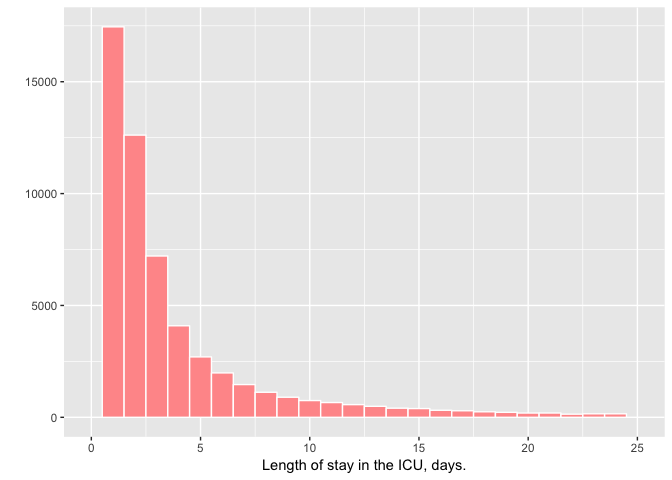

Length of stay in the ICU
================
tom pollard
10/10/2017

``` r
# Load configuration settings
dbdriver <- 'PostgreSQL'
host  <- '127.0.0.1'
port  <- '5432'
user  <- 'postgres'
password <- 'postgres'
dbname <- 'mimic'
schema <- 'mimiciii'
# Connect to the database using the configuration settings
con <- dbConnect(dbDriver(dbdriver), dbname = dbname, host = host, port = port, 
                 user = user, password = password)
# Set the default schema
dbExecute(con, paste("SET search_path TO ", schema, sep=" "))
```

    ## [1] 0

``` r
sql_query <- "SELECT i.subject_id, i.hadm_id, i.los
              FROM icustays i;"
data <- dbGetQuery(con, sql_query)
```

This document shows how RMarkdown can be used to create a reproducible analysis using MIMIC-III (version 1.4). Let's calculate the median length of stay in the ICU and then include this value in our document.

``` r
avg_los <- median(data$los, na.rm=TRUE)
rounded_avg_los <-round(avg_los, digits = 2)
```

So the median length of stay in the ICU is 2.09225 days. Rounded to two decimal places, this is 2.09 days. We can plot the distribution of length of stay using the qplot function:


