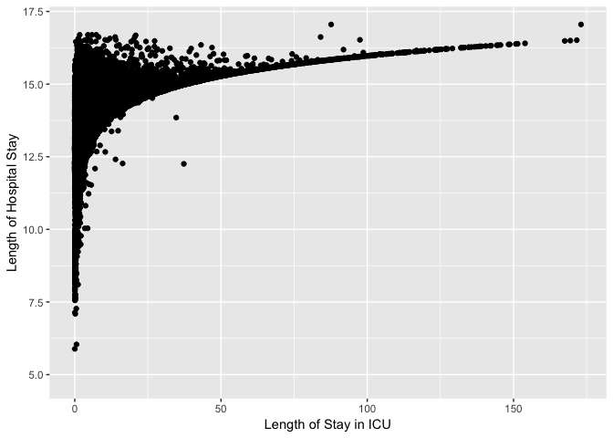
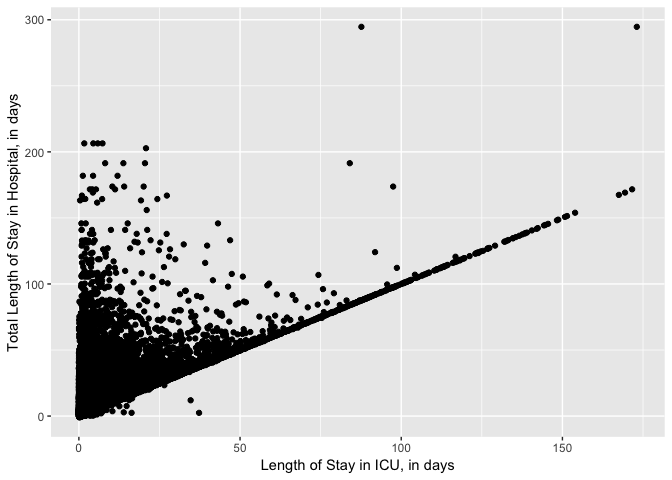
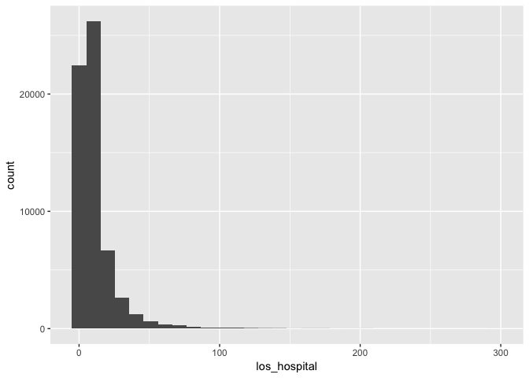
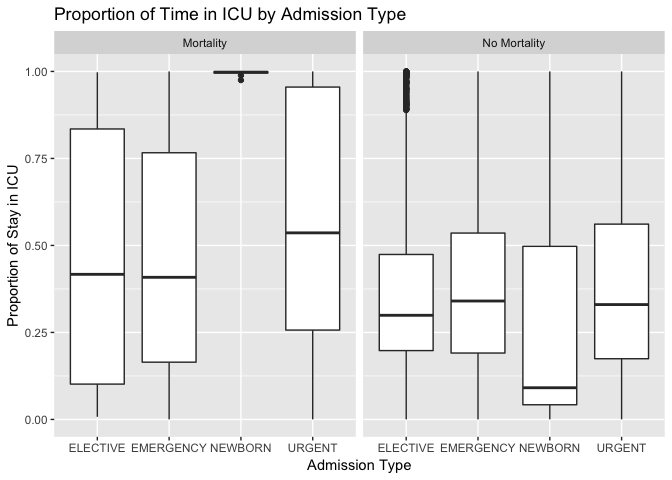
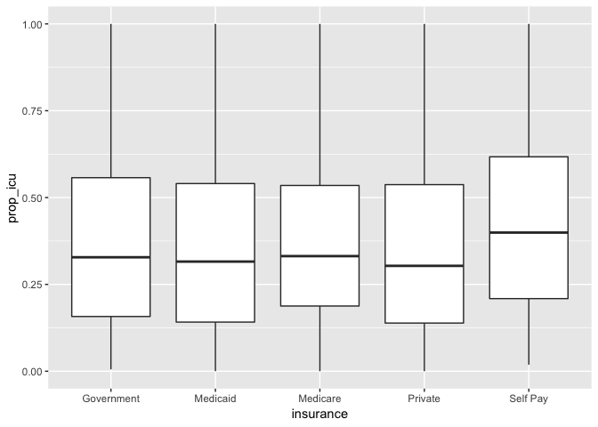

length\_of\_care
================
Samantha Brown
11/17/2018

``` r
admissions <- 
  read_csv("./database/data/admissions.csv") %>% 
  janitor::clean_names() %>% 
  mutate(diagnosis = factor(diagnosis))
```

Exploratory analysis
--------------------

``` r
n_admits = admissions %>% 
  nrow()

n_discharge = admissions %>% 
  filter(is.na(deathtime)) %>% 
  nrow()

round((1 - (n_discharge/n_admits)) * 100, digits = 2)
```

    ## [1] 9.93

**Out of 58976 patient admissions, 53122 patients were ultimately discharged. The remaining 9.93% were recorded deaths.**

``` r
## Ethnicity
ethnicity = admissions %>% 
  group_by(ethnicity) %>% 
  count()
```

Need to do string replace to combine similar groups.

``` r
## Married
marital_status = admissions %>% 
  group_by(marital_status) %>% 
  count() %>% 
  mutate(percent = n/nrow(admissions)*100) %>% 
  arrange(desc(percent))
```

41.0997694% of the critical care patients were married, while 22.4735486% of patients were single. The remaining 36.43% were either widowed, divorced, separated, had a life partner, or marital status was unknown.

``` r
## Distribution of insurance type
admissions %>% 
  group_by(insurance) %>% 
  count() %>% 
  mutate(percent_of_patients = round(n/nrow(admissions)*100, digits = 2)) %>% 
  arrange(desc(percent_of_patients)) %>% 
  select(-n)
```

    ## # A tibble: 5 x 2
    ## # Groups:   insurance [5]
    ##   insurance  percent_of_patients
    ##   <chr>                    <dbl>
    ## 1 Medicare                 47.8 
    ## 2 Private                  38.3 
    ## 3 Medicaid                  9.81
    ## 4 Government                3.02
    ## 5 Self Pay                  1.04

``` r
## Top 10 causes of recorded mortalities
admissions %>% 
  filter(deathtime > 0) %>%
  count(diagnosis) %>% 
  top_n(10) %>% 
  arrange(desc(n))
```

    ## Warning: Factor `diagnosis` contains implicit NA, consider using
    ## `forcats::fct_explicit_na`

    ## Selecting by n

    ## # A tibble: 10 x 2
    ##    diagnosis                    n
    ##    <fct>                    <int>
    ##  1 SEPSIS                     267
    ##  2 PNEUMONIA                  264
    ##  3 INTRACRANIAL HEMORRHAGE    231
    ##  4 CONGESTIVE HEART FAILURE   126
    ##  5 ALTERED MENTAL STATUS       88
    ##  6 CARDIAC ARREST              81
    ##  7 ABDOMINAL PAIN              80
    ##  8 S/P FALL                    78
    ##  9 HYPOTENSION                 74
    ## 10 SUBARACHNOID HEMORRHAGE     71

``` r
## Look at sepsis diagnoses
sepsis = admissions %>% 
  filter(diagnosis == "SEPSIS") %>% 
  ## discharge = 1, mortality = 0
  mutate(mortality = ifelse(is.na(deathtime), 1, 0)) %>% 
  ## create indicator variable: married = 1, not married = 0
  mutate(marital_status = ifelse(marital_status == "MARRIED", 1, 0)) %>% 
  select(subject_id, insurance, marital_status, ethnicity, mortality)


## Look at top 10 causes of mortalities
top_10_causes = admissions %>% 
  filter(diagnosis == c("SEPSIS", "PNEUMONIA", "INTRACRANIAL HEMORRHAGE", "CONGESTIVE HEART FAILURE", "ALTERED MENTAL STATUS", "CARDIAC ARREST", "ABDOMINAL PAIN", "S/P FALL", "HYPOTENSION", "SUBARACHNOID HEMORRHAGE"))
```

    ## Warning in `==.default`(diagnosis, c("SEPSIS", "PNEUMONIA", "INTRACRANIAL
    ## HEMORRHAGE", : longer object length is not a multiple of shorter object
    ## length

    ## Warning in is.na(e1) | is.na(e2): longer object length is not a multiple of
    ## shorter object length

``` r
## Insurance -- mortality vs. no mortality 

## mortality
mortalities = admissions %>% 
  filter(deathtime > 0) %>% 
  group_by(insurance) %>% 
  count() %>% 
  mutate(outcome = "mortality")

total_mortalities = sum(mortalities$n)

mortalities = mortalities %>% 
  mutate(patient_proportion = round(n/total_mortalities, digits = 4))

discharge = admissions %>% 
  filter(deathtime > 0) %>% 
  group_by(insurance) %>% 
  count() %>% 
  mutate(outcome = "no_mortality")

total_discharge = sum(discharge$n)

dishcharge = discharge %>% 
  mutate(patient_proportion = round(n/total_discharge, digits = 4)) %>% 
  rbind(mortalities) %>% 
  mutate(log_count = log(n)) %>% 
  ggplot(aes(x = reorder(insurance, log_count), y = log_count)) +
  geom_point(color = "blue") 
```

Exploratory:
------------

I want to discuss with you guys the challenge in finding length of care -- if someone was admitted on December 1, 1980 and discharged January 5, 1981, I'm not sure if we can just subtract the times? Using Francis's method, it results in negative number for month. Also, we cannot measure minutes/hours, because admit time does not have minutes

Should we measure length of stays by hours? then we can combine day and hour to one unit measurement

``` r
library(lubridate)
admissions_data <- read_csv("./database/data/admissions.csv") %>% 
  janitor::clean_names()
```

    ## Parsed with column specification:
    ## cols(
    ##   ROW_ID = col_integer(),
    ##   SUBJECT_ID = col_integer(),
    ##   HADM_ID = col_integer(),
    ##   ADMITTIME = col_datetime(format = ""),
    ##   DISCHTIME = col_datetime(format = ""),
    ##   DEATHTIME = col_datetime(format = ""),
    ##   ADMISSION_TYPE = col_character(),
    ##   ADMISSION_LOCATION = col_character(),
    ##   DISCHARGE_LOCATION = col_character(),
    ##   INSURANCE = col_character(),
    ##   LANGUAGE = col_character(),
    ##   RELIGION = col_character(),
    ##   MARITAL_STATUS = col_character(),
    ##   ETHNICITY = col_character(),
    ##   EDREGTIME = col_datetime(format = ""),
    ##   EDOUTTIME = col_datetime(format = ""),
    ##   DIAGNOSIS = col_character(),
    ##   HOSPITAL_EXPIRE_FLAG = col_integer(),
    ##   HAS_CHARTEVENTS_DATA = col_integer()
    ## )

``` r
difference = admissions_data %>% 
  mutate(length_of_stay =  lubridate::as.duration(admittime %--% dischtime),
         mortality = ifelse(is.na(deathtime), 1, 0))

summary(difference$length_of_stay)
```

    ##                              Min.                           1st Qu. 
    ##           "81660s (~22.68 hours)"            "323460s (~3.74 days)" 
    ##                            Median                              Mean 
    ##            "558750s (~6.47 days)" "875570.349294628s (~1.45 weeks)" 
    ##                           3rd Qu.                              Max. 
    ##          "1019100s (~1.69 weeks)"        "25458660s (~42.09 weeks)"

``` r
stay_in_days = difference %>% 
  mutate(length_of_stay = as.numeric(length_of_stay)/(60*60*24))


max(difference$length_of_stay)
```

    ## [1] 25458660

``` r
max_length_in_days = max(as.numeric(difference$length_of_stay)/(60*60*24))
-1*min(as.numeric(difference$length_of_stay))/(60*60*24)
```

    ## [1] 0.9451389

``` r
## Merge ICU data with admissions dataset 
## Now we have length of hospital stay and length of ICU stay
icu_data = read_csv("./database/data/icu_detail.csv")
```

    ## Parsed with column specification:
    ## cols(
    ##   subject_id = col_integer(),
    ##   hadm_id = col_integer(),
    ##   icustay_id = col_integer(),
    ##   gender = col_character(),
    ##   dod = col_datetime(format = ""),
    ##   admittime = col_datetime(format = ""),
    ##   dischtime = col_datetime(format = ""),
    ##   los_hospital = col_double(),
    ##   admission_age = col_double(),
    ##   ethnicity = col_character(),
    ##   admission_type = col_character(),
    ##   hospital_expire_flag = col_integer(),
    ##   hospstay_seq = col_integer(),
    ##   first_hosp_stay = col_logical(),
    ##   intime = col_datetime(format = ""),
    ##   outtime = col_datetime(format = ""),
    ##   los_icu = col_double(),
    ##   icustay_seq = col_integer(),
    ##   first_icu_stay = col_logical()
    ## )

``` r
icu_data = icu_data %>% 
  select(hadm_id, los_icu, los_hospital, icustay_seq, first_icu_stay)

merged_data = left_join(difference, icu_data, by = "hadm_id")

class(merged_data$los_icu)
```

    ## [1] "numeric"

``` r
class(merged_data$length_of_stay)
```

    ## [1] "Duration"
    ## attr(,"package")
    ## [1] "lubridate"

``` r
ggplot(merged_data, aes(x = los_icu, y = log(as.numeric(length_of_stay)))) +
  geom_point() +
  labs(
    x = "Length of Stay in ICU",
    y = "Length of Hospital Stay"
  )
```

    ## Warning in log(as.numeric(length_of_stay)): NaNs produced

    ## Warning in log(as.numeric(length_of_stay)): NaNs produced

    ## Warning: Removed 1734 rows containing missing values (geom_point).



``` r
## Plot using all ICU data -- lengths on same scale
## Good plot!!! 
ggplot(icu_data, aes(x = los_icu, y = los_hospital)) +
  geom_point() +
  labs(
    x = "Length of Stay in ICU, in days", 
    y = "Total Length of Stay in Hospital, in days" 
  )
```

    ## Warning: Removed 10 rows containing missing values (geom_point).



``` r
## Is the relationship between ICU stay and hospital stay different with newborns removed? No
##icu_no_babies = icu_data %>% 
 ## filter(admission_type != "NEWBORN")

##ggplot(icu_no_babies, aes(x = los_icu, y = los_hospital)) +
  ##geom_point()


merged_data = merged_data %>% 
  mutate(length_proportion = (los_icu / los_hospital)) %>% 
  filter(!(length_proportion == "NA"))

icu_data %>% 
  ggplot(aes(x = los_hospital)) +
  geom_histogram() 
```

    ## `stat_bin()` using `bins = 30`. Pick better value with `binwidth`.



``` r
icu_data %>% 
  filter(los_hospital > 100) %>% 
  arrange(desc(los_hospital))
```

    ## # A tibble: 244 x 5
    ##    hadm_id los_icu los_hospital icustay_seq first_icu_stay
    ##      <int>   <dbl>        <dbl>       <int> <lgl>         
    ##  1  168201   87.6          295.           1 TRUE          
    ##  2  168201  173.           295.           2 FALSE         
    ##  3  115396    1.68         206.           1 TRUE          
    ##  4  115396    4.47         206.           2 FALSE         
    ##  5  115396    7.33         206.           3 FALSE         
    ##  6  115396    5.87         206.           4 FALSE         
    ##  7  147501   20.8          203.           1 TRUE          
    ##  8  157559   13.8          191.           1 TRUE          
    ##  9  157559   84.0          191.           2 FALSE         
    ## 10  157559    8.15         191.           3 FALSE         
    ## # … with 234 more rows

``` r
## How many proportions are greater than 1? (Too many)
## Limitation
icu_data %>% 
  mutate(prop_icu = los_icu/los_hospital) %>% 
  arrange(desc(prop_icu)) %>% 
  mutate(prop_true = ifelse(prop_icu > 1, 1, 0)) %>% 
  count(prop_true) %>% 
  filter(prop_true == 1)
```

    ## # A tibble: 1 x 2
    ##   prop_true     n
    ##       <dbl> <int>
    ## 1         1  7466

``` r
## We ran into a challenge that some proportions of length of stay in ICU to length of stay in hospital (which includes stay in ICU) are greater than 1. This suggests possible flaws in the data. While we acknowledge that these flaws exist, for the purpose of this project we will filter out the proportions greater than 1 and analyze this subset of the dataset. 

## Filter out proportions greater than 1
true_prop = icu_data %>% 
  mutate(prop_icu = los_icu/los_hospital) %>% 
  filter(!(prop_icu > 1), !(prop_icu < 0))

filtered_admissions = admissions %>% 
  mutate(mortality = ifelse(is.na(deathtime), "No Mortality", "Mortality")) %>% 
  select(hadm_id, admission_type, diagnosis, religion, ethnicity, marital_status, insurance, mortality)

filtered_prop = left_join(true_prop, filtered_admissions, by = "hadm_id")
  
  
summary(filtered_prop$los_hospital)
```

    ##     Min.  1st Qu.   Median     Mean  3rd Qu.     Max. 
    ##   0.0333   4.1410   7.1069  11.2429  13.0136 294.6604

``` r
summary(filtered_prop$los_icu)
```

    ##     Min.  1st Qu.   Median     Mean  3rd Qu.     Max. 
    ##   0.0001   1.0947   2.0146   3.9317   3.9529 173.0725

``` r
## Proportion of time in ICU by admission type
## INCLUDE!!! 
ggplot(filtered_prop, aes(x = admission_type, y = prop_icu)) +
  geom_boxplot() +
  facet_grid(~mortality) +
  labs(
    x = "Admission Type", 
    y = "Proportion of Stay in ICU", 
    title = "Proportion of Time in ICU by Admission Type"
  )
```



``` r
## Proportion of time in ICU by insurance type
## Not significant
ggplot(filtered_prop, aes(x = insurance, y = prop_icu)) +
  geom_boxplot()
```



``` r
ggplot(filtered_prop, aes(x = insurance, y = prop_icu)) +
  geom_boxplot() 
```


``` r
length_of_care = lm(length_of_stay ~ admission_type + insurance + marital_status + religion + ethnicity + mortality + los_icu, data = merged_data)
```

    ## Note: method with signature 'Duration#ANY' chosen for function '-',
    ##  target signature 'Duration#Duration'.
    ##  "ANY#Duration" would also be valid

``` r
AIC(length_of_care)
```

    ## [1] 1537208

``` r
step(length_of_care, direction = "backward")
```

    ## Start:  AIC=1393652
    ## length_of_stay ~ admission_type + insurance + marital_status + 
    ##     religion + ethnicity + mortality + los_icu
    ## 
    ##                  Df  Sum of Sq        RSS     AIC
    ## - mortality       1 1.0593e+10 4.6543e+16 1393650
    ## <none>                         4.6543e+16 1393652
    ## - marital_status  6 4.1273e+13 4.6584e+16 1393685
    ## - insurance       4 4.3534e+13 4.6586e+16 1393692
    ## - admission_type  3 8.9068e+13 4.6632e+16 1393743
    ## - ethnicity      40 1.8731e+14 4.6730e+16 1393776
    ## - religion       19 2.6336e+14 4.6806e+16 1393900
    ## - los_icu         1 1.8712e+16 6.5255e+16 1410744
    ## 
    ## Step:  AIC=1393650
    ## length_of_stay ~ admission_type + insurance + marital_status + 
    ##     religion + ethnicity + los_icu
    ## 
    ##                  Df  Sum of Sq        RSS     AIC
    ## <none>                         4.6543e+16 1393650
    ## - marital_status  6 4.1335e+13 4.6584e+16 1393683
    ## - insurance       4 4.3659e+13 4.6586e+16 1393690
    ## - admission_type  3 8.9093e+13 4.6632e+16 1393741
    ## - ethnicity      40 1.8730e+14 4.6730e+16 1393774
    ## - religion       19 2.6385e+14 4.6807e+16 1393898
    ## - los_icu         1 1.8907e+16 6.5450e+16 1410894

    ## 
    ## Call:
    ## lm(formula = length_of_stay ~ admission_type + insurance + marital_status + 
    ##     religion + ethnicity + los_icu, data = merged_data)
    ## 
    ## Coefficients:
    ##                                                       (Intercept)  
    ##                                                         1162884.9  
    ##                                           admission_typeEMERGENCY  
    ##                                                           15889.1  
    ##                                             admission_typeNEWBORN  
    ##                                                         -475381.9  
    ##                                              admission_typeURGENT  
    ##                                                          138028.1  
    ##                                                 insuranceMedicaid  
    ##                                                           70325.1  
    ##                                                 insuranceMedicare  
    ##                                                          -12160.3  
    ##                                                  insurancePrivate  
    ##                                                           13071.9  
    ##                                                 insuranceSelf Pay  
    ##                                                         -196177.1  
    ##                                        marital_statusLIFE PARTNER  
    ##                                                         -274398.9  
    ##                                             marital_statusMARRIED  
    ##                                                          -20691.3  
    ##                                           marital_statusSEPARATED  
    ##                                                           84786.4  
    ##                                              marital_statusSINGLE  
    ##                                                             291.1  
    ##                                   marital_statusUNKNOWN (DEFAULT)  
    ##                                                           49399.2  
    ##                                             marital_statusWIDOWED  
    ##                                                          -82929.6  
    ##                                                   religionBAPTIST  
    ##                                                         -318048.9  
    ##                                                  religionBUDDHIST  
    ##                                                         -506728.3  
    ##                                                  religionCATHOLIC  
    ##                                                         -368804.1  
    ##                                       religionCHRISTIAN SCIENTIST  
    ##                                                         -332779.2  
    ##                                              religionEPISCOPALIAN  
    ##                                                         -402420.7  
    ##                                            religionGREEK ORTHODOX  
    ##                                                         -409423.8  
    ##                                                    religionHEBREW  
    ##                                                         -521207.9  
    ##                                                     religionHINDU  
    ##                                                         -671344.7  
    ##                                         religionJEHOVAH'S WITNESS  
    ##                                                         -233198.7  
    ##                                                    religionJEWISH  
    ##                                                         -436060.9  
    ##                                                  religionLUTHERAN  
    ##                                                         -746481.3  
    ##                                                 religionMETHODIST  
    ##                                                         -470550.7  
    ##                                                    religionMUSLIM  
    ##                                                         -205132.4  
    ##                                             religionNOT SPECIFIED  
    ##                                                         -451967.7  
    ##                                                     religionOTHER  
    ##                                                         -336806.1  
    ##                                         religionPROTESTANT QUAKER  
    ##                                                         -316567.1  
    ##                                       religionROMANIAN EAST. ORTH  
    ##                                                           48582.9  
    ##                                    religionUNITARIAN-UNIVERSALIST  
    ##                                                         -384982.8  
    ##                                              religionUNOBTAINABLE  
    ##                                                         -566303.4  
    ## ethnicityAMERICAN INDIAN/ALASKA NATIVE FEDERALLY RECOGNIZED TRIBE  
    ##                                                         -314394.6  
    ##                                                    ethnicityASIAN  
    ##                                                         -142660.6  
    ##                                     ethnicityASIAN - ASIAN INDIAN  
    ##                                                          133774.7  
    ##                                        ethnicityASIAN - CAMBODIAN  
    ##                                                         1944398.5  
    ##                                          ethnicityASIAN - CHINESE  
    ##                                                         -184128.2  
    ##                                         ethnicityASIAN - FILIPINO  
    ##                                                         -424046.9  
    ##                                         ethnicityASIAN - JAPANESE  
    ##                                                         -613960.7  
    ##                                           ethnicityASIAN - KOREAN  
    ##                                                         -396623.7  
    ##                                            ethnicityASIAN - OTHER  
    ##                                                          258533.3  
    ##                                             ethnicityASIAN - THAI  
    ##                                                         -199647.0  
    ##                                       ethnicityASIAN - VIETNAMESE  
    ##                                                         -243870.5  
    ##                                            ethnicityBLACK/AFRICAN  
    ##                                                         -505484.8  
    ##                                   ethnicityBLACK/AFRICAN AMERICAN  
    ##                                                         -244177.7  
    ##                                       ethnicityBLACK/CAPE VERDEAN  
    ##                                                         -280408.6  
    ##                                            ethnicityBLACK/HAITIAN  
    ##                                                         -319083.6  
    ##                                         ethnicityCARIBBEAN ISLAND  
    ##                                                         -495140.9  
    ##                                       ethnicityHISPANIC OR LATINO  
    ##                                                         -193740.8  
    ##               ethnicityHISPANIC/LATINO - CENTRAL AMERICAN (OTHER)  
    ##                                                         -664085.6  
    ##                              ethnicityHISPANIC/LATINO - COLOMBIAN  
    ##                                                         -360258.3  
    ##                                  ethnicityHISPANIC/LATINO - CUBAN  
    ##                                                          -58393.0  
    ##                              ethnicityHISPANIC/LATINO - DOMINICAN  
    ##                                                           15318.3  
    ##                             ethnicityHISPANIC/LATINO - GUATEMALAN  
    ##                                                         -387706.8  
    ##                               ethnicityHISPANIC/LATINO - HONDURAN  
    ##                                                           99428.6  
    ##                                ethnicityHISPANIC/LATINO - MEXICAN  
    ##                                                         -470355.8  
    ##                           ethnicityHISPANIC/LATINO - PUERTO RICAN  
    ##                                                         -316759.4  
    ##                             ethnicityHISPANIC/LATINO - SALVADORAN  
    ##                                                         -368490.7  
    ##                                           ethnicityMIDDLE EASTERN  
    ##                                                         -203905.9  
    ##                                     ethnicityMULTI RACE ETHNICITY  
    ##                                                           -9119.4  
    ##                ethnicityNATIVE HAWAIIAN OR OTHER PACIFIC ISLANDER  
    ##                                                         -353920.0  
    ##                                                    ethnicityOTHER  
    ##                                                         -170995.5  
    ##                               ethnicityPATIENT DECLINED TO ANSWER  
    ##                                                         -269665.1  
    ##                                               ethnicityPORTUGUESE  
    ##                                                          166300.1  
    ##                                           ethnicitySOUTH AMERICAN  
    ##                                                           77854.6  
    ##                                         ethnicityUNABLE TO OBTAIN  
    ##                                                         -136807.0  
    ##                                    ethnicityUNKNOWN/NOT SPECIFIED  
    ##                                                         -207911.3  
    ##                                                    ethnicityWHITE  
    ##                                                         -170935.7  
    ##                                        ethnicityWHITE - BRAZILIAN  
    ##                                                          112255.6  
    ##                                 ethnicityWHITE - EASTERN EUROPEAN  
    ##                                                          298017.2  
    ##                                   ethnicityWHITE - OTHER EUROPEAN  
    ##                                                         -317296.5  
    ##                                          ethnicityWHITE - RUSSIAN  
    ##                                                         -337469.1  
    ##                                                           los_icu  
    ##                                                           96599.4

``` r
anova(lm(lm(length_of_stay ~ admission_type + insurance + marital_status + religion + ethnicity + + mortality + los_icu, data = merged_data)))
```

    ## Analysis of Variance Table
    ## 
    ## Response: length_of_stay
    ##                   Df     Sum Sq    Mean Sq    F value    Pr(>F)    
    ## admission_type     3 1.1682e+14 3.8941e+13    42.2606 < 2.2e-16 ***
    ## insurance          4 8.1805e+13 2.0451e+13    22.1944 < 2.2e-16 ***
    ## marital_status     6 6.5937e+13 1.0989e+13    11.9261 2.004e-13 ***
    ## religion          19 2.8827e+14 1.5172e+13    16.4653 < 2.2e-16 ***
    ## ethnicity         40 2.5564e+14 6.3911e+12     6.9358 < 2.2e-16 ***
    ## mortality          1 1.9549e+14 1.9549e+14   212.1582 < 2.2e-16 ***
    ## los_icu            1 1.8712e+16 1.8712e+16 20306.8514 < 2.2e-16 ***
    ## Residuals      50510 4.6543e+16 9.2146e+11                         
    ## ---
    ## Signif. codes:  0 '***' 0.001 '**' 0.01 '*' 0.05 '.' 0.1 ' ' 1

Length of Stay Regression
-------------------------

``` r
library(broom)

length_of_care = lm(length_of_stay ~ admission_type + insurance + marital_status + religion + ethnicity + mortality, data = difference)

## Why such a high p-value?
lm(mortality ~ length_of_stay, data = difference) %>% summary()
```

    ## 
    ## Call:
    ## lm(formula = mortality ~ length_of_stay, data = difference)
    ## 
    ## Residuals:
    ##      Min       1Q   Median       3Q      Max 
    ## -0.90158  0.09924  0.09927  0.09929  0.09931 
    ## 
    ## Coefficients:
    ##                 Estimate Std. Error t value Pr(>|t|)    
    ## (Intercept)    9.007e-01  1.587e-03 567.446   <2e-16 ***
    ## length_of_stay 4.960e-11  1.144e-09   0.043    0.965    
    ## ---
    ## Signif. codes:  0 '***' 0.001 '**' 0.01 '*' 0.05 '.' 0.1 ' ' 1
    ## 
    ## Residual standard error: 0.299 on 58974 degrees of freedom
    ## Multiple R-squared:  3.187e-08,  Adjusted R-squared:  -1.692e-05 
    ## F-statistic: 0.00188 on 1 and 58974 DF,  p-value: 0.9654

``` r
##fit1 = update(length_of_care, . ~ . -admission_type)
##summary(fit1)

##fit2 = update(length_of_care, . ~ . -insurance)
##summary(fit2)

##fit3 = update(length_of_care, . ~ . -marital_status)
##summary(fit3)

##fit4 = update(length_of_care, . ~ . -religion)
##summary(fit4)

##fit5 = update(length_of_care, . ~ . -ethnicity)
##summary(fit1)

##fit6 = update(length_of_care, . ~ . -mortality)
##summary(fit6)

##fit7 = update(length_of_care, . ~ . +diagnosis)
##summary(fit1)


summary(step(length_of_care, direction = "backward"))
```

    ## Start:  AIC=1336466
    ## length_of_stay ~ admission_type + insurance + marital_status + 
    ##     religion + ethnicity + mortality
    ## 
    ##                  Df  Sum of Sq        RSS     AIC
    ## <none>                         4.2195e+16 1336466
    ## - mortality       1 1.2449e+13 4.2208e+16 1336478
    ## - ethnicity      40 8.7118e+13 4.2282e+16 1336486
    ## - marital_status  6 2.9826e+13 4.2225e+16 1336488
    ## - insurance       4 4.5362e+13 4.2241e+16 1336510
    ## - admission_type  3 1.1794e+14 4.2313e+16 1336595
    ## - religion       19 1.5062e+14 4.2346e+16 1336601

    ## 
    ## Call:
    ## lm(formula = length_of_stay ~ admission_type + insurance + marital_status + 
    ##     religion + ethnicity + mortality, data = difference)
    ## 
    ## Residuals:
    ##      Min       1Q   Median       3Q      Max 
    ## -1703192  -506275  -252553   174817 24618786 
    ## attr(,"class")
    ## [1] "Duration"
    ## attr(,"class")attr(,"package")
    ## [1] "lubridate"
    ## 
    ## Coefficients:
    ##                                                                   Estimate
    ## (Intercept)                                                        1301322
    ## admission_typeEMERGENCY                                             104265
    ## admission_typeNEWBORN                                                80671
    ## admission_typeURGENT                                                300186
    ## insuranceMedicaid                                                    91231
    ## insuranceMedicare                                                    19036
    ## insurancePrivate                                                     14990
    ## insuranceSelf Pay                                                  -213583
    ## marital_statusLIFE PARTNER                                         -157988
    ## marital_statusMARRIED                                               -20794
    ## marital_statusSEPARATED                                              32184
    ## marital_statusSINGLE                                                -11773
    ## marital_statusUNKNOWN (DEFAULT)                                     104359
    ## marital_statusWIDOWED                                               -77516
    ## religionBAPTIST                                                    -172625
    ## religionBUDDHIST                                                   -386939
    ## religionCATHOLIC                                                   -247006
    ## religionCHRISTIAN SCIENTIST                                        -262022
    ## religionEPISCOPALIAN                                               -231152
    ## religionGREEK ORTHODOX                                             -263231
    ## religionHEBREW                                                     -371075
    ## religionHINDU                                                      -509406
    ## religionJEHOVAH'S WITNESS                                          -145005
    ## religionJEWISH                                                     -328266
    ## religionLUTHERAN                                                   -567636
    ## religionMETHODIST                                                   142049
    ## religionMUSLIM                                                     -138636
    ## religionNOT SPECIFIED                                              -339124
    ## religionOTHER                                                      -243691
    ## religionPROTESTANT QUAKER                                          -229112
    ## religionROMANIAN EAST. ORTH                                         -12671
    ## religionUNITARIAN-UNIVERSALIST                                     -231366
    ## religionUNOBTAINABLE                                               -386033
    ## ethnicityAMERICAN INDIAN/ALASKA NATIVE FEDERALLY RECOGNIZED TRIBE   182870
    ## ethnicityASIAN                                                     -223067
    ## ethnicityASIAN - ASIAN INDIAN                                        65324
    ## ethnicityASIAN - CAMBODIAN                                          730668
    ## ethnicityASIAN - CHINESE                                           -203554
    ## ethnicityASIAN - FILIPINO                                          -529443
    ## ethnicityASIAN - JAPANESE                                          -686730
    ## ethnicityASIAN - KOREAN                                            -453117
    ## ethnicityASIAN - OTHER                                              507958
    ## ethnicityASIAN - THAI                                              -288568
    ## ethnicityASIAN - VIETNAMESE                                        -338225
    ## ethnicityBLACK/AFRICAN                                             -400579
    ## ethnicityBLACK/AFRICAN AMERICAN                                    -252797
    ## ethnicityBLACK/CAPE VERDEAN                                        -315915
    ## ethnicityBLACK/HAITIAN                                             -333218
    ## ethnicityCARIBBEAN ISLAND                                          -627952
    ## ethnicityHISPANIC OR LATINO                                        -241580
    ## ethnicityHISPANIC/LATINO - CENTRAL AMERICAN (OTHER)                -743454
    ## ethnicityHISPANIC/LATINO - COLOMBIAN                               -179390
    ## ethnicityHISPANIC/LATINO - CUBAN                                   -214812
    ## ethnicityHISPANIC/LATINO - DOMINICAN                                -24620
    ## ethnicityHISPANIC/LATINO - GUATEMALAN                              -461057
    ## ethnicityHISPANIC/LATINO - HONDURAN                                 -33494
    ## ethnicityHISPANIC/LATINO - MEXICAN                                 -459054
    ## ethnicityHISPANIC/LATINO - PUERTO RICAN                            -326330
    ## ethnicityHISPANIC/LATINO - SALVADORAN                              -373490
    ## ethnicityMIDDLE EASTERN                                             -64158
    ## ethnicityMULTI RACE ETHNICITY                                       -78948
    ## ethnicityNATIVE HAWAIIAN OR OTHER PACIFIC ISLANDER                 -441604
    ## ethnicityOTHER                                                     -170871
    ## ethnicityPATIENT DECLINED TO ANSWER                                -205468
    ## ethnicityPORTUGUESE                                                  16481
    ## ethnicitySOUTH AMERICAN                                            -151270
    ## ethnicityUNABLE TO OBTAIN                                          -169580
    ## ethnicityUNKNOWN/NOT SPECIFIED                                     -169819
    ## ethnicityWHITE                                                     -196479
    ## ethnicityWHITE - BRAZILIAN                                          113696
    ## ethnicityWHITE - EASTERN EUROPEAN                                   -58546
    ## ethnicityWHITE - OTHER EUROPEAN                                    -342890
    ## ethnicityWHITE - RUSSIAN                                           -365021
    ## mortality                                                           -52854
    ##                                                                   Std. Error
    ## (Intercept)                                                           230154
    ## admission_typeEMERGENCY                                                11959
    ## admission_typeNEWBORN                                                  55944
    ## admission_typeURGENT                                                   29473
    ## insuranceMedicaid                                                      29022
    ## insuranceMedicare                                                      26716
    ## insurancePrivate                                                       26999
    ## insuranceSelf Pay                                                      51843
    ## marital_statusLIFE PARTNER                                            241431
    ## marital_statusMARRIED                                                  17706
    ## marital_statusSEPARATED                                                42648
    ## marital_statusSINGLE                                                   18553
    ## marital_statusUNKNOWN (DEFAULT)                                        53660
    ## marital_statusWIDOWED                                                  20108
    ## religionBAPTIST                                                       207706
    ## religionBUDDHIST                                                      129684
    ## religionCATHOLIC                                                      110187
    ## religionCHRISTIAN SCIENTIST                                           121040
    ## religionEPISCOPALIAN                                                  115489
    ## religionGREEK ORTHODOX                                                119119
    ## religionHEBREW                                                        257782
    ## religionHINDU                                                         164305
    ## religionJEHOVAH'S WITNESS                                             137417
    ## religionJEWISH                                                        110900
    ## religionLUTHERAN                                                      938868
    ## religionMETHODIST                                                     369422
    ## religionMUSLIM                                                        130954
    ## religionNOT SPECIFIED                                                 110300
    ## religionOTHER                                                         111598
    ## religionPROTESTANT QUAKER                                             110372
    ## religionROMANIAN EAST. ORTH                                           158492
    ## religionUNITARIAN-UNIVERSALIST                                        143357
    ## religionUNOBTAINABLE                                                  110887
    ## ethnicityAMERICAN INDIAN/ALASKA NATIVE FEDERALLY RECOGNIZED TRIBE     575683
    ## ethnicityASIAN                                                        201938
    ## ethnicityASIAN - ASIAN INDIAN                                         227990
    ## ethnicityASIAN - CAMBODIAN                                            303956
    ## ethnicityASIAN - CHINESE                                              207858
    ## ethnicityASIAN - FILIPINO                                             278342
    ## ethnicityASIAN - JAPANESE                                             429704
    ## ethnicityASIAN - KOREAN                                               334904
    ## ethnicityASIAN - OTHER                                                335562
    ## ethnicityASIAN - THAI                                                 510805
    ## ethnicityASIAN - VIETNAMESE                                           241645
    ## ethnicityBLACK/AFRICAN                                                247664
    ## ethnicityBLACK/AFRICAN AMERICAN                                       199497
    ## ethnicityBLACK/CAPE VERDEAN                                           209964
    ## ethnicityBLACK/HAITIAN                                                220902
    ## ethnicityCARIBBEAN ISLAND                                             369081
    ## ethnicityHISPANIC OR LATINO                                           200694
    ## ethnicityHISPANIC/LATINO - CENTRAL AMERICAN (OTHER)                   344680
    ## ethnicityHISPANIC/LATINO - COLOMBIAN                                  369318
    ## ethnicityHISPANIC/LATINO - CUBAN                                      275459
    ## ethnicityHISPANIC/LATINO - DOMINICAN                                  225674
    ## ethnicityHISPANIC/LATINO - GUATEMALAN                                 249037
    ## ethnicityHISPANIC/LATINO - HONDURAN                                   507061
    ## ethnicityHISPANIC/LATINO - MEXICAN                                    344509
    ## ethnicityHISPANIC/LATINO - PUERTO RICAN                               208529
    ## ethnicityHISPANIC/LATINO - SALVADORAN                                 296774
    ## ethnicityMIDDLE EASTERN                                               247822
    ## ethnicityMULTI RACE ETHNICITY                                         216892
    ## ethnicityNATIVE HAWAIIAN OR OTHER PACIFIC ISLANDER                    334778
    ## ethnicityOTHER                                                        201110
    ## ethnicityPATIENT DECLINED TO ANSWER                                   203949
    ## ethnicityPORTUGUESE                                                   233208
    ## ethnicitySOUTH AMERICAN                                               404806
    ## ethnicityUNABLE TO OBTAIN                                             203031
    ## ethnicityUNKNOWN/NOT SPECIFIED                                        199748
    ## ethnicityWHITE                                                        199119
    ## ethnicityWHITE - BRAZILIAN                                            234985
    ## ethnicityWHITE - EASTERN EUROPEAN                                     278250
    ## ethnicityWHITE - OTHER EUROPEAN                                       226036
    ## ethnicityWHITE - RUSSIAN                                              212070
    ## mortality                                                              13967
    ##                                                                   t value
    ## (Intercept)                                                         5.654
    ## admission_typeEMERGENCY                                             8.719
    ## admission_typeNEWBORN                                               1.442
    ## admission_typeURGENT                                               10.185
    ## insuranceMedicaid                                                   3.144
    ## insuranceMedicare                                                   0.713
    ## insurancePrivate                                                    0.555
    ## insuranceSelf Pay                                                  -4.120
    ## marital_statusLIFE PARTNER                                         -0.654
    ## marital_statusMARRIED                                              -1.174
    ## marital_statusSEPARATED                                             0.755
    ## marital_statusSINGLE                                               -0.635
    ## marital_statusUNKNOWN (DEFAULT)                                     1.945
    ## marital_statusWIDOWED                                              -3.855
    ## religionBAPTIST                                                    -0.831
    ## religionBUDDHIST                                                   -2.984
    ## religionCATHOLIC                                                   -2.242
    ## religionCHRISTIAN SCIENTIST                                        -2.165
    ## religionEPISCOPALIAN                                               -2.002
    ## religionGREEK ORTHODOX                                             -2.210
    ## religionHEBREW                                                     -1.439
    ## religionHINDU                                                      -3.100
    ## religionJEHOVAH'S WITNESS                                          -1.055
    ## religionJEWISH                                                     -2.960
    ## religionLUTHERAN                                                   -0.605
    ## religionMETHODIST                                                   0.385
    ## religionMUSLIM                                                     -1.059
    ## religionNOT SPECIFIED                                              -3.075
    ## religionOTHER                                                      -2.184
    ## religionPROTESTANT QUAKER                                          -2.076
    ## religionROMANIAN EAST. ORTH                                        -0.080
    ## religionUNITARIAN-UNIVERSALIST                                     -1.614
    ## religionUNOBTAINABLE                                               -3.481
    ## ethnicityAMERICAN INDIAN/ALASKA NATIVE FEDERALLY RECOGNIZED TRIBE   0.318
    ## ethnicityASIAN                                                     -1.105
    ## ethnicityASIAN - ASIAN INDIAN                                       0.287
    ## ethnicityASIAN - CAMBODIAN                                          2.404
    ## ethnicityASIAN - CHINESE                                           -0.979
    ## ethnicityASIAN - FILIPINO                                          -1.902
    ## ethnicityASIAN - JAPANESE                                          -1.598
    ## ethnicityASIAN - KOREAN                                            -1.353
    ## ethnicityASIAN - OTHER                                              1.514
    ## ethnicityASIAN - THAI                                              -0.565
    ## ethnicityASIAN - VIETNAMESE                                        -1.400
    ## ethnicityBLACK/AFRICAN                                             -1.617
    ## ethnicityBLACK/AFRICAN AMERICAN                                    -1.267
    ## ethnicityBLACK/CAPE VERDEAN                                        -1.505
    ## ethnicityBLACK/HAITIAN                                             -1.508
    ## ethnicityCARIBBEAN ISLAND                                          -1.701
    ## ethnicityHISPANIC OR LATINO                                        -1.204
    ## ethnicityHISPANIC/LATINO - CENTRAL AMERICAN (OTHER)                -2.157
    ## ethnicityHISPANIC/LATINO - COLOMBIAN                               -0.486
    ## ethnicityHISPANIC/LATINO - CUBAN                                   -0.780
    ## ethnicityHISPANIC/LATINO - DOMINICAN                               -0.109
    ## ethnicityHISPANIC/LATINO - GUATEMALAN                              -1.851
    ## ethnicityHISPANIC/LATINO - HONDURAN                                -0.066
    ## ethnicityHISPANIC/LATINO - MEXICAN                                 -1.332
    ## ethnicityHISPANIC/LATINO - PUERTO RICAN                            -1.565
    ## ethnicityHISPANIC/LATINO - SALVADORAN                              -1.259
    ## ethnicityMIDDLE EASTERN                                            -0.259
    ## ethnicityMULTI RACE ETHNICITY                                      -0.364
    ## ethnicityNATIVE HAWAIIAN OR OTHER PACIFIC ISLANDER                 -1.319
    ## ethnicityOTHER                                                     -0.850
    ## ethnicityPATIENT DECLINED TO ANSWER                                -1.007
    ## ethnicityPORTUGUESE                                                 0.071
    ## ethnicitySOUTH AMERICAN                                            -0.374
    ## ethnicityUNABLE TO OBTAIN                                          -0.835
    ## ethnicityUNKNOWN/NOT SPECIFIED                                     -0.850
    ## ethnicityWHITE                                                     -0.987
    ## ethnicityWHITE - BRAZILIAN                                          0.484
    ## ethnicityWHITE - EASTERN EUROPEAN                                  -0.210
    ## ethnicityWHITE - OTHER EUROPEAN                                    -1.517
    ## ethnicityWHITE - RUSSIAN                                           -1.721
    ## mortality                                                          -3.784
    ##                                                                   Pr(>|t|)
    ## (Intercept)                                                       1.58e-08
    ## admission_typeEMERGENCY                                            < 2e-16
    ## admission_typeNEWBORN                                             0.149308
    ## admission_typeURGENT                                               < 2e-16
    ## insuranceMedicaid                                                 0.001670
    ## insuranceMedicare                                                 0.476149
    ## insurancePrivate                                                  0.578752
    ## insuranceSelf Pay                                                 3.80e-05
    ## marital_statusLIFE PARTNER                                        0.512869
    ## marital_statusMARRIED                                             0.240242
    ## marital_statusSEPARATED                                           0.450460
    ## marital_statusSINGLE                                              0.525712
    ## marital_statusUNKNOWN (DEFAULT)                                   0.051802
    ## marital_statusWIDOWED                                             0.000116
    ## religionBAPTIST                                                   0.405920
    ## religionBUDDHIST                                                  0.002849
    ## religionCATHOLIC                                                  0.024986
    ## religionCHRISTIAN SCIENTIST                                       0.030411
    ## religionEPISCOPALIAN                                              0.045343
    ## religionGREEK ORTHODOX                                            0.027123
    ## religionHEBREW                                                    0.150018
    ## religionHINDU                                                     0.001934
    ## religionJEHOVAH'S WITNESS                                         0.291331
    ## religionJEWISH                                                    0.003078
    ## religionLUTHERAN                                                  0.545450
    ## religionMETHODIST                                                 0.700598
    ## religionMUSLIM                                                    0.289756
    ## religionNOT SPECIFIED                                             0.002109
    ## religionOTHER                                                     0.028992
    ## religionPROTESTANT QUAKER                                         0.037916
    ## religionROMANIAN EAST. ORTH                                       0.936279
    ## religionUNITARIAN-UNIVERSALIST                                    0.106552
    ## religionUNOBTAINABLE                                              0.000499
    ## ethnicityAMERICAN INDIAN/ALASKA NATIVE FEDERALLY RECOGNIZED TRIBE 0.750746
    ## ethnicityASIAN                                                    0.269326
    ## ethnicityASIAN - ASIAN INDIAN                                     0.774480
    ## ethnicityASIAN - CAMBODIAN                                        0.016227
    ## ethnicityASIAN - CHINESE                                          0.327441
    ## ethnicityASIAN - FILIPINO                                         0.057160
    ## ethnicityASIAN - JAPANESE                                         0.110017
    ## ethnicityASIAN - KOREAN                                           0.176070
    ## ethnicityASIAN - OTHER                                            0.130095
    ## ethnicityASIAN - THAI                                             0.572125
    ## ethnicityASIAN - VIETNAMESE                                       0.161617
    ## ethnicityBLACK/AFRICAN                                            0.105792
    ## ethnicityBLACK/AFRICAN AMERICAN                                   0.205100
    ## ethnicityBLACK/CAPE VERDEAN                                       0.132429
    ## ethnicityBLACK/HAITIAN                                            0.131448
    ## ethnicityCARIBBEAN ISLAND                                         0.088876
    ## ethnicityHISPANIC OR LATINO                                       0.228702
    ## ethnicityHISPANIC/LATINO - CENTRAL AMERICAN (OTHER)               0.031015
    ## ethnicityHISPANIC/LATINO - COLOMBIAN                              0.627158
    ## ethnicityHISPANIC/LATINO - CUBAN                                  0.435494
    ## ethnicityHISPANIC/LATINO - DOMINICAN                              0.913127
    ## ethnicityHISPANIC/LATINO - GUATEMALAN                             0.064124
    ## ethnicityHISPANIC/LATINO - HONDURAN                               0.947333
    ## ethnicityHISPANIC/LATINO - MEXICAN                                0.182707
    ## ethnicityHISPANIC/LATINO - PUERTO RICAN                           0.117609
    ## ethnicityHISPANIC/LATINO - SALVADORAN                             0.208217
    ## ethnicityMIDDLE EASTERN                                           0.795723
    ## ethnicityMULTI RACE ETHNICITY                                     0.715862
    ## ethnicityNATIVE HAWAIIAN OR OTHER PACIFIC ISLANDER                0.187144
    ## ethnicityOTHER                                                    0.395531
    ## ethnicityPATIENT DECLINED TO ANSWER                               0.313726
    ## ethnicityPORTUGUESE                                               0.943661
    ## ethnicitySOUTH AMERICAN                                           0.708641
    ## ethnicityUNABLE TO OBTAIN                                         0.403587
    ## ethnicityUNKNOWN/NOT SPECIFIED                                    0.395238
    ## ethnicityWHITE                                                    0.323776
    ## ethnicityWHITE - BRAZILIAN                                        0.628500
    ## ethnicityWHITE - EASTERN EUROPEAN                                 0.833349
    ## ethnicityWHITE - OTHER EUROPEAN                                   0.129281
    ## ethnicityWHITE - RUSSIAN                                          0.085215
    ## mortality                                                         0.000154
    ##                                                                      
    ## (Intercept)                                                       ***
    ## admission_typeEMERGENCY                                           ***
    ## admission_typeNEWBORN                                                
    ## admission_typeURGENT                                              ***
    ## insuranceMedicaid                                                 ** 
    ## insuranceMedicare                                                    
    ## insurancePrivate                                                     
    ## insuranceSelf Pay                                                 ***
    ## marital_statusLIFE PARTNER                                           
    ## marital_statusMARRIED                                                
    ## marital_statusSEPARATED                                              
    ## marital_statusSINGLE                                                 
    ## marital_statusUNKNOWN (DEFAULT)                                   .  
    ## marital_statusWIDOWED                                             ***
    ## religionBAPTIST                                                      
    ## religionBUDDHIST                                                  ** 
    ## religionCATHOLIC                                                  *  
    ## religionCHRISTIAN SCIENTIST                                       *  
    ## religionEPISCOPALIAN                                              *  
    ## religionGREEK ORTHODOX                                            *  
    ## religionHEBREW                                                       
    ## religionHINDU                                                     ** 
    ## religionJEHOVAH'S WITNESS                                            
    ## religionJEWISH                                                    ** 
    ## religionLUTHERAN                                                     
    ## religionMETHODIST                                                    
    ## religionMUSLIM                                                       
    ## religionNOT SPECIFIED                                             ** 
    ## religionOTHER                                                     *  
    ## religionPROTESTANT QUAKER                                         *  
    ## religionROMANIAN EAST. ORTH                                          
    ## religionUNITARIAN-UNIVERSALIST                                       
    ## religionUNOBTAINABLE                                              ***
    ## ethnicityAMERICAN INDIAN/ALASKA NATIVE FEDERALLY RECOGNIZED TRIBE    
    ## ethnicityASIAN                                                       
    ## ethnicityASIAN - ASIAN INDIAN                                        
    ## ethnicityASIAN - CAMBODIAN                                        *  
    ## ethnicityASIAN - CHINESE                                             
    ## ethnicityASIAN - FILIPINO                                         .  
    ## ethnicityASIAN - JAPANESE                                            
    ## ethnicityASIAN - KOREAN                                              
    ## ethnicityASIAN - OTHER                                               
    ## ethnicityASIAN - THAI                                                
    ## ethnicityASIAN - VIETNAMESE                                          
    ## ethnicityBLACK/AFRICAN                                               
    ## ethnicityBLACK/AFRICAN AMERICAN                                      
    ## ethnicityBLACK/CAPE VERDEAN                                          
    ## ethnicityBLACK/HAITIAN                                               
    ## ethnicityCARIBBEAN ISLAND                                         .  
    ## ethnicityHISPANIC OR LATINO                                          
    ## ethnicityHISPANIC/LATINO - CENTRAL AMERICAN (OTHER)               *  
    ## ethnicityHISPANIC/LATINO - COLOMBIAN                                 
    ## ethnicityHISPANIC/LATINO - CUBAN                                     
    ## ethnicityHISPANIC/LATINO - DOMINICAN                                 
    ## ethnicityHISPANIC/LATINO - GUATEMALAN                             .  
    ## ethnicityHISPANIC/LATINO - HONDURAN                                  
    ## ethnicityHISPANIC/LATINO - MEXICAN                                   
    ## ethnicityHISPANIC/LATINO - PUERTO RICAN                              
    ## ethnicityHISPANIC/LATINO - SALVADORAN                                
    ## ethnicityMIDDLE EASTERN                                              
    ## ethnicityMULTI RACE ETHNICITY                                        
    ## ethnicityNATIVE HAWAIIAN OR OTHER PACIFIC ISLANDER                   
    ## ethnicityOTHER                                                       
    ## ethnicityPATIENT DECLINED TO ANSWER                                  
    ## ethnicityPORTUGUESE                                                  
    ## ethnicitySOUTH AMERICAN                                              
    ## ethnicityUNABLE TO OBTAIN                                            
    ## ethnicityUNKNOWN/NOT SPECIFIED                                       
    ## ethnicityWHITE                                                       
    ## ethnicityWHITE - BRAZILIAN                                           
    ## ethnicityWHITE - EASTERN EUROPEAN                                    
    ## ethnicityWHITE - OTHER EUROPEAN                                      
    ## ethnicityWHITE - RUSSIAN                                          .  
    ## mortality                                                         ***
    ## ---
    ## Signif. codes:  0 '***' 0.001 '**' 0.01 '*' 0.05 '.' 0.1 ' ' 1
    ## 
    ## Residual standard error: 932400 on 48538 degrees of freedom
    ##   (10364 observations deleted due to missingness)
    ## Multiple R-squared:  0.01037,    Adjusted R-squared:  0.008883 
    ## F-statistic: 6.968 on 73 and 48538 DF,  p-value: < 2.2e-16
