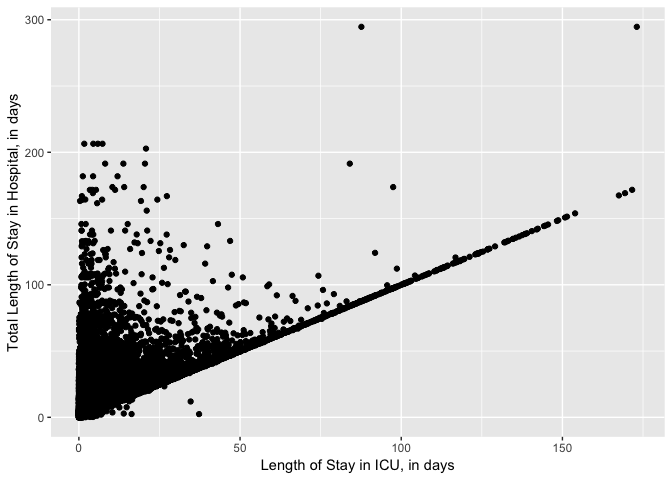
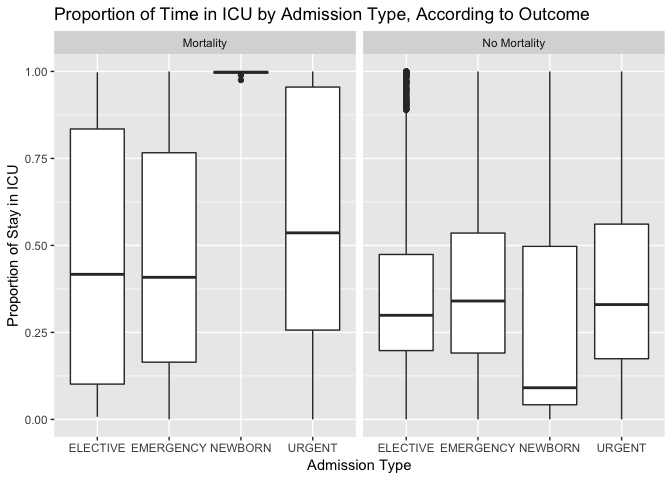

Influential Factors in Critical Care Patients
================

| Group Members   | UNI     |
|-----------------|---------|
| Samantha Brown  | slb2240 |
| Laura Cosgrove  | lec2197 |
| Francis Z. Fang | zf2211  |

### Introduction

Critical care involves the specialized treatment of patients whose conditions pose life-threatening risks and require around-the-clock care. Critical care treatment typically takes place in an intensive care unit (ICU) of a hospital. Due to the nature of critical care, many patients eventually recover, but some die. For the purpose of this project, we seek to explore factors that influence critical care patients.

### Motivation and Related Work

Previous research has focused on the physiological- and disease-driven factors that influence critical care. In this report, we consider whether demographic characteristics of patients in critical care influence outcomes such as mortality and length of hospital stay.

Related work includes MIT Computational Lab's 2015 research publication titled *"Mortality prediction in the ICU: can we do better? Results from the Super ICU Learner Algorithm (SICULA) project, a population-based study"*, which considers whether a machine learning technique can help predict mortality for patients in critical care. This publication considers MIMIC, an openly accessible critical care database created by the MIT Lab for Computational Physiology. With the goal of engaging in open research by reproducing an analysis, this project works to understand and analyze the MIMIC database. MIMIC will be described further in the Data Collection section of the report.

Data Collection
---------------

The MIMIC database comprises deidentified health-related data associated with over forty thousand patients who stayed in critical care units of the Beth Israel Deaconess Medical Center between 2001 and 2012. It includes the following information: demographics, vital sign measurements made at the bedside (~1 data point per hour), laboratory test results, procedures, medications, caregiver notes, imaging reports, and mortality (both in and out of hospital). After completing the CITI “Data or Specimens Only Research” training course, PhysioNet granted us access to the MIMIC database.

The next step was to follow the MIMIC website's open tutorial to install MIMIC in a local Postgres database. We referenced the public Github MIMIC-code repository for MIT Lab for Computational Physiology (<https://github.com/MIT-LCP/mimic-code/tree/master/buildmimic>) as a guide. The MIT researchers who built the MIMIC database also built this repository with the goal of sharing how they performed the technical analysis described in their published literature. Given the time constraints of this project, we were limited to how much we could understand how to make use of the MIMIC data on our own. Therefore, MIT's Lab for Computational Physiology Github repository served as the most productive and efficient way for us to understand and analyze the MIMIC database.

From this database query, we were able to gain a clean table of demographic data for all patients who were in the ICU. Using the query, we performed exploratory analysis on the Admissions data from MIMIC. This gave us patient admit time and discharge time, along with several other demographic variables. However we wanted to dig deeper into the relationship between length of total stay in the hospital, length of stay in the ICU, and proportion of mortalities to try to predict the probability of death. This led us to focus a portion of our analysis on patient severity scores. These scores represent aggregate indices of a patient's condition when they arrive at the ICU. Ultimately we found that the SAPS-II severity score performs best. Using the SAPS-II scores, we ran a regression to obtain the probability of patient mortality. This data collection process allowed us to perform a comprehensive analysis on the MIMIC data.

**@LAURA -- Here, let's describe the process of simplifying diagnoses**

Initial Questions
-----------------

Our analysis is centered around the question of which factors affect patient mortality. From previous research, prior to the project we understood and recognized the signficant role that physiological factors play in determining the probability of death in a patient. However, we wanted to explore the question: do demographic characteristics help to predict patient mortality? And how strong is their influence of this prediction? For example, does the health insurance coverage of a patient play a part in mortality, beyond basic diagnostic factors? Additionally, we wished to consider whether length of patient hospital stay is associated with the patient's demographic characteristics. More specifically, which demographic factors influence patient length of stay? **Finally, we hoped to determine whether length of patient hospital stay is associated with patient mortality. For this question, we examined both patients' total hospital stay and patients' stay in the ICU. (IS THIS RIGHT?)** Our work to explore these questions is detailed later on in the Exploratory Analysis and Additional Analysis sections.

Exploratory Analysis
--------------------

The raw admissions dataset consists of 58976 observations of the following 19 variables:

-   Row ID
-   Subject ID
-   HADM ID (hospital admission ID)
-   Admit time
-   Discharge time
-   Death time
-   Admission type
-   Admission location
-   Discharge location
-   Insurance
-   Language
-   Religion
-   Marital status
-   Ethnicity
-   ED reg time
-   ED out time
-   Diagnosis
-   Hospital expire flag
-   Has chart events

**Initial exploration**

-   71.34% of patients admitted were classified as emergencies, while 13.33% were newborns and 13.07% were elective. The remaining 2.26% were classified as urgent.

-   47.84% of patients had Medicare, while 38.29% had private insurance and 9.81% had Medicaid. The remaining patients either were insured by the government or paid out of pocket.

-   41.1% of the critical care patients were married, 22.47% of patients were single, 12.23% were widowed and 5.45% were divorced. The remaining 18.75% were either separated, with a life partner, or marital status was unknown.

-   42.95% of the patients were missing data entries for language. Of the patients that did have language entries, 49.32% of them spoke English.

-   90.07% of patients were ultimately discharged. The remaining 9.93% were recorded as patient deaths.

-   On average, patients remained in the ICU for 4.94 days and patients remained in the hospital for 11.34 days. Both length distributions are right-skewed.

Next, we considered the association between length of total hospital stay and length of time in the ICU. As expected, we saw a positive relationship between length of total hospital stay and length of time in the ICU. However, we were surprised to see that a portion of the patients had nearly exactly proportional length of ICU stay to length of total hospital stay. In context, this means that the entirety of these patients' hospital stays were inside the ICU. There are two notable recorded points in which length of ICU stay is greater than the length of total hospital stay; this is impossible and suggest the existence of flaws in the dataset. These results are illustrated below:

We considered whether this nearly exactly proportional relationship would be different if we filtered out newborns from the data. Subsequently, we removed newborns replotted the graph above. The resulting relationship between length of total hospital stay vs. length of stay in the ICU showed to be about the same. Therefore, we concluded that newborns did not significantly influence the overall association between length of total hospital stay and length of ICU stay.

Then, we calculated the ratio of length of ICU stay to length of total hospital stay. We found that there were proportions that were greater than 1, which is further evidence that possible flaws exist within the data. While we recognize the importance of noting and acknowledging these potential errors, for the purpose of this project we filtered out the proportions greater than one.

Next, we considered the relationship between patient demographic characteristics and this proportion. The proportion of length of ICU stay to length of total hospital stay did not show any notable results when considering insurance type, ethnicity, or marital status. However, we found an interesting association between this proportion and patient admission type, specifically according to mortality outcome. Our analysis indicated that unfortunately, nearly all newborns who spent the entirety of the their hospital stay in the ICU resulted in mortalities. In contrast, approximately 75% newborns who were eventually discharged had proportions of ICU stays less than or equal to 0.5. These results are depicted below:

**Include top 10 diagnoses associated with death**

Additional Analysis
-------------------

Discussion
----------

We were very ambitious and there were some limitations to using such an ambitious dataset. For example, ...

Conclusion
----------
