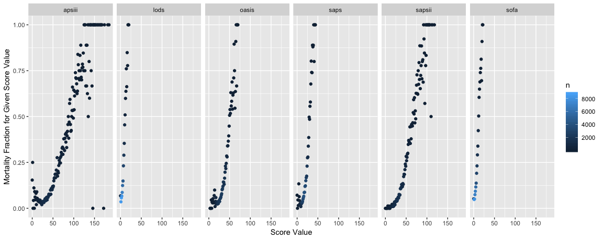
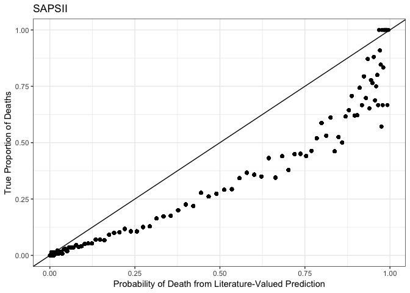
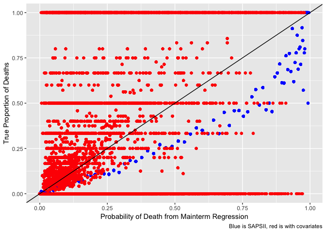
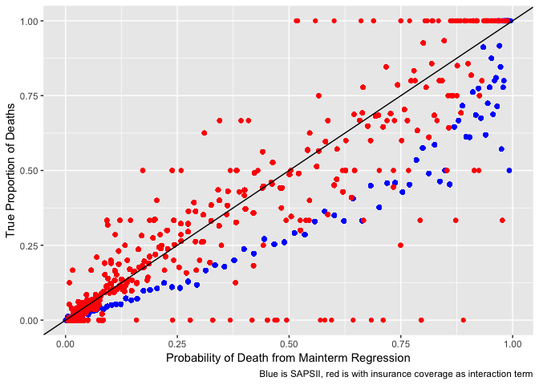

Influential Factors in Critical Care Patients
================

-   [Introduction](#introduction)
-   [Motivation and Related Work](#motivation-and-related-work)
-   [Data Collection](#data-collection)
    -   [Using SQL in RMarkdown](#using-sql-in-rmarkdown)
-   [Initial Questions](#initial-questions)
-   [Exploratory Analysis](#exploratory-analysis)
-   [Additional Analysis](#additional-analysis)
    -   [Database Setup](#database-setup)
    -   [Motivation for Additional Analysis](#motivation-for-additional-analysis)
    -   [Generating Views](#generating-views)
    -   [Visualize how fractions of death increase](#visualize-how-fractions-of-death-increase)
    -   [Other severity scores](#other-severity-scores)
    -   [Analysis with admissions data](#analysis-with-admissions-data)
    -   [Validation of Predictive Ability](#validation-of-predictive-ability)
    -   [SOFA Score](#sofa-score)
    -   [Map for all Scores](#map-for-all-scores)
    -   [Area under ROC curves](#area-under-roc-curves)
    -   [Adding other predictors to our model](#adding-other-predictors-to-our-model)
    -   [Testing original hypothesis](#testing-original-hypothesis)
-   [Discussion](#discussion)
-   [Conclusion](#conclusion)

| Group Members   | UNI     |
|-----------------|---------|
| Samantha Brown  | slb2240 |
| Laura Cosgrove  | lec2197 |
| Francis Z. Fang | zf2211  |

### Introduction

Millions of data points are collected every second in hospitals and health systems across the U.S., providing a deep well of individual-level data about the course of a person's care. Historically, much of these data are stored in aging EHR and medical device lexicons and siloed on private servers; little of it is shared with the research community. The [MIMIC Critical Care Database](https://mimic.physionet.org/), developed in 2015 by the MIT Lab for Computational Physiology is a unique opportunity for researchers and data scientists to engage with this kind of patient data. Instructions about gaining access to MIMIC are [here](https://mimic.physionet.org/gettingstarted/access/), along with richer background information about the open research exchange.

Critical care involves the specialized treatment of patients whose conditions pose life-threatening risks and require around-the-clock care. Critical care treatment typically takes place in an intensive care unit (ICU) of a hospital. Due to the nature of critical care, many patients eventually recover, but some die.

This project aims to visualize the predictive capability of five physiologic severity scores computed from first-day stays in the ICU, and to determine whether covariate demographic factors affect mortality outcomes. More loosely, we hoped to explore our capability to reproduce analyses in an open research community and find new ways to understand the data through interactive visualization.

### Motivation and Related Work

Previous research with MIMIC has focused primarily on the physiological- and disease-driven factors that influence critical care. In this report, we aimed to consider whether demographic characteristics of patients in critical care influence mortality outcomes.

This project could not have been completed without, of course, the MIT Lab for Computational Physiology's [MIMIC open code repository](https://github.com/MIT-LCP/mimic-code) and Pirracchio et al.'s [2014 research paper](https://www.ncbi.nlm.nih.gov/pmc/articles/PMC4321691/) on mortality prediction in the ICU. In this work, the authors describe development of SICULA, a super-learner algorithm trained on the MIMIC data. Our aim was to reproduce their benchmark analyses of the known severity scores for mortality prediction, which make use, primarily, of physiologic data from a patient's first stay in the ICU.

Data Collection
---------------

The MIMIC database comprises deidentified health-related data associated with over forty thousand patients who stayed in critical care units of the Beth Israel Deaconess Medical Center between 2001 and 2012. It includes the following information: demographics, vital sign measurements made at the bedside (~1 data point per hour), laboratory test results, procedures, medications, caregiver notes, imaging reports, and mortality (both in and out of hospital). After completing the CITI “Data or Specimens Only Research” training course, PhysioNet granted us access to the MIMIC database.

Following access, downloading the data is straightforward to do either using command-line tools or through the browser interface. The full MIMIC dataset consists of 26 datasheets, linked across topics or data inputs by unique keys (usually subject\_id, hadm\_id, or icustay\_id). The datasheets range in size from manageable to process in R (e.g. ~1 MB, admissions data) to impossible to use in R without running out of memory (e.g. 7.5 MB, procedure events data).

To work with large data in an independent project, it's efficient to use SQL queries. As soon as we decided that we wanted to explore physiologic data, which were located in datasheets from ~5MB to 1 GB in size, it became clear that we needed to build a local database for which we could make use of the MIT open code repository's public SQL queries that create useful views into data we would need in order to fill our goal in reproducing the mortality prediction analysis. There are many great tutorials on how to build a local Postgres database, and I followed the one published by MIMIC: the MIT researchers who built the MIMIC database also built this repository with the goal of sharing how they performed the technical analysis described in their published literature. Given the time constraints of this project, we were limited to how much we could understand how to make use of the physiologic data on our own. Therefore, MIT's Lab for Computational Physiology Github repository served as the most productive and efficient way for us to understand and analyze the MIMIC database. Following that, though, I had to troubleshoot how to integrate SQL in an R workflow. I'm going to go into some detail of how to use Postgres with RMarkdown in hopes that it will prove useful.

### Using SQL in RMarkdown

The below chunk loads your configuration settings.

``` r
# Load configuration settings
dbdriver <- 'PostgreSQL'
host  <- '127.0.0.1'
port  <- '5432'
user  <- 'postgres'
password <- 'postgres'
dbname <- 'mimic'
schema <- 'mimiciii'
# Connect to the database using the configuration settings
con <- dbConnect(dbDriver(dbdriver), dbname = dbname, host = host, port = port, 
                 user = user, password = password)
# Set the default schema
dbExecute(con, paste("SET search_path TO ", schema, sep=" "))
```

Set this database as the connection for all future sql chunks:

``` r
knitr::opts_chunk$set(connection = "con")
```

The above chunk is useful if you use knitr to generate the query by including an SQL chunk in your R Markdown. Similar to building websites, it would be necessary to "knit" in order to execute the query. For this project, I decided instead to primarily use `read_file` in order to save SQL queries as a character object then using `dbGetQuery`.

``` r
sample_view <- read_file("./database/sample.sql")

#Generate materialized views
dbGetQuery(con, sample_view)
```

The above chunk generates a "materialized view" in your Postgres database, meaning the data is sitting in your database in the right format (specified by your SQL file): you just need to grab it, by selecting all (\*) from the name of your materialized view. It's easiest to generate that in a `tidyverse` workflow by saving a query as a character object, then saving the output of your query as a tibble:

``` r
#View sapsii_data
sample_query <- "SELECT *
              FROM sample i;"
sample_data <- as.tibble(dbGetQuery(con, sample_query))
```

The final step is to write a .csv to share with your group members.

``` r
write_csv(sample_data, path = "./database/sample.csv")
```

Examples of real code I used in the analysis can be seen in our [github](https://github.com/lauracosgrove/p8105_final-project) repository.

From database queries, we were able to gain a few interesting views of the data. First, we were able to use SQL to pre-process timestamp data, which proved essential as we ran into issues with R's interpretation of the timestamps. Using the length of care query, we performed exploratory analysis on the Admissions data from MIMIC. After initial exploration of demographic variables' association in mortality, we wanted to compare our predictions with predictions made from physiologic data. This led us to focus a portion of our analysis on patient severity scores. These scores represent aggregate indices of a patient's condition when they arrive at the ICU. Ultimately, we found that the SAPS-II severity score performs best. Using the SAPS-II scores, we ran a regression to obtain the probability of patient mortality. This data collection process allowed us to perform a comprehensive analysis on the MIMIC data.

We also used AHRQ's ICD code classification system to generate high-level classification of diagnosis for later manipulation in our interactive [Shiny webapp](https://mimicroc.shinyapps.io/severity-scores-analysis). The R code contained in diagnostic\_cat.Rmd in our project fo makes use of the Clinical Classification Software (CCS), which categorizes ICD-9 coded diagnoses into clinically meaningful groups. The categorization was developed by the Agency for Healthcare Research and Quality (AHRQ). More detail can be found on the AHRQ website: <https://www.hcup-us.ahrq.gov/tools_software.jsp>. This software contains two tables: `ccs_single_level_dx.csv.gz` and `ccs_multi_level_dx.csv.gz`. The first table contains high-level diagnostic category infomation, while the multi-level diagnostic category information contains four levels of diagnostic detail. The purpose of reading in AHRQ's clinical categories is to help make diagnosis descriptions for our data more intuitive.

Initial Questions
-----------------

Our analysis is centered around the question of which factors affect patient mortality. From previous research, prior to the project we understood and recognized the signficant role that physiological factors play in determining the probability of death in a patient. However, we wanted to explore the question: do demographic characteristics help to predict patient mortality? And how strong is their influence of this prediction? For example, does the health insurance coverage of a patient play a part in mortality, beyond basic diagnostic factors? Additionally, we wished to consider whether length of patient hospital stay is associated with the patient's demographic characteristics. More specifically, which of these demographic factors influence patient length of stay? Our work to explore these questions is detailed later on in the Exploratory Analysis and Additional Analysis sections.

Exploratory Analysis
--------------------

The raw admissions dataset consists of 58976 observations of the following 19 variables:

-   Row ID
-   Subject ID
-   HADM ID (hospital admission ID)
-   Admit time
-   Discharge time
-   Death time
-   Admission type
-   Admission location
-   Discharge location
-   Insurance
-   Language
-   Religion
-   Marital status
-   Ethnicity
-   ED reg time
-   ED out time
-   Diagnosis
-   Hospital expire flag
-   Has chart events

**Initial exploration**

-   71.34% of patients admitted were classified as emergencies, while 13.33% were newborns and 13.07% were elective. The remaining 2.26% were classified as urgent.

-   47.84% of patients had Medicare, while 38.29% had private insurance and 9.81% had Medicaid. The remaining patients either were insured by the government or paid out of pocket.

-   41.1% of the critical care patients were married, 22.47% of patients were single, 12.23% were widowed and 5.45% were divorced. The remaining 18.75% were either separated, with a life partner, or marital status was unknown.

-   42.95% of the patients were missing data entries for language. Of the patients that did have language entries, 49.32% of them spoke English.

-   90.07% of patients were ultimately discharged. The remaining 9.93% were recorded as patient deaths.

-   On average, patients remained in the ICU for 4.94 days and patients remained in the hospital for 11.34 days. Both length distributions are right-skewed.

Next, we considered the association between length of total hospital stay and length of time in the ICU.As expected, we saw a positive relationship between length of total hospital stay and length of time in the ICU. However, we were surprised to see that a portion of the patients had nearly exactly proportional length of ICU stay to length of total hospital stay. In context, this means that the entirety of these patients' hospital stays were inside the ICU. There are two notable recorded points in which length of ICU stay is greater than the length of total hospital stay; this is impossible and suggest the existence of flaws in the dataset. These results are illustrated below:


We considered whether this nearly exactly proportional relationship would be different if we filtered out newborns from the data. Subsequently, we removed newborns replotted the graph above. The resulting relationship between length of total hospital stay vs. length of stay in the ICU showed to be about the same. Therefore, we concluded that newborns did not significantly influence the overall association between length of total hospital stay and length of ICU stay.

Then, we calculated the ratio of length of ICU stay to length of total hospital stay. We found that there were proportions that were greater than 1, which is further evidence that possible flaws exist within the data. While we recognize the importance of noting and acknowledging these potential errors, for the purpose of this project we filtered out the proportions greater than one.

Next, we considered the relationship between patient demographic characteristics and this proportion. The proportion of length of ICU stay to length of total hospital stay did not show any notable results when considering insurance type, ethnicity, or marital status. However, we found an interesting association between this proportion and patient admission type, specifically according to mortality outcome. Our analysis indicated that unfortunately, nearly all newborns who spent the entirety of the their hospital stay in the ICU resulted in mortalities. In contrast, approximately 75% newborns who were eventually discharged had proportions of ICU stays less than or equal to 0.5. These results are depicted below:


From a .csv generated with code in `diagnostic_cat.Rmd`, the top 50 most common and most deadly diagnoses can be materialized with:

    ## Parsed with column specification:
    ## cols(
    ##   hadm_id = col_integer(),
    ##   death_bin = col_integer(),
    ##   admit_diagnosis = col_character(),
    ##   icd9_code = col_character(),
    ##   short_title = col_character(),
    ##   category = col_character()
    ## )

    ## Selecting by n

| Diagnostic Category: Most Commonly Diagnosed         |  pct\_deaths|      n|
|:-----------------------------------------------------|------------:|------:|
| Coronary atherosclerosis and other heart disease     |        0.084|  27196|
| Essential hypertension                               |        0.097|  21157|
| Congestive heart failure; nonhypertensive            |        0.131|  21113|
| Cardiac dysrhythmias                                 |        0.140|  19683|
| Fluid and electrolyte disorders                      |        0.185|  18645|
| Complications of surgical procedures or medical care |        0.103|  15323|

| Diagnostic Category: Highest Rate of Fatalities  |  pct\_deaths|     n|
|:-------------------------------------------------|------------:|-----:|
| Cardiac arrest and ventricular fibrillation      |        0.478|  1933|
| Cystic fibrosis                                  |        0.400|     5|
| Shock                                            |        0.388|  4468|
| Coma; stupor; and brain damage                   |        0.347|  1202|
| Cancer of other male genital organs              |        0.333|    15|
| Malignant neoplasm without specification of site |        0.330|   188|

Additional Analysis
-------------------

It's necessary to have a working copy of a Postgres MIMIC database in order to execute the additional analysis. The working code is reproduced here:

### Database Setup

``` r
# Load configuration settings
dbdriver <- 'PostgreSQL'
host  <- '127.0.0.1'
port  <- '5432'
user  <- 'postgres'
password <- 'postgres'
dbname <- 'mimic'
schema <- 'mimiciii'
# Connect to the database using the configuration settings
con <- dbConnect(dbDriver(dbdriver), dbname = dbname, host = host, port = port, 
                 user = user, password = password)
# Set the default schema
dbExecute(con, paste("SET search_path TO ", schema, sep=" "))
```

    ## [1] 0

### Motivation for Additional Analysis

The purpose for this portion of the report is to leverage the physiologic data from the EMR in order to estimate likelihood of in-hospital death using severity scores pre-determined in the literature as being a useful proxy for likeliood of mortality. One of these severity scores, or a combination of the scores, will provide us with our base model, after which we will explore whether a model additionally considering factors like insurance coverage, gender, and ethnicity will improve the fit in any meaningful way.

### Generating Views

We will make use of the local Postgres database and the publicly-accessible [https://github.com/MIT-LCP/mimic-code](MIMIC%20code%20repository) from the MIT Computational Physiology lab to make use of biological data in order to obtain computational physiology severity scores.

We need to generate some views into the database before the query to generate the severity scores:

-   uofirstday - generated by urine-output-first-day.sql. This draws from the "outputevents" table measured from CareVue, an ICU vitals monitoring device, to obtain total urine output for the first day in the ICU.

-   ventdurations - generated by ventilation-durations.sql. This is the total time a patient spends on airway ventilation.

-   vitalsfirstday - generated by vitals-first-day.sql. This contains queries for a number of summary vitals scores, including heart rate, blood pressure, respiration rate, and temperature.

-   gcsfirstday - generated by gcs-first-day.sql. This is a measure of a patient's verbal, motor, and eye opening response.

-   labsfirstday - generated by labs-first-day.sql. This creates a number of scores related to (blood) lab tests taken in the first day, including creatinine levels, white blood cell count, and platelet count.

-   bloodgasarterialfirstday - generated by blood-gas-first-day-arterial.sql. This is a query that computes a common Arterial Blood Gas test from device (Carevue) monitoring records. This measures oxygen and carbon dioxide levels in blood and serves as an indicator of health.

``` r
urine_view <- read_file("./database/mimic-code/concepts/firstday/urine-output-first-day.sql")
ventdurations_view <- read_file("./database/mimic-code/concepts/durations/ventilation-durations.sql")
vitals_view <- read_file("./database/mimic-code/concepts/firstday/vitals-first-day.sql")
gcs_view <- read_file("./database/mimic-code/concepts/firstday/gcs-first-day.sql")
labs_view <- read_file("./database/mimic-code/concepts/firstday/labs-first-day.sql")
bloodgasarterial_view <- read_file("./database/mimic-code/concepts/firstday/blood-gas-first-day-arterial.sql")
sapsii_view <- read_file("./database/mimic-code/concepts/severityscores/sapsii.sql")
#Generate materialized views
dbGetQuery(con, urine_view)
dbGetQuery(con, ventdurations_view)
dbGetQuery(con, vitals_view)
dbGetQuery(con, gcs_view)
dbGetQuery(con, labs_view)
dbGetQuery(con, bloodgasarterial_view)
dbGetQuery(con, sapsii_view)
```

A note in the SQL file is the following:

Note:

-   The score is calculated for *all* ICU patients, with the assumption that the user will subselect appropriate ICUSTAY\_IDs.

-   For example, the score is calculated for neonates, but it is likely inappropriate to actually use the score values for these patients.

### Visualize how fractions of death increase

For a quick validation, we'll visualize how the fractions of deaths increase for the SAPSII scores.


We see that more patients fall into the mid-range for SAPS II scores, and that the mortality fraction for a given SAPSII score shows an exponential increase with a unit increase in SAPSII score.

### Other severity scores

(Note: must run document once before knitting, but eval is set to false so the views aren't re-loaded every time you knit.)

``` r
sofa_view <- read_file("./database/mimic-code/concepts/severityscores/sofa.sql")
lods_view <- read_file("./database/mimic-code/concepts/severityscores/lods.sql")
saps_view <- read_file("./database/mimic-code/concepts/severityscores/saps.sql")
apsiii_view <- read_file("./database/mimic-code/concepts/severityscores/apsiii.sql")
oasis_view <- read_file("./database/mimic-code/concepts/severityscores/oasis.sql")
#SOFA needs echo data 
echodata_view <- read_file("./database/mimic-code/concepts/echo-data.sql")
dbGetQuery(con, echodata_view)
dbGetQuery(con, sofa_view)
#LODS
dbGetQuery(con, lods_view)
#SAPS needs ventilated first day
ventfirstday_view <- read_file("./database/mimic-code/concepts/firstday/ventilation-first-day.sql")
dbGetQuery(con, ventfirstday_view)
dbGetQuery(con, saps_view)
# APSIII  
dbGetQuery(con, apsiii_view)
# OASIS  
dbGetQuery(con, oasis_view)
```

As before, read all the data from the generated materialized views into tibbles:

### Analysis with admissions data

``` r
#ICU detail is demographic data with length of stay: an improved version of the admssions dataset
icu_detail <- read_csv("./database/icu_detail.csv") %>% 
  janitor::clean_names()
predictor_detail_data <- icu_detail %>% 
  inner_join(., sapsii_data, by = "hadm_id") %>% 
  inner_join(., sofa_data, by = "hadm_id") %>% 
  inner_join(., lods_data, by = "hadm_id") %>% 
  inner_join(., saps_data, by = "hadm_id") %>% 
  inner_join(., apsiii_data, by = "hadm_id") %>% 
  inner_join(., oasis_data, by = "hadm_id") %>% 
  select(hadm_id, subject_id, icustay_id, gender, ethnicity, admission_type, admission_age, los_hospital, los_icu, dod, hospital_expire_flag.y, hospstay_seq, first_hosp_stay, icustay_seq, first_icu_stay, sapsii, sofa, lods, saps, apsiii, oasis, respiration, coagulation, liver, cardiovascular.y, cns, renal.y, ends_with("score")) %>% 
  rename(death_bin = hospital_expire_flag.y) %>% 
    filter(admission_type != "NEWBORN")
write_csv(predictor_detail_data, "./database/predictor_detail_data.csv")
#Correlation of aggregate scores for distinct ICU stays (to remove confusion due to readmission)
predictor_detail_data %>% 
  distinct(icustay_id, .keep_all = TRUE) %>% 
  select(sapsii:oasis) %>% 
  cor()
```

    ##           sapsii      sofa      lods      saps    apsiii     oasis
    ## sapsii 1.0000000 0.6838641 0.8021351 0.7417353 0.7558680 0.6600098
    ## sofa   0.6838641 1.0000000 0.7351709 0.5986570 0.7025452 0.4945946
    ## lods   0.8021351 0.7351709 1.0000000 0.6846753 0.7509069 0.5936155
    ## saps   0.7417353 0.5986570 0.6846753 1.0000000 0.6562129 0.6457071
    ## apsiii 0.7558680 0.7025452 0.7509069 0.6562129 1.0000000 0.5838826
    ## oasis  0.6600098 0.4945946 0.5936155 0.6457071 0.5838826 1.0000000

The physiologic scores show correlation between one another, which is intuitive.



All scores show a exponential association with the mortality fraction, which indicates promising predictive power. APSIII and SAPSII have a ceiling effect for very high scores, at which their mortality fraction hits 100%. For APSII, we could consider recommending that a score over 125 should be of extreme concern. APSII has a poor fit at the low range of scores, however, while SAPSII appears to acheive a good fit on the low-risk range. OASIS and SAPS seem to have a dense grouping around very low scores with high variability, indicating a poor fit in that range. SOFA and LODS have a smaller scale than other scores, with a more discrete distribution, and acheive a nearly linear fit with mortality fraction.

### Validation of Predictive Ability

It's good just as a quick gut check to see how fraction of deaths increase over the distributions of the various severity scores. But how do the scores perform based on their original authored likelihoods or in terms of discriminative and predictive ability?

#### SAPS II

We'll start with the SAPSII score.

Individual mortality prediction for the SAPS II score is defined by its authors to be:

log(\[pr(death)\]\[1 - pr(death)\]) = -7.7631 + 0.07237*SAPSII + 0.9971*log(1 + SAPSII)

A mortality prediction algorithm is said to have adequate discrimination if it tends to assign higher severity scores to patients that died in the hospital compared to those that did not. To evaluate discrimination, we'll visualize the probability of death as predicted by the SAPSII score versus the actual proportion of patients who died with that SAPSII score.

Because I suspect I may want the information to do subgroup analyses, I'm going to start by using the large datasheet from the `predictor_detail_data`.



We see that the SAPSII predicted values from the authored regression is more aggressive in assigning likelihood of mortaility, based on the observed true mortality fraction from those patients with the SAPSII score. Although the authors of the SAPS score publish a non-linear in parameters regression for association with likelihood of death, I'll fit a main-term logistic regression to obtain mortality prediction based on a linear-in-parameters assumption.

    ## # A tibble: 2 x 5
    ##   term        estimate std.error statistic p.value
    ##   <chr>          <dbl>     <dbl>     <dbl>   <dbl>
    ## 1 (Intercept)  -5.22     0.0489     -107.        0
    ## 2 sapsii        0.0803   0.00104      77.0       0

    ## # A tibble: 2 x 7
    ##   term        estimate std.error statistic p.value conf.low conf.high
    ##   <chr>          <dbl>     <dbl>     <dbl>   <dbl>    <dbl>     <dbl>
    ## 1 (Intercept)  0.00541   0.0489     -107.        0  0.00491   0.00595
    ## 2 sapsii       1.08      0.00104      77.0       0  1.08      1.09

The regression fits a parameter estimate of log(\[pr(death)\]\[1 - pr(death)\]) = -5.22 + 0.0803\*SAPSII; or, for every unit increase in SAPSII score, you can expect to have 1.08x the odds of death.

I'll refit the plot based on the mainterm regression:


We see a better fit with the mainterm logistic regression, which makes sense given that the literature value was an externally-generated prediction, while our regression is internally-generated. Keep that caveat in mind as we continue with algorithm comparison for other scores, because no direct external value exists for predictive capability of the other severity scores; rather, they're used in practive as clinical decision support rather than giving probability determination.

### SOFA Score

Authors of the SOFA score do not publish a base probability calculation for likelihood of death, so I'll use a main-term logistic regression to obtain mortality prediction based on the SOFA score.

    ## # A tibble: 2 x 5
    ##   term        estimate std.error statistic p.value
    ##   <chr>          <dbl>     <dbl>     <dbl>   <dbl>
    ## 1 (Intercept)   -3.36    0.0280     -120.        0
    ## 2 sofa           0.273   0.00409      66.7       0

    ## # A tibble: 2 x 7
    ##   term        estimate std.error statistic p.value conf.low conf.high
    ##   <chr>          <dbl>     <dbl>     <dbl>   <dbl>    <dbl>     <dbl>
    ## 1 (Intercept)   0.0347   0.0280     -120.        0   0.0328    0.0366
    ## 2 sofa          1.31     0.00409      66.7       0   1.30      1.32

The regression fits a parameter estimate of log(\[pr(death)\]\[1 - pr(death)\]) = -3.36 + 0.273\*SOFA; for every unit increase in SOFA score, you can expect to have 1.31x the odds of death.

This regression obtains a good fit, which makes sense because the probability was obtained from our data rather than a literature value.

### Map for all Scores

Taking lessons from the above methods, we can use a `map` operation with some tidying of our original data to speed up the generation of the predicted probabilities of each score.

| score  | term         |    estimate|  std.error|   statistic|  p.value|
|:-------|:-------------|-----------:|----------:|-----------:|--------:|
| sapsii | (Intercept)  |  -5.2192420|  0.0488676|  -106.80368|        0|
| sapsii | score\_value |   0.0802632|  0.0010430|    76.95157|        0|
| sofa   | (Intercept)  |  -3.3612355|  0.0280183|  -119.96578|        0|
| sofa   | score\_value |   0.2729313|  0.0040941|    66.66408|        0|
| lods   | (Intercept)  |  -3.5465359|  0.0301791|  -117.51615|        0|
| lods   | score\_value |   0.3235153|  0.0047330|    68.35295|        0|
| apsiii | (Intercept)  |  -4.4522295|  0.0400586|  -111.14294|        0|
| apsiii | score\_value |   0.0494333|  0.0006722|    73.53993|        0|
| oasis  | (Intercept)  |  -5.8499849|  0.0624610|   -93.65818|        0|
| oasis  | score\_value |   0.1129726|  0.0016420|    68.80387|        0|

All severity scores are significant predictors. We'll need to impute a special result for SAPSII following this code, because we're taking the literature value:

``` r
score_data_tidy <- predictor_detail_data_tidy %>% 
  select(score, death_bin, score_value) %>% 
  group_by(score) %>% 
  nest() %>% 
  mutate(glm = map(data, ~glm(death_bin ~ score_value, family = binomial, data = .))) %>% 
  mutate(glm_coef = map(glm, broom::tidy)) %>% 
  mutate(predictions = map2(data, glm, modelr::add_predictions)) %>% 
  select(score, predictions) %>% 
  unnest() %>% 
  mutate(prob_death = exp(pred)/(1 + exp(pred))) %>% 
  mutate(prob_death = if_else(score == "sapsii", 
                              exp(-7.7631 + 0.07237*score_value + 0.9971*log(1 + score_value))/(1 + exp(-7.7631 +  0.07237*score_value + 0.9971*log(1 + score_value))), 
                              prob_death))
```


Above, we've plotted the true, observed proportion of deaths for each score value versus the probability of death predicted from mainterm regression (or, in the SAPSII case, a literature value) for each severity score. Each point is a particular score value for a patient -- i.e., there are 5x the numbers of ICU patients plotted.

There's some interesting data here! As expected, the SAPSII test, being from a literature value, is further under the equality line for most scores. This means that the external, literature value is more aggressive in estimating probability of death for patients, compared ot probabilities imputed from regression on our data. This could be because the care at Beth Israel Deaconness is unusually good, or it could be because it is clinically useful that a classification algorithm be a bit more aggressive in estimating severity.

Another interesting finding is that some severity scores "silo" near probabilities 1 and 0. This could mean that there needs to be an adjustment in the range of the severity scores.

### Area under ROC curves

To plot the area under the curve for the SAPSII and SOFA scores, I need to calculate the respective TPR and FPR for each score. I'll use the literature value for the SAPSII score.

``` r
for_roc <- score_data_tidy %>% 
  select(score, death_bin, prob_death) %>% 
  group_by(score) %>% 
  nest()
###############ROC AUC Functions#############################
#This code could be improved with a better function.
roc_log_fcn <- function(result, y_prob){
  probs <- seq(0,1, by = 0.005)
  roc_log <- matrix(0, nrow = length(probs), ncol=2)
  i <- 1
  for(p in probs){
    pred <- y_prob > p
    ##False positive rate
    FPR <- sum(!result & pred)/sum(!result)
    ##True positive rate
    TPR <- sum(result & pred)/sum(result)
    roc_log[i,] <- c(FPR, TPR)
    i <- i + 1
  }
  return(roc_log)
}
#SAPSII
sapsii_for_roc <- for_roc %>% 
  filter(score == "sapsii") %>% 
  unnest() 
roc_log_sapsii <- roc_log_fcn(sapsii_for_roc$death_bin, sapsii_for_roc$prob_death)
#SOFA
sofa_for_roc <- for_roc %>% 
  filter(score == "sofa") %>% 
  unnest() 
roc_log_sofa <- roc_log_fcn(sofa_for_roc$death_bin, sofa_for_roc$prob_death)
#LODS
lods_for_roc <- for_roc %>% 
  filter(score == "lods") %>% 
  unnest() 
roc_log_lods <- roc_log_fcn(lods_for_roc$death_bin, lods_for_roc$prob_death)
#APSIII
apsiii_for_roc <- for_roc %>% 
  filter(score == "apsiii") %>% 
  unnest() 
roc_log_apsiii <- roc_log_fcn(apsiii_for_roc$death_bin, apsiii_for_roc$prob_death)
#OASIS
oasis_for_roc <- for_roc %>% 
  filter(score == "oasis") %>% 
  unnest() 
roc_log_oasis <- roc_log_fcn(oasis_for_roc$death_bin, oasis_for_roc$prob_death)
tidy_for_roc <- tibble(FPR_sapsii = roc_log_sapsii[,1], TPR_sapsii = roc_log_sapsii[,2],
       FPR_sofa = roc_log_sofa[,1], TPR_sofa = roc_log_sofa[,2],
       FPR_lods = roc_log_lods[,1], TPR_lods = roc_log_lods[,2],
       FPR_apsiii = roc_log_apsiii[,1], TPR_apsiii = roc_log_apsiii[,2],
       FPR_oasis = roc_log_oasis[,1], TPR_oasis = roc_log_oasis[,2]) %>% 
  gather(key = score, value = FPR, starts_with("FPR")) %>% 
  gather(key = score2, value = TPR, starts_with("TPR")) %>% 
  mutate(score = if_else(score == "FPR_sapsii", 
                         #yes sapsii
                         if_else(score2 == "TPR_sapsii", "sapsii", "NA"),
                         #no sapsii 
                            (if_else(score == "FPR_sofa", 
                              # yes sofa 
                              if_else(score2 == "TPR_sofa", "sofa", "NA"), 
                              # no sofa
                              (if_else(score == "FPR_lods",
                              #yes lods
                                if_else(score2 == "TPR_lods", "lods", "NA"),
                              # no lods
                              (if_else(score == "FPR_apsiii",
                                if_else(score2 == "TPR_apsiii", "apsiii", "NA"), 
                              (if_else(score == "FPR_oasis", 
                                if_else(score2 == "TPR_oasis", "oasis", "NA"), "NA"
                              )))))))))
                         ) %>% 
  filter(score != "NA")
tidy_for_roc %>% 
  select(score, FPR, TPR) %>% 
  ggplot(aes(x = FPR, y = TPR, color = score)) +
  geom_point() +
  geom_step() +
  labs(title = "ROC Curves",
       x = "False Positive Rate",
       y = "True Positive Rate") +
  theme_bw() +
  scale_color_viridis_d()
```


SAPSII looks like the best-performing model, and let's confirm that with an AUROC analysis.

| score  |      AUROC|
|:-------|----------:|
| sapsii |  0.7952234|
| apsiii |  0.7651836|
| oasis  |  0.7505908|
| lods   |  0.7023117|
| sofa   |  0.6930094|

SAPSII is our winner in terms of AUROC.

### Adding other predictors to our model

The above analysis showed us that when considered severity scores computed from biomarkers, the best mortality algorithm as imputed by an AUROC analysis was the SAPSII score, taking the literature values for probability.

Can we improve upon this severity score by adding other predictors?

Our initial analysis showed that the best-fit logistic regression model for mortaility in terms of AIC included the following covariate terms from the admissions dataset: admission\_type, admission\_location, insurance, religion, marital\_status, and ethnicity.

``` r
predictor_detail_data <- predictor_detail_data %>% 
  distinct(icustay_id, .keep_all = TRUE) %>% 
#Need a couple more variables
  inner_join(admissions, by = "hadm_id") %>% 
  select(icustay_id, death_bin, sapsii, admission_type.x, admission_age, admission_location, insurance, religion, marital_status, ethnicity.x) %>% 
  rename(admission_type = admission_type.x, ethnicity = ethnicity.x) %>% 
  mutate(admission_type = factor(admission_type), admission_age = factor(admission_age), insurance = factor(insurance), religion = factor(religion), marital_status = factor(marital_status), ethnicity = factor(ethnicity))
#Removing missing values for effective comparison
predictor_detail_data <- predictor_detail_data %>% 
  drop_na()
fit_null <- predictor_detail_data %>% 
  glm(death_bin ~ sapsii, data = .) 
fit_alt <- predictor_detail_data %>% 
  glm(death_bin ~ sapsii + admission_type + admission_location + insurance + religion + marital_status + ethnicity, family = binomial, data = .) 
#Use anova to compare the null with the added predictors model
anova(fit_null, fit_alt)
```

    ## Analysis of Deviance Table
    ## 
    ## Model 1: death_bin ~ sapsii
    ## Model 2: death_bin ~ sapsii + admission_type + admission_location + insurance + 
    ##     religion + marital_status + ethnicity
    ##   Resid. Df Resid. Dev Df Deviance
    ## 1     50278     4389.2            
    ## 2     50199    28422.4 79   -24033

``` r
library(lmtest)
lrtest(fit_null, fit_alt)
```

    ## Likelihood ratio test
    ## 
    ## Model 1: death_bin ~ sapsii
    ## Model 2: death_bin ~ sapsii + admission_type + admission_location + insurance + 
    ##     religion + marital_status + ethnicity
    ##   #Df LogLik Df  Chisq Pr(>Chisq)    
    ## 1   3 -10042                         
    ## 2  81 -14211 78 8339.5  < 2.2e-16 ***
    ## ---
    ## Signif. codes:  0 '***' 0.001 '**' 0.01 '*' 0.05 '.' 0.1 ' ' 1

``` r
##Shows a significant increase in log-likelihood
```

Our tests show a significant increase in log-likelihood for the alternative, larger model.

We can calculate AUROC for our new model and compare against SAPSII. Note that we will be missing some values we previously had.



What a mess! This goes to show that something that looks promising from a model diagnostics perspective may, in fact, be more complex and far less predictive in terms of individual probability values.

Can we improve it by just adding one term? We sure added a lot in the beginning, and a large number of factors. We'll use the `caret` package to pick out the most promising variable:

``` r
head(caret::varImp(fit_alt))
```

    ##                                                 Overall
    ## sapsii                                      70.30796782
    ## admission_typeEMERGENCY                      6.55227777
    ## admission_typeURGENT                         4.58258971
    ## admission_locationCLINIC REFERRAL/PREMATURE  0.80154474
    ## admission_locationEMERGENCY ROOM ADMIT       0.67432013
    ## admission_locationHMO REFERRAL/SICK          0.01456729

``` r
#Admission type is the most important predictor
fit_alt_2 <- predictor_detail_data %>% 
  glm(death_bin ~ sapsii + admission_type, family = binomial, data = .) 
#Use anova to compare the null with the added predictors model
anova(fit_null, fit_alt_2)
```

    ## Analysis of Deviance Table
    ## 
    ## Model 1: death_bin ~ sapsii
    ## Model 2: death_bin ~ sapsii + admission_type
    ##   Resid. Df Resid. Dev Df Deviance
    ## 1     50278     4389.2            
    ## 2     50276    28875.5  2   -24486

``` r
library(lmtest)
lrtest(fit_null, fit_alt_2)
```

    ## Likelihood ratio test
    ## 
    ## Model 1: death_bin ~ sapsii
    ## Model 2: death_bin ~ sapsii + admission_type
    ##   #Df LogLik Df  Chisq Pr(>Chisq)    
    ## 1   3 -10042                         
    ## 2   4 -14438  1 8792.6  < 2.2e-16 ***
    ## ---
    ## Signif. codes:  0 '***' 0.001 '**' 0.01 '*' 0.05 '.' 0.1 ' ' 1

``` r
##Significant result for the fuller model
```


It looks like the algorithm with `admission_type` added as a covariate has far more variance on observed proportion of deaths for a given assigned probabiity of death.

### Testing original hypothesis

Finally, one of our original research questions was if insurance coverage could play a part in mortality, beyond basic diagnostic factors. For this, I'll enter insurance type into the model as an interaction term, because our hypothesis is that the type of insurance someone has could modify the effect of severity of disease by affecting the quality of care that is given.

``` r
fit_alt_3 <- predictor_detail_data %>% 
  glm(death_bin ~ sapsii + insurance:sapsii, family = binomial, data = .) 
#Use anova to compare the null with the added predictors model
anova(fit_null, fit_alt_3)
```

    ## Analysis of Deviance Table
    ## 
    ## Model 1: death_bin ~ sapsii
    ## Model 2: death_bin ~ sapsii + insurance:sapsii
    ##   Resid. Df Resid. Dev Df Deviance
    ## 1     50278     4389.2            
    ## 2     50274    29146.2  4   -24757

``` r
library(lmtest)
lrtest(fit_null, fit_alt_3)
```

    ## Likelihood ratio test
    ## 
    ## Model 1: death_bin ~ sapsii
    ## Model 2: death_bin ~ sapsii + insurance:sapsii
    ##   #Df LogLik Df  Chisq Pr(>Chisq)    
    ## 1   3 -10042                         
    ## 2   6 -14573  3 9063.2  < 2.2e-16 ***
    ## ---
    ## Signif. codes:  0 '***' 0.001 '**' 0.01 '*' 0.05 '.' 0.1 ' ' 1

``` r
##Another significant result
```


We see a significant result adding insurance coverage as an interaction term in favor of the full model, and we see a similar decreased biased (but increased variance) in the probability graph. For this hypothesis, I'll create an ROC curve.



| score                             |      AUROC|
|:----------------------------------|----------:|
| sapsii                            |  0.7952234|
| sapsii with insurance interaction |  0.8002027|

The AUROC values for the two models are surprisingly close, something that is not apparent when looking at the predicted probabilities versus proportions of actual deaths.

Discussion
----------

In summary, we used the MIT LCP to generate severity scores and detailed ICU data for the &gt;50,000 patients in this dataset from their chart events in the ICU. We also used AHRQ's ICD code classification system to generate high-level classification of diagnosis for later manipulation in our interactive [Shiny webapp](https://mimicroc.shinyapps.io/severity-scores-analysis). We evaluated the different severity scores first through an intuitive visualization, and then through an AUROC analysis, making use of predictions imputed in the case of SAPSII by a published literature value and, for other scores, through a mainterm logicstic regression. An AUROC analysis maximizes the ratio of true positives to false positive through every possible "cutoff" value for a continuous-probability test; i.e., if an algorithem were to classify an outcome based on different levels of probability, the false positive rate and true positive rate would change. A algorithm with good discrimination will quickly maxi the true positive rate vs. false positive rate as your threshold for classification changes. We find this type of analysis applicable to the clinical use case; given that different clinicians, programs, or systems may assign different interpretations to the same severity, a useful algorithm will quickly be "better than chance" throughout its range. Our AUROC analysis resulted in SAPSII being the most predictive severity score.

One of our initial aims was to fit a regression model purely based on demographic factors. We do not report the results here because we found we acheived a poor fit using only demographic factors, which provided the inspiration to use physiologic data to build the model. But following the completion of the severity score models, we revisited an earlier question of interest-- do demographic factors affect outcomes--through two means: first, we investigated whether adding additional terms to the model improved the SAPSII prediction, through our earlier "intuitive" graph and an AUROC analysis. We found a marginal improvement in AUROC when adding an interaction term with admission type (emergency or elective), and a log-likelihood test found the additional terms added to be significant. However, our main conclusion was how quickly models are muddied in interpretability by adding additional terms, which was a useful exploration of the principle of parsimony. To close our project, we found that a less certain, but more visualization-rich analysis would be a useful addition to this research question, and we created a [Shiny dashboard](https://mimicroc.shinyapps.io/severity-scores-analysis) wherein users can explore the effect of different diagnoses (from the top 50 most common diagnostic categories), insurance types, and age on observed deaths and the ROC curves for the severity scores. (N.b.: this also serves as an exploration of how sample size affects evaluation of algorithms).

Conclusion
----------

We found that physiologic severity scores were reasonably effective algorithmic predictors of death for critical care patients in the ICU. We also found that demographic additions to the severity scores did not improve our predictions meaningfully.

Future directions could subgroup patients by demographic in order to determine which severity score should be used for mortality prediction, if there is a significant difference. We began to explore this opportunity with our Shiny visualization, but did not do rigorous inference for the research question.

The MIMIC database is rich with opportunity for analysis. We are interested in exploring medication-related factors of adverse events and death, which could be approached by combining the medications table with the chartevents table. To answer this question, we'll need to know more about how chart events are coded in order to process medication-related adverse events.
