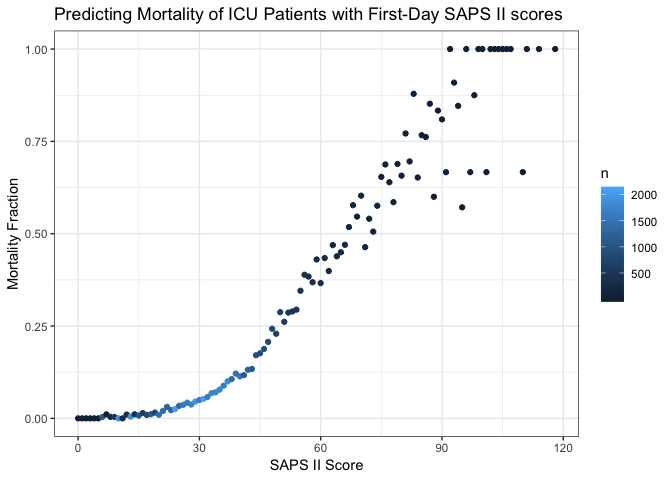
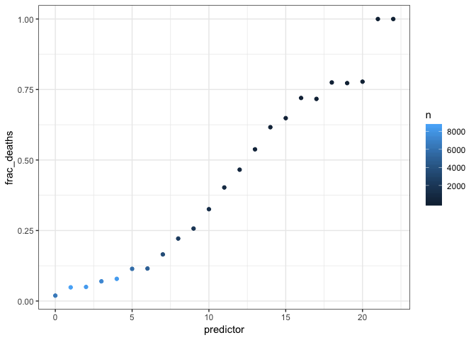
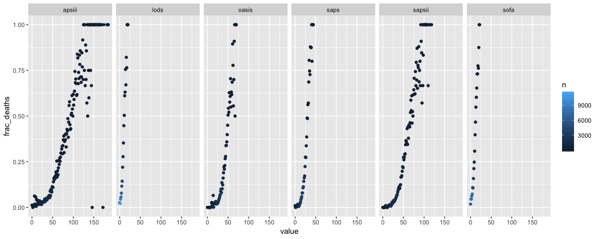

Generating severity scores
================
Laura Cosgrove
11/20/2018

``` r
# Load configuration settings
dbdriver <- 'PostgreSQL'
host  <- '127.0.0.1'
port  <- '5432'
user  <- 'postgres'
password <- 'postgres'
dbname <- 'mimic'
schema <- 'mimiciii'
# Connect to the database using the configuration settings
con <- dbConnect(dbDriver(dbdriver), dbname = dbname, host = host, port = port, 
                 user = user, password = password)
# Set the default schema
dbExecute(con, paste("SET search_path TO ", schema, sep=" "))
```

    ## [1] 0

Set this database as the connection for all future sql chunks:

``` r
knitr::opts_chunk$set(connection = "con")
```

The above chunk works if you use knitr to generate the analysis! But in building the analysis it is maybe better to run your query by saving the sql query as a character object then using `dbGetQuery`.

Credit for SQL code authoring is not mine:

We need to generate some views into the database before the query to generate the severity scores works. -- 1) uofirstday - generated by urine-output-first-day.sql -- 2) ventdurations - generated by ventilation-durations.sql -- 3) vitalsfirstday - generated by vitals-first-day.sql -- 4) gcsfirstday - generated by gcs-first-day.sql -- 5) labsfirstday - generated by labs-first-day.sql -- 6) bloodgasarterialfirstday - generated by blood-gas-first-day-arterial.sql

``` r
urine_view <- read_file("./database/mimic-code/concepts/firstday/urine-output-first-day.sql")
ventdurations_view <- read_file("./database/mimic-code/concepts/durations/ventilation-durations.sql")
vitals_view <- read_file("./database/mimic-code/concepts/firstday/vitals-first-day.sql")
gcs_view <- read_file("./database/mimic-code/concepts/firstday/gcs-first-day.sql")
labs_view <- read_file("./database/mimic-code/concepts/firstday/labs-first-day.sql")
bloodgasarterial_view <- read_file("./database/mimic-code/concepts/firstday/blood-gas-first-day-arterial.sql")
sapsii_view <- read_file("./database/mimic-code/concepts/severityscores/sapsii.sql")


#Generate materialized views
dbGetQuery(con, urine_view)
dbGetQuery(con, ventdurations_view)
dbGetQuery(con, vitals_view)
dbGetQuery(con, gcs_view)
dbGetQuery(con, labs_view)
dbGetQuery(con, bloodgasarterial_view)
dbGetQuery(con, sapsii_view)
```

Rewrite `sapsii_view` in R using `dbplyr`?

``` r
#View sapsii_data
sapsii_query <- "SELECT *
              FROM sapsii i;"
sapsii_data <- as.tibble(dbGetQuery(con, sapsii_query))
write_csv(sapsii_data, path = "./database/sapsii.csv")
```

OMG Finally!

Plot distribution:

``` r
sapsii_data %>% 
  ggplot(aes(x = sapsii)) + 
  geom_histogram()
```

    ## `stat_bin()` using `bins = 30`. Pick better value with `binwidth`.


A note in the SQL file is the following: Note: The score is calculated for *all* ICU patients, with the assumption that the user will subselect appropriate ICUSTAY\_IDs. For example, the score is calculated for neonates, but it is likely inappropriate to actually use the score values for these patients.

``` sql
SELECT *
FROM sapsii i
```

|  subject\_id|  hadm\_id|  icustay\_id|  sapsii|  sapsii\_prob|  age\_score|  hr\_score|  sysbp\_score|  temp\_score|  pao2fio2\_score|  uo\_score|  bun\_score|  wbc\_score|  potassium\_score|  sodium\_score|  bicarbonate\_score|  bilirubin\_score|  gcs\_score|  comorbidity\_score|  admissiontype\_score|
|------------:|---------:|------------:|-------:|-------------:|-----------:|----------:|-------------:|------------:|----------------:|----------:|-----------:|-----------:|-----------------:|--------------:|-------------------:|-----------------:|-----------:|-------------------:|---------------------:|
|        55973|    152234|       200001|      38|     0.2125600|          12|          4|             5|            0|               NA|         11|          NA|           0|                 0|              0|                   0|                 0|           0|                   0|                     6|
|        27513|    163557|       200003|      30|     0.1063982|           7|          4|             5|            0|               NA|          0|           0|           3|                 0|              0|                   3|                 0|           0|                   0|                     8|
|        10950|    189514|       200006|      20|     0.0372047|           7|          2|             5|            0|               NA|          0|           0|           0|                 0|              0|                   0|                NA|           0|                   0|                     6|
|        20707|    129310|       200007|      18|     0.0292952|           7|          0|             5|            0|               NA|          0|           0|           0|                 0|              0|                   0|                NA|           0|                   0|                     6|
|        29904|    129607|       200009|      21|     0.0417535|           7|          0|             5|            0|                6|          0|           0|           0|                 3|              0|                   0|                NA|           0|                   0|                     0|
|        11861|    192256|       200010|       6|     0.0045838|           0|          0|             0|            0|               NA|          0|           0|           0|                 0|              0|                   0|                 0|           0|                   0|                     6|
|        93535|    121562|       200011|      41|     0.2660865|          18|          2|             0|            0|                6|          0|           6|           0|                 3|              0|                   0|                NA|           0|                   0|                     6|
|        28448|    177527|       200012|      11|     0.0112653|           0|          0|             5|            0|               NA|          0|           0|           0|                 0|              0|                   0|                NA|           0|                   0|                     6|
|         9514|    127229|       200014|      43|     0.3055972|          18|          2|             5|            0|                6|          4|           0|           0|                 0|              0|                   0|                 0|           0|                   0|                     8|
|        74032|    117458|       200016|      20|     0.0372047|          12|          2|             5|            0|               NA|          0|           0|           0|                 0|              1|                   0|                NA|           0|                   0|                     0|

ROC curve for saps ii score:

``` r
admissions <- read_csv("./database/data/ADMISSIONS.csv.gz") %>% 
  janitor::clean_names()
```

    ## Parsed with column specification:
    ## cols(
    ##   ROW_ID = col_integer(),
    ##   SUBJECT_ID = col_integer(),
    ##   HADM_ID = col_integer(),
    ##   ADMITTIME = col_datetime(format = ""),
    ##   DISCHTIME = col_datetime(format = ""),
    ##   DEATHTIME = col_datetime(format = ""),
    ##   ADMISSION_TYPE = col_character(),
    ##   ADMISSION_LOCATION = col_character(),
    ##   DISCHARGE_LOCATION = col_character(),
    ##   INSURANCE = col_character(),
    ##   LANGUAGE = col_character(),
    ##   RELIGION = col_character(),
    ##   MARITAL_STATUS = col_character(),
    ##   ETHNICITY = col_character(),
    ##   EDREGTIME = col_datetime(format = ""),
    ##   EDOUTTIME = col_datetime(format = ""),
    ##   DIAGNOSIS = col_character(),
    ##   HOSPITAL_EXPIRE_FLAG = col_integer(),
    ##   HAS_CHARTEVENTS_DATA = col_integer()
    ## )

``` r
patients <- read_csv("./database/data/PATIENTS.csv.gz") %>% 
  janitor::clean_names()
```

    ## Parsed with column specification:
    ## cols(
    ##   ROW_ID = col_integer(),
    ##   SUBJECT_ID = col_integer(),
    ##   GENDER = col_character(),
    ##   DOB = col_datetime(format = ""),
    ##   DOD = col_datetime(format = ""),
    ##   DOD_HOSP = col_datetime(format = ""),
    ##   DOD_SSN = col_datetime(format = ""),
    ##   EXPIRE_FLAG = col_integer()
    ## )

``` r
sapsii <- read_csv("./database/sapsii.csv") %>% 
  janitor::clean_names()
```

    ## Parsed with column specification:
    ## cols(
    ##   .default = col_integer(),
    ##   sapsii_prob = col_double()
    ## )

    ## See spec(...) for full column specifications.

``` r
admissions %>% 
  inner_join(., patients, by = "subject_id") %>% 
  filter(has_chartevents_data == 1) %>% 
  inner_join(., sapsii, by = "hadm_id") %>% 
  mutate(target = if_else(deathtime %in% NA, 0, 1),
         predictor = sapsii) %>%
  select(subject_id.x, target, predictor) %>% 
  group_by(predictor) %>% 
  summarize(deaths = sum(target),
            n = n()) %>% 
  mutate(frac_deaths = deaths/n) %>% 
  ggplot(aes(x = predictor, y = frac_deaths)) +
  geom_point(aes(color = n)) + 
  labs(x = "SAPS II Score",
       y = "Mortality Fraction", 
       title = "Predicting Mortality of ICU Patients with First-Day SAPS II scores") +
  theme_bw()
```



Repeat for other severity scores:

(Note: must run document once before knitting, but eval is set to false so the views aren't re-loaded every time you knit.)

``` r
sofa_view <- read_file("./database/mimic-code/concepts/severityscores/sofa.sql")
lods_view <- read_file("./database/mimic-code/concepts/severityscores/lods.sql")
saps_view <- read_file("./database/mimic-code/concepts/severityscores/saps.sql")
apsiii_view <- read_file("./database/mimic-code/concepts/severityscores/apsiii.sql")
oasis_view <- read_file("./database/mimic-code/concepts/severityscores/oasis.sql")

#SOFA needs echo data 
echodata_view <- read_file("./database/mimic-code/concepts/echo-data.sql")

dbGetQuery(con, echodata_view)
dbGetQuery(con, sofa_view)

#LODS
dbGetQuery(con, lods_view)

#SAPS needs ventilated first day
ventfirstday_view <- read_file("./database/mimic-code/concepts/firstday/ventilation-first-day.sql")
dbGetQuery(con, ventfirstday_view)
dbGetQuery(con, saps_view)

# APSIII  
dbGetQuery(con, apsiii_view)

# OASIS  
dbGetQuery(con, oasis_view)
```

As before, read all the data from the generated materialized views into tibbles:

``` r
#SOFA
sofa_query <- "SELECT *
              FROM sofa i;"
sofa_data <- as.tibble(dbGetQuery(con, sofa_query))

#LODS
lods_query <- "SELECT *
              FROM lods i;"
lods_data <- as.tibble(dbGetQuery(con, lods_query))

#SAPS
saps_query <- "SELECT *
              FROM saps i;"
saps_data <- as.tibble(dbGetQuery(con, saps_query))

# APSIII  
apsiii_query <- "SELECT *
              FROM apsiii i;"
apsiii_data <- as.tibble(dbGetQuery(con, apsiii_query))

#OASIS
oasis_query <- "SELECT *
              FROM oasis i;"
oasis_data <- as.tibble(dbGetQuery(con, oasis_query))
```

Plot curves for all other scores

``` r
# I should create a nested df where I can map the inner join and generate multiple plots in the same code chunk

admissions %>% 
  inner_join(., patients, by = "subject_id") %>% 
  filter(has_chartevents_data == 1) %>% 
  inner_join(., sofa_data, by = "hadm_id") %>% 
  mutate(target = if_else(deathtime %in% NA, 0, 1),
         predictor = sofa) %>%
  select(subject_id.x, target, predictor) %>% 
  group_by(predictor) %>% 
  summarize(deaths = sum(target),
            n = n()) %>% 
  mutate(frac_deaths = deaths/n) %>% 
  ggplot(aes(x = predictor, y = frac_deaths)) +
  geom_point(aes(color = n)) + 
  theme_bw()
```



``` r
# Make a big datasheet?
all_scores <- admissions %>% 
  inner_join(., patients, by = "subject_id") %>% 
  inner_join(., sapsii_data, by = "hadm_id") %>% 
  inner_join(., sofa_data, by = "hadm_id") %>% 
  inner_join(., lods_data, by = "hadm_id") %>% 
  inner_join(., saps_data, by = "hadm_id") %>% 
  inner_join(., apsiii_data, by = "hadm_id") %>% 
  inner_join(., oasis_data, by = "hadm_id") %>% 
  mutate(target = if_else(deathtime %in% NA, 0, 1)) %>% 
  select(subject_id.x, hadm_id, target, sapsii, saps, sofa, lods, apsiii, oasis)

all_scores %>% 
  select(sapsii:oasis) %>% 
  cor()
```

    ##           sapsii      saps      sofa      lods    apsiii     oasis
    ## sapsii 1.0000000 0.4010758 0.2783896 0.3565768 0.3857192 0.3868378
    ## saps   0.4010758 1.0000000 0.2097454 0.3023607 0.3534089 0.3647637
    ## sofa   0.2783896 0.2097454 1.0000000 0.3652635 0.4195737 0.1785834
    ## lods   0.3565768 0.3023607 0.3652635 1.0000000 0.3788148 0.2732510
    ## apsiii 0.3857192 0.3534089 0.4195737 0.3788148 1.0000000 0.2824301
    ## oasis  0.3868378 0.3647637 0.1785834 0.2732510 0.2824301 1.0000000

``` r
all_scores %>% 
  distinct(hadm_id, .keep_all = TRUE) %>% 
  gather(key = score, value, sapsii, saps, sofa, lods, apsiii, oasis) %>% 
  group_by(score, value) %>% 
  summarize(deaths = sum(target), 
            n = n()) %>% 
  mutate(frac_deaths = deaths/n) %>% 
  ggplot(aes(x = value, y = frac_deaths)) + 
  geom_point(aes(color = n)) +
  facet_grid(~score)
```



### Individual mortality prediction
