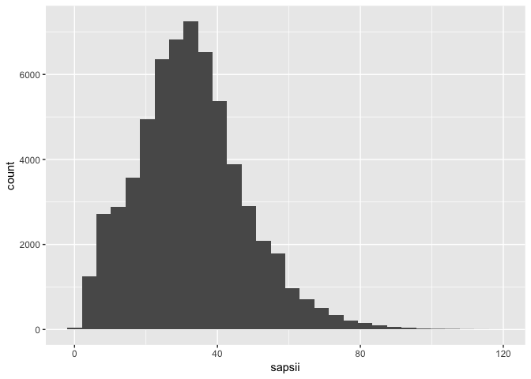
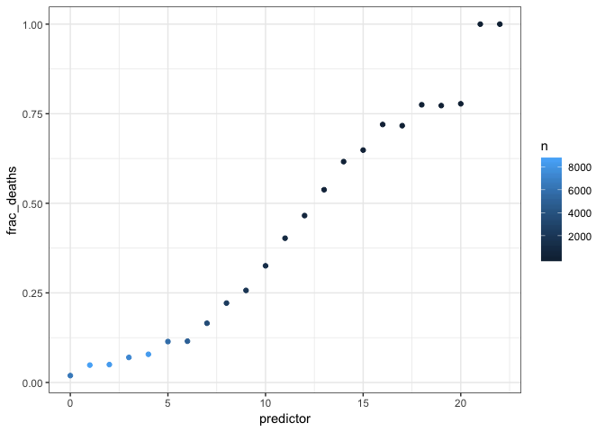
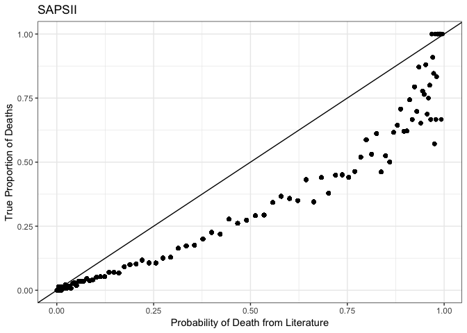
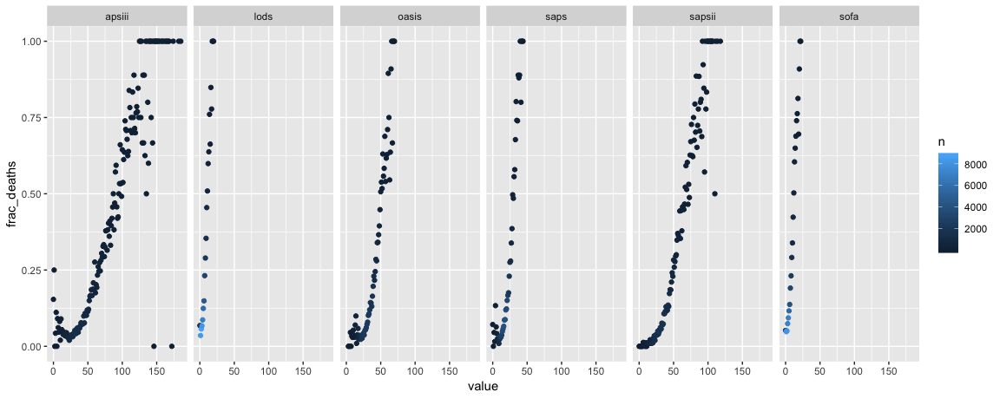
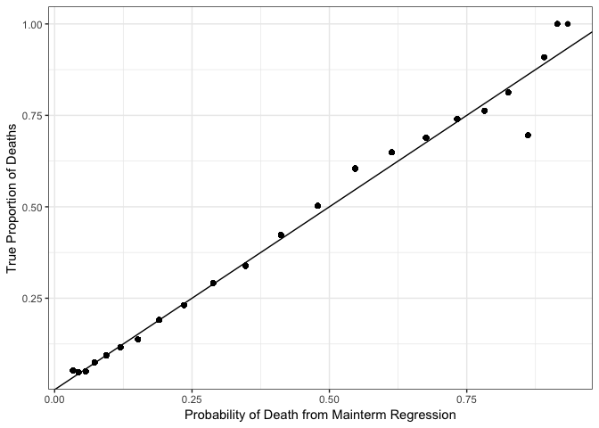
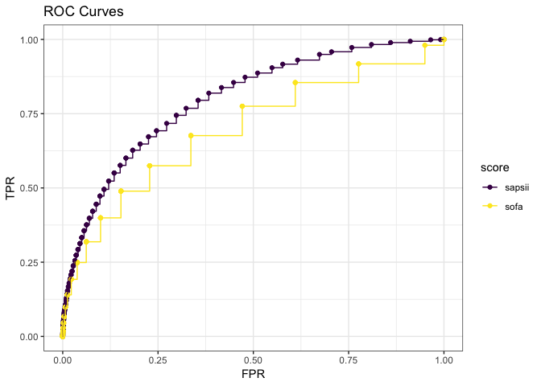
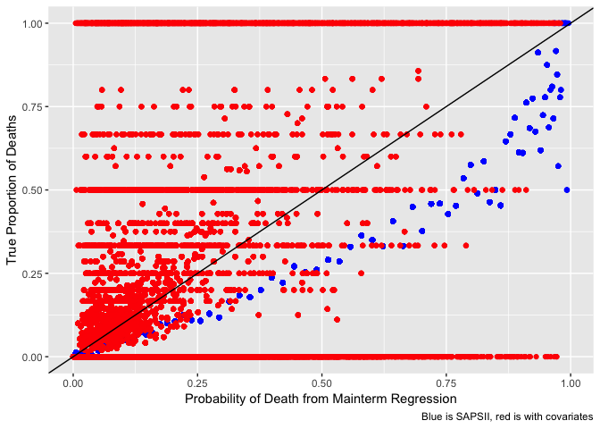
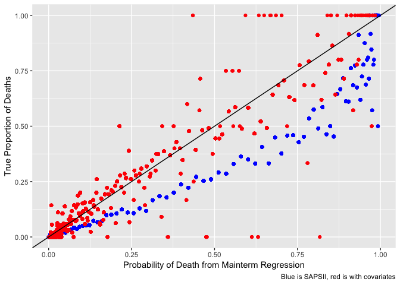
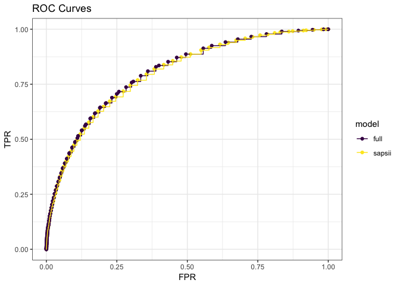
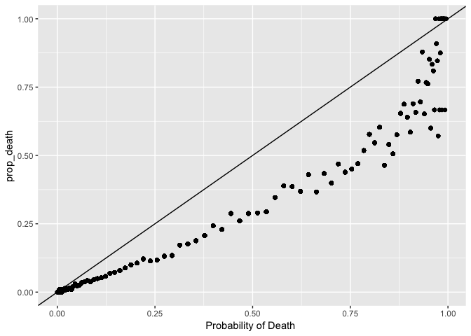

Generating severity scores
================
Laura Cosgrove
11/20/2018

``` r
# Load configuration settings
dbdriver <- 'PostgreSQL'
host  <- '127.0.0.1'
port  <- '5432'
user  <- 'postgres'
password <- 'postgres'
dbname <- 'mimic'
schema <- 'mimiciii'
# Connect to the database using the configuration settings
con <- dbConnect(dbDriver(dbdriver), dbname = dbname, host = host, port = port, 
                 user = user, password = password)
# Set the default schema
dbExecute(con, paste("SET search_path TO ", schema, sep=" "))
```

    ## [1] 0

Set this database as the connection for all future sql chunks:

``` r
knitr::opts_chunk$set(connection = "con")
```

The above chunk works if you use knitr to generate the analysis! But in building the analysis it is maybe better to run your query by saving the sql query as a character object then using `dbGetQuery`.

Credit for SQL code authoring is not mine:

We need to generate some views into the database before the query to generate the severity scores works. -- 1) uofirstday - generated by urine-output-first-day.sql -- 2) ventdurations - generated by ventilation-durations.sql -- 3) vitalsfirstday - generated by vitals-first-day.sql -- 4) gcsfirstday - generated by gcs-first-day.sql -- 5) labsfirstday - generated by labs-first-day.sql -- 6) bloodgasarterialfirstday - generated by blood-gas-first-day-arterial.sql

``` r
urine_view <- read_file("./database/mimic-code/concepts/firstday/urine-output-first-day.sql")
ventdurations_view <- read_file("./database/mimic-code/concepts/durations/ventilation-durations.sql")
vitals_view <- read_file("./database/mimic-code/concepts/firstday/vitals-first-day.sql")
gcs_view <- read_file("./database/mimic-code/concepts/firstday/gcs-first-day.sql")
labs_view <- read_file("./database/mimic-code/concepts/firstday/labs-first-day.sql")
bloodgasarterial_view <- read_file("./database/mimic-code/concepts/firstday/blood-gas-first-day-arterial.sql")
sapsii_view <- read_file("./database/mimic-code/concepts/severityscores/sapsii.sql")


#Generate materialized views
dbGetQuery(con, urine_view)
dbGetQuery(con, ventdurations_view)
dbGetQuery(con, vitals_view)
dbGetQuery(con, gcs_view)
dbGetQuery(con, labs_view)
dbGetQuery(con, bloodgasarterial_view)
dbGetQuery(con, sapsii_view)
```

Rewrite `sapsii_view` in R using `dbplyr`?

``` r
#View sapsii_data
sapsii_query <- "SELECT *
              FROM sapsii i;"
sapsii_data <- as.tibble(dbGetQuery(con, sapsii_query))
write_csv(sapsii_data, path = "./database/sapsii.csv")
```

OMG Finally!

Plot distribution:

``` r
sapsii_data %>% 
  ggplot(aes(x = sapsii)) + 
  geom_histogram()
```

    ## `stat_bin()` using `bins = 30`. Pick better value with `binwidth`.



A note in the SQL file is the following: Note: The score is calculated for *all* ICU patients, with the assumption that the user will subselect appropriate ICUSTAY\_IDs. For example, the score is calculated for neonates, but it is likely inappropriate to actually use the score values for these patients.

``` sql
SELECT *
FROM sapsii i
```

|  subject\_id|  hadm\_id|  icustay\_id|  sapsii|  sapsii\_prob|  age\_score|  hr\_score|  sysbp\_score|  temp\_score|  pao2fio2\_score|  uo\_score|  bun\_score|  wbc\_score|  potassium\_score|  sodium\_score|  bicarbonate\_score|  bilirubin\_score|  gcs\_score|  comorbidity\_score|  admissiontype\_score|
|------------:|---------:|------------:|-------:|-------------:|-----------:|----------:|-------------:|------------:|----------------:|----------:|-----------:|-----------:|-----------------:|--------------:|-------------------:|-----------------:|-----------:|-------------------:|---------------------:|
|        55973|    152234|       200001|      38|     0.2125600|          12|          4|             5|            0|               NA|         11|          NA|           0|                 0|              0|                   0|                 0|           0|                   0|                     6|
|        27513|    163557|       200003|      30|     0.1063982|           7|          4|             5|            0|               NA|          0|           0|           3|                 0|              0|                   3|                 0|           0|                   0|                     8|
|        10950|    189514|       200006|      20|     0.0372047|           7|          2|             5|            0|               NA|          0|           0|           0|                 0|              0|                   0|                NA|           0|                   0|                     6|
|        20707|    129310|       200007|      18|     0.0292952|           7|          0|             5|            0|               NA|          0|           0|           0|                 0|              0|                   0|                NA|           0|                   0|                     6|
|        29904|    129607|       200009|      21|     0.0417535|           7|          0|             5|            0|                6|          0|           0|           0|                 3|              0|                   0|                NA|           0|                   0|                     0|
|        11861|    192256|       200010|       6|     0.0045838|           0|          0|             0|            0|               NA|          0|           0|           0|                 0|              0|                   0|                 0|           0|                   0|                     6|
|        93535|    121562|       200011|      41|     0.2660865|          18|          2|             0|            0|                6|          0|           6|           0|                 3|              0|                   0|                NA|           0|                   0|                     6|
|        28448|    177527|       200012|      11|     0.0112653|           0|          0|             5|            0|               NA|          0|           0|           0|                 0|              0|                   0|                NA|           0|                   0|                     6|
|         9514|    127229|       200014|      43|     0.3055972|          18|          2|             5|            0|                6|          4|           0|           0|                 0|              0|                   0|                 0|           0|                   0|                     8|
|        74032|    117458|       200016|      20|     0.0372047|          12|          2|             5|            0|               NA|          0|           0|           0|                 0|              1|                   0|                NA|           0|                   0|                     0|

### Visualize how fractions of death increase

``` r
admissions <- read_csv("./database/data/ADMISSIONS.csv.gz") %>% 
  janitor::clean_names()
```

    ## Parsed with column specification:
    ## cols(
    ##   ROW_ID = col_integer(),
    ##   SUBJECT_ID = col_integer(),
    ##   HADM_ID = col_integer(),
    ##   ADMITTIME = col_datetime(format = ""),
    ##   DISCHTIME = col_datetime(format = ""),
    ##   DEATHTIME = col_datetime(format = ""),
    ##   ADMISSION_TYPE = col_character(),
    ##   ADMISSION_LOCATION = col_character(),
    ##   DISCHARGE_LOCATION = col_character(),
    ##   INSURANCE = col_character(),
    ##   LANGUAGE = col_character(),
    ##   RELIGION = col_character(),
    ##   MARITAL_STATUS = col_character(),
    ##   ETHNICITY = col_character(),
    ##   EDREGTIME = col_datetime(format = ""),
    ##   EDOUTTIME = col_datetime(format = ""),
    ##   DIAGNOSIS = col_character(),
    ##   HOSPITAL_EXPIRE_FLAG = col_integer(),
    ##   HAS_CHARTEVENTS_DATA = col_integer()
    ## )

``` r
patients <- read_csv("./database/data/PATIENTS.csv.gz") %>% 
  janitor::clean_names()
```

    ## Parsed with column specification:
    ## cols(
    ##   ROW_ID = col_integer(),
    ##   SUBJECT_ID = col_integer(),
    ##   GENDER = col_character(),
    ##   DOB = col_datetime(format = ""),
    ##   DOD = col_datetime(format = ""),
    ##   DOD_HOSP = col_datetime(format = ""),
    ##   DOD_SSN = col_datetime(format = ""),
    ##   EXPIRE_FLAG = col_integer()
    ## )

``` r
sapsii <- read_csv("./database/sapsii.csv") %>% 
  janitor::clean_names()
```

    ## Parsed with column specification:
    ## cols(
    ##   .default = col_integer(),
    ##   sapsii_prob = col_double()
    ## )

    ## See spec(...) for full column specifications.

``` r
admissions %>% 
  inner_join(., patients, by = "subject_id") %>% 
  filter(has_chartevents_data == 1) %>% 
  inner_join(., sapsii, by = "hadm_id") %>% 
  mutate(target = if_else(deathtime %in% NA, 0, 1),
         predictor = sapsii) %>%
  select(subject_id.x, target, predictor) %>% 
  group_by(predictor) %>% 
  summarize(deaths = sum(target),
            n = n()) %>% 
  mutate(frac_deaths = deaths/n) %>% 
  ggplot(aes(x = predictor, y = frac_deaths)) +
  geom_point(aes(color = n)) + 
  labs(x = "SAPS II Score",
       y = "Mortality Fraction", 
       title = "Predicting Mortality of ICU Patients with First-Day SAPS II scores") +
  theme_bw()
```



Repeat for other severity scores:

(Note: must run document once before knitting, but eval is set to false so the views aren't re-loaded every time you knit.)

``` r
sofa_view <- read_file("./database/mimic-code/concepts/severityscores/sofa.sql")
lods_view <- read_file("./database/mimic-code/concepts/severityscores/lods.sql")
saps_view <- read_file("./database/mimic-code/concepts/severityscores/saps.sql")
apsiii_view <- read_file("./database/mimic-code/concepts/severityscores/apsiii.sql")
oasis_view <- read_file("./database/mimic-code/concepts/severityscores/oasis.sql")

#SOFA needs echo data 
echodata_view <- read_file("./database/mimic-code/concepts/echo-data.sql")

dbGetQuery(con, echodata_view)
dbGetQuery(con, sofa_view)

#LODS
dbGetQuery(con, lods_view)

#SAPS needs ventilated first day
ventfirstday_view <- read_file("./database/mimic-code/concepts/firstday/ventilation-first-day.sql")
dbGetQuery(con, ventfirstday_view)
dbGetQuery(con, saps_view)

# APSIII  
dbGetQuery(con, apsiii_view)

# OASIS  
dbGetQuery(con, oasis_view)
```

As before, read all the data from the generated materialized views into tibbles:

``` r
#SOFA
sofa_query <- "SELECT *
              FROM sofa i;"
sofa_data <- as.tibble(dbGetQuery(con, sofa_query))

#LODS
lods_query <- "SELECT *
              FROM lods i;"
lods_data <- as.tibble(dbGetQuery(con, lods_query))

#SAPS
saps_query <- "SELECT *
              FROM saps i;"
saps_data <- as.tibble(dbGetQuery(con, saps_query))

# APSIII  
apsiii_query <- "SELECT *
              FROM apsiii i;"
apsiii_data <- as.tibble(dbGetQuery(con, apsiii_query))

#OASIS
oasis_query <- "SELECT *
              FROM oasis i;"
oasis_data <- as.tibble(dbGetQuery(con, oasis_query))
```

Plot curves for all other scores

``` r
# I should create a nested df where I can map the inner join and generate multiple plots in the same code chunk

admissions %>% 
  inner_join(., patients, by = "subject_id") %>% 
  filter(has_chartevents_data == 1) %>% 
  inner_join(., sofa_data, by = "hadm_id") %>% 
  mutate(target = if_else(deathtime %in% NA, 0, 1),
         predictor = sofa) %>%
  select(subject_id.x, target, predictor) %>% 
  group_by(predictor) %>% 
  summarize(deaths = sum(target),
            n = n()) %>% 
  mutate(frac_deaths = deaths/n) %>% 
  ggplot(aes(x = predictor, y = frac_deaths)) +
  geom_point(aes(color = n)) + 
  theme_bw()
```



``` r
<<<<<<< HEAD
predictor_detail_data <- icu_detail %>% 
=======
# Make a big datasheet?
all_scores <- admissions %>% 
  inner_join(., patients, by = "subject_id") %>% 
>>>>>>> 017d77e53d9b2f67b1a13bee768670353fff6558
  inner_join(., sapsii_data, by = "hadm_id") %>% 
  inner_join(., sofa_data, by = "hadm_id") %>% 
  inner_join(., lods_data, by = "hadm_id") %>% 
  inner_join(., saps_data, by = "hadm_id") %>% 
  inner_join(., apsiii_data, by = "hadm_id") %>% 
  inner_join(., oasis_data, by = "hadm_id") %>% 
  mutate(target = if_else(deathtime %in% NA, 0, 1)) %>% 
  select(subject_id.x, hadm_id, target, sapsii, saps, sofa, lods, apsiii, oasis)

all_scores %>% 
  select(sapsii:oasis) %>% 
  cor()
```

    ##           sapsii      saps      sofa      lods    apsiii     oasis
    ## sapsii 1.0000000 0.4010758 0.2783896 0.3565768 0.3857192 0.3868378
    ## saps   0.4010758 1.0000000 0.2097454 0.3023607 0.3534089 0.3647637
    ## sofa   0.2783896 0.2097454 1.0000000 0.3652635 0.4195737 0.1785834
    ## lods   0.3565768 0.3023607 0.3652635 1.0000000 0.3788148 0.2732510
    ## apsiii 0.3857192 0.3534089 0.4195737 0.3788148 1.0000000 0.2824301
    ## oasis  0.3868378 0.3647637 0.1785834 0.2732510 0.2824301 1.0000000

``` r
all_scores %>% 
  distinct(hadm_id, .keep_all = TRUE) %>% 
  gather(key = score, value, sapsii, saps, sofa, lods, apsiii, oasis) %>% 
  group_by(score, value) %>% 
  summarize(deaths = sum(target), 
            n = n()) %>% 
  mutate(frac_deaths = deaths/n) %>% 
  ggplot(aes(x = value, y = frac_deaths)) + 
  geom_point(aes(color = n)) +
  facet_grid(~score)
```



Individual mortality prediction
-------------------------------

It's fine just as a quick gut check to see how fraction of deaths increase over the distributions of the various severity scores. But how do the scores perform based on their original authored likelihoods?

### SAPS II

We'll start with the SAPS II score.

Individual mortality prediction for the SAPS II score is defined by its authors to be:

log(\[pr(death)\]\[1 - pr(death)\]) = -7.7631 + 0.07237*SAPSII + 0.9971*log(1 + SAPSII)

A mortality prediction algorithm is said to have adequate discrimination if it tends to assign higher severity scores to patients that died in the hospital compared to those that did not. To evaluate discrimination, we'll visualize the probability of death as predicted by the SAPSII score versus the actual proportion of patients who died with that SAPSII score.

``` r
sapsii_data %>% 
  mutate(prob_death = exp(-7.7631 + 0.07237*sapsii + 0.9971*log(1 + sapsii))/(1 + exp(-7.7631 + 0.07237*sapsii + 0.9971*log(1 + sapsii)))) %>% 
  inner_join(admissions, by = "hadm_id") %>% 
  mutate(mortality = if_else(deathtime %in% NA, 0, 1),
         hosp_los = admittime %--% dischtime) %>% 
  select(hadm_id, sapsii, prob_death, hosp_los, mortality, starts_with("admission"), diagnosis) %>% 
  group_by(sapsii) %>% 
  add_tally(mortality) %>% 
  rename(mortality_by_group = n) %>% 
  add_tally() %>% 
  mutate(prop_death = mortality_by_group/n) %>% 
  select(sapsii, prob_death, prop_death) %>% 
  ggplot(aes(x = prob_death, y = prop_death)) + 
  geom_point() +
  geom_abline(slope = 1, intercept = 0) +
  labs(x = "Probability of Death ")
```

<<<<<<< HEAD


Although the authors of the SAPS score publish a non-linear in parameters regression for association with likelihood of death, I'll fit a main-term logistic regression to obtain mortality prediction based on a linear-in-parameters assumption.

``` r
fit_sapsii <- predictor_detail_data %>% 
  distinct(icustay_id, .keep_all = TRUE) %>% 
  select(sapsii, death_bin) %>% 
  glm(death_bin ~ sapsii, family = binomial, data = .) 

fit_sapsii %>% 
  broom::tidy()
```

    ## # A tibble: 2 x 5
    ##   term        estimate std.error statistic p.value
    ##   <chr>          <dbl>     <dbl>     <dbl>   <dbl>
    ## 1 (Intercept)  -5.22     0.0489     -107.        0
    ## 2 sapsii        0.0803   0.00104      77.0       0

``` r
fit_sapsii %>% 
  broom::tidy(conf.int = TRUE, exponentiate = TRUE)
```

    ## # A tibble: 2 x 7
    ##   term        estimate std.error statistic p.value conf.low conf.high
    ##   <chr>          <dbl>     <dbl>     <dbl>   <dbl>    <dbl>     <dbl>
    ## 1 (Intercept)  0.00541   0.0489     -107.        0  0.00491   0.00595
    ## 2 sapsii       1.08      0.00104      77.0       0  1.08      1.09

The regression fits a parameter estimate of log(\[pr(death)\]\[1 - pr(death)\]) = -5.22 + 0.0803\*SAPSII; or, for every unit increase in SOFA score, you can expect to have 1.08x the odds of death.

I'll refit the plot based on the mainterm regression:

``` r
predictor_detail_data %>% 
  distinct(icustay_id, .keep_all = TRUE) %>% 
  select(hadm_id, sapsii, death_bin) %>% 
  mutate(prob_death = exp( -5.22 + 0.0803*sapsii)/(1 + exp(-5.22 + 0.0803*sapsii))) %>% 
  group_by(sapsii) %>% 
  add_tally(death_bin) %>% 
  rename(tot_death_by_group = n) %>% 
  add_tally() %>% 
  mutate(prop_death = tot_death_by_group/n) %>% 
  select(sapsii, prob_death, prop_death) %>% 
  ggplot(aes(x = prob_death, y = prop_death)) + 
  geom_point() +
  geom_abline(slope = 1, intercept = 0) +
  labs(title = "SAPSII",
      x = "Probability of Death from Mainterm Regression",
       y = "True Proportion of Deaths") + 
  theme_bw()
```



We see a better fit with the mainterm logistic regression, which makes sense given that the literature value was an externally-generated prediction, while our regression is internally-generated. Keep that caveat in mind as we continue with algorithm comparison for other scores, because no direct external value exists for predictive capability of the other severity scores; rather, they're used in practive as clinical decision support rather than giving probability determination.

SOFA Score
----------

Authors of the SOFA score do not publish a base probability calculation for likelihood of death, so I'll use a main-term logistic regression to obtain mortality prediction based on the SOFA score.

``` r
fit_sofa <- predictor_detail_data %>% 
  distinct(icustay_id, .keep_all = TRUE) %>% 
  select(sofa, death_bin) %>% 
  glm(death_bin ~ sofa, family = binomial, data = .) 

fit_sofa %>% 
  broom::tidy()
```

    ## # A tibble: 2 x 5
    ##   term        estimate std.error statistic p.value
    ##   <chr>          <dbl>     <dbl>     <dbl>   <dbl>
    ## 1 (Intercept)   -3.36    0.0280     -120.        0
    ## 2 sofa           0.273   0.00409      66.7       0

``` r
fit_sofa %>% 
  broom::tidy(conf.int = TRUE, exponentiate = TRUE)
```

    ## # A tibble: 2 x 7
    ##   term        estimate std.error statistic p.value conf.low conf.high
    ##   <chr>          <dbl>     <dbl>     <dbl>   <dbl>    <dbl>     <dbl>
    ## 1 (Intercept)   0.0347   0.0280     -120.        0   0.0328    0.0366
    ## 2 sofa          1.31     0.00409      66.7       0   1.30      1.32

The regression fits a parameter estimate of log(\[pr(death)\]\[1 - pr(death)\]) = -3.36 + 0.273\*SOFA; for every unit increase in SOFA score, you can expect to have 1.31x the odds of death.

``` r
predictor_detail_data %>% 
  distinct(icustay_id, .keep_all = TRUE) %>% 
  select(hadm_id, sofa, death_bin) %>% 
  mutate(prob_death = exp(-3.36 + 0.273*sofa)/(1 + exp(-3.36 + 0.273*sofa))) %>% 
  group_by(sofa) %>% 
  add_tally(death_bin) %>% 
  rename(tot_death_by_group = n) %>% 
  add_tally() %>% 
  mutate(prop_death = tot_death_by_group/n) %>% 
  select(sofa, prob_death, prop_death)%>% 
  ggplot(aes(x = prob_death, y = prop_death)) + 
  geom_point() +
  geom_abline(slope = 1, intercept = 0) +
  labs(x = "Probability of Death from Mainterm Regression",
       y = "True Proportion of Deaths") + 
  theme_bw()
```


This regression obtains a good fit, which makes sense because the probability was obtained from our data rather than a literature value.

Map for all Scores
------------------

We can use a `map` operation with some tidying of our original data to speed up the generation of the predicted probabilities of each score.

``` r
predictor_detail_data_tidy <- predictor_detail_data %>% 
  distinct(icustay_id, .keep_all = TRUE) %>% 
  gather(key = score, value = score_value, sapsii, sofa, lods, apsiii, oasis) %>% 
  select(icustay_id, score, score_value, everything())

predictor_detail_data_tidy %>% 
  select(score, death_bin, score_value) %>% 
  group_by(score) %>% 
  nest() %>% 
  mutate(glm = map(data, ~glm(death_bin ~ score_value, family = binomial, data = .))) %>% 
  mutate(glm_coef = map(glm, broom::tidy)) %>% 
  select(score, glm_coef) %>% 
  unnest() %>% 
  knitr::kable()
```

| score  | term         |    estimate|  std.error|   statistic|  p.value|
|:-------|:-------------|-----------:|----------:|-----------:|--------:|
| sapsii | (Intercept)  |  -5.2192420|  0.0488676|  -106.80368|        0|
| sapsii | score\_value |   0.0802632|  0.0010430|    76.95157|        0|
| sofa   | (Intercept)  |  -3.3612355|  0.0280183|  -119.96578|        0|
| sofa   | score\_value |   0.2729313|  0.0040941|    66.66408|        0|
| lods   | (Intercept)  |  -3.5465359|  0.0301791|  -117.51615|        0|
| lods   | score\_value |   0.3235153|  0.0047330|    68.35295|        0|
| apsiii | (Intercept)  |  -4.4522295|  0.0400586|  -111.14294|        0|
| apsiii | score\_value |   0.0494333|  0.0006722|    73.53993|        0|
| oasis  | (Intercept)  |  -5.8499849|  0.0624610|   -93.65818|        0|
| oasis  | score\_value |   0.1129726|  0.0016420|    68.80387|        0|

All severity scores are significant predictors. We'll need to impute a special result for SAPSII following this code, because we're taking the literature value:

``` r
score_data_tidy <- predictor_detail_data_tidy %>% 
  select(score, death_bin, score_value) %>% 
  group_by(score) %>% 
  nest() %>% 
  mutate(glm = map(data, ~glm(death_bin ~ score_value, family = binomial, data = .))) %>% 
  mutate(glm_coef = map(glm, broom::tidy)) %>% 
  mutate(predictions = map2(data, glm, modelr::add_predictions)) %>% 
  select(score, predictions) %>% 
  unnest() %>% 
  mutate(prob_death = exp(pred)/(1 + exp(pred))) %>% 
  mutate(prob_death = if_else(score == "sapsii", 
                              exp(-7.7631 + 0.07237*score_value + 0.9971*log(1 + score_value))/(1 + exp(-7.7631 +  0.07237*score_value + 0.9971*log(1 + score_value))), 
                              prob_death))
```

``` r
score_data_tidy %>% 
  select(score, death_bin, prob_death) %>% 
  group_by(score, prob_death) %>%
  add_tally(death_bin) %>% 
  rename(tot_death_by_group = n) %>% 
  add_tally() %>% 
  mutate(prop_death = tot_death_by_group/n) %>% 
  ggplot(aes(x = prob_death, y = prop_death, color = score)) + 
  geom_point() +
  geom_abline(slope = 1, intercept = 0) +
  labs(x = "Probability of Death from Mainterm Regression or Literature Value",
       y = "True Proportion of Deaths")
```


Above, we've plotted the true, observed proportion of deaths for each score value versus the probability of death predicted from mainterm regression (or, in the SAPSII case, a literature value) for each severity score. Each point is a particular score value for a patient -- i.e., there are 5x the numbers of ICU patients plotted.

There's some interesting data here! As expected, the SAPSII test, being from a literature value, is further under the equality line for most scores. This means that the external, literature value is more aggressive in estimating probability of death for patients, compared ot probabilities imputed from regression on our data. This could be because the care at Beth Israel Deaconness is unusually good, or it could be because it is clinically useful that a classification algorithm be a bit more aggressive in estimating severity.

Another interesting finding is that some severity scores "silo" near probabilities 1 and 0. This could mean that there needs to be an adjustment in the range of the severity scores.

Area under ROC curves
---------------------

To plot the area under the curve for the SAPSII and SOFA scores, I need to calculate the respective TPR and FPR for each score. I'll use the literature value for the SAPSII score.

``` r
for_roc <- score_data_tidy %>% 
  select(score, death_bin, prob_death) %>% 
  group_by(score) %>% 
  nest()

###############ROC AUC Functions#############################
#This code could be improved with a better function.

roc_log_fcn <- function(result, y_prob){
  probs <- seq(0,1, by = 0.005)
  roc_log <- matrix(0, nrow = length(probs), ncol=2)
  i <- 1
  for(p in probs){
    pred <- y_prob > p
    ##False positive rate
    FPR <- sum(!result & pred)/sum(!result)
    ##True positive rate
    TPR <- sum(result & pred)/sum(result)
    roc_log[i,] <- c(FPR, TPR)
    i <- i + 1
  }
  return(roc_log)
}

#SAPSII
sapsii_for_roc <- for_roc %>% 
  filter(score == "sapsii") %>% 
  unnest() 
roc_log_sapsii <- roc_log_fcn(sapsii_for_roc$death_bin, sapsii_for_roc$prob_death)

#SOFA
sofa_for_roc <- for_roc %>% 
  filter(score == "sofa") %>% 
  unnest() 
roc_log_sofa <- roc_log_fcn(sofa_for_roc$death_bin, sofa_for_roc$prob_death)

#LODS
lods_for_roc <- for_roc %>% 
  filter(score == "lods") %>% 
  unnest() 
roc_log_lods <- roc_log_fcn(lods_for_roc$death_bin, lods_for_roc$prob_death)

#APSIII
apsiii_for_roc <- for_roc %>% 
  filter(score == "apsiii") %>% 
  unnest() 
roc_log_apsiii <- roc_log_fcn(apsiii_for_roc$death_bin, apsiii_for_roc$prob_death)

#OASIS
oasis_for_roc <- for_roc %>% 
  filter(score == "oasis") %>% 
  unnest() 
roc_log_oasis <- roc_log_fcn(oasis_for_roc$death_bin, oasis_for_roc$prob_death)


tidy_for_roc <- tibble(FPR_sapsii = roc_log_sapsii[,1], TPR_sapsii = roc_log_sapsii[,2],
       FPR_sofa = roc_log_sofa[,1], TPR_sofa = roc_log_sofa[,2],
       FPR_lods = roc_log_lods[,1], TPR_lods = roc_log_lods[,2],
       FPR_apsiii = roc_log_apsiii[,1], TPR_apsiii = roc_log_apsiii[,2],
       FPR_oasis = roc_log_oasis[,1], TPR_oasis = roc_log_oasis[,2]) %>% 
  gather(key = score, value = FPR, starts_with("FPR")) %>% 
  gather(key = score2, value = TPR, starts_with("TPR")) %>% 
  mutate(score = if_else(score == "FPR_sapsii", 
                         #yes sapsii
                         if_else(score2 == "TPR_sapsii", "sapsii", "NA"),
                         #no sapsii 
                            (if_else(score == "FPR_sofa", 
                              # yes sofa 
                              if_else(score2 == "TPR_sofa", "sofa", "NA"), 
                              # no sofa
                              (if_else(score == "FPR_lods",
                              #yes lods
                                if_else(score2 == "TPR_lods", "lods", "NA"),
                              # no lods
                              (if_else(score == "FPR_apsiii",
                                if_else(score2 == "TPR_apsiii", "apsiii", "NA"), 
                              (if_else(score == "FPR_oasis", 
                                if_else(score2 == "TPR_oasis", "oasis", "NA"), "NA"
                              )))))))))
                         ) %>% 
  filter(score != "NA")

tidy_for_roc %>% 
  select(score, FPR, TPR) %>% 
  ggplot(aes(x = FPR, y = TPR, color = score)) +
  geom_point() +
  geom_step() +
  labs(title = "ROC Curves") +
  theme_bw() +
  scale_color_viridis_d()
```



SAPSII looks like the best-performing model, and let's confirm that with an AUROC analysis.

``` r
auc <- function(roc){
  len <- nrow(roc)
  ##The "delta X" values
  delta <- roc[-1,1]-roc[-len,1]
  ##The "heights" the rectangle (drop the first or last).
  hgt <- roc[-1,2]
  ##The Riemann Sum
  sum(-delta*hgt)
}

tibble(score = c("sapsii", "sofa", "lods", "apsiii", "oasis"), AUROC = c(auc(roc_log_sapsii), auc(roc_log_sofa), auc(roc_log_lods), auc(roc_log_apsiii), auc(roc_log_oasis))) %>% 
  arrange(desc(AUROC)) %>% 
  knitr::kable()
```

| score  |      AUROC|
|:-------|----------:|
| sapsii |  0.7952234|
| apsiii |  0.7651836|
| oasis  |  0.7505908|
| lods   |  0.7023117|
| sofa   |  0.6930094|

SAPSII is our winner in terms of AUROC.

Adding other predictors to our model
------------------------------------

The above analysis showed us that when considered severity scores computed from biomarkers, the best mortality algorithm as imputed by an AUROC analysis was the SAPSII score, taking the literature values for probability.

Can we improve upon this severity score by adding other predictors?

Our initial analysis showed that the best-fit logistic regression model for mortaility in terms of AIC included the following covariate terms from the admissions dataset: admission\_type, admission\_location, insurance, religion, marital\_status, and ethnicity.

``` r
predictor_detail_data <- predictor_detail_data %>% 
  distinct(icustay_id, .keep_all = TRUE) %>% 
#Need a couple more variables
  inner_join(admissions, by = "hadm_id") %>% 
  select(icustay_id, death_bin, sapsii, admission_type.x, admission_age, admission_location, insurance, religion, marital_status, ethnicity.x) %>% 
  rename(admission_type = admission_type.x, ethnicity = ethnicity.x) %>% 
  mutate(admission_type = factor(admission_type), admission_age = factor(admission_age), insurance = factor(insurance), religion = factor(religion), marital_status = factor(marital_status), ethnicity = factor(ethnicity))

#Removing missing values for effective comparison
predictor_detail_data <- predictor_detail_data %>% 
  drop_na()

fit_null <- predictor_detail_data %>% 
  glm(death_bin ~ sapsii, data = .) 

fit_alt <- predictor_detail_data %>% 
  glm(death_bin ~ sapsii + admission_type + admission_location + insurance + religion + marital_status + ethnicity, family = binomial, data = .) 

#Use anova to compare the null with the added predictors model
anova(fit_null, fit_alt)
```

    ## Analysis of Deviance Table
    ## 
    ## Model 1: death_bin ~ sapsii
    ## Model 2: death_bin ~ sapsii + admission_type + admission_location + insurance + 
    ##     religion + marital_status + ethnicity
    ##   Resid. Df Resid. Dev Df Deviance
    ## 1     50278     4389.2            
    ## 2     50199    28422.4 79   -24033

``` r
library(lmtest)
```

    ## Loading required package: zoo

    ## 
    ## Attaching package: 'zoo'

    ## The following objects are masked from 'package:base':
    ## 
    ##     as.Date, as.Date.numeric

``` r
lrtest(fit_null, fit_alt)
```

    ## Likelihood ratio test
    ## 
    ## Model 1: death_bin ~ sapsii
    ## Model 2: death_bin ~ sapsii + admission_type + admission_location + insurance + 
    ##     religion + marital_status + ethnicity
    ##   #Df LogLik Df  Chisq Pr(>Chisq)    
    ## 1   3 -10042                         
    ## 2  81 -14211 78 8339.5  < 2.2e-16 ***
    ## ---
    ## Signif. codes:  0 '***' 0.001 '**' 0.01 '*' 0.05 '.' 0.1 ' ' 1

``` r
##Shows a significant increase in log-likelihood
```

Our tests show a significant increase in log-likelihood for the alternative, larger model.

We can calculate AUROC for our new model and compare against SAPSII. Note that we will be missing some values we previously had.

``` r
 predictor_detail_data %>% 
  mutate(prob_death_sapsii = exp(-7.7631 + 0.07237*sapsii + 0.9971*log(1 + sapsii))/(1 + exp(-7.7631 +  0.07237*sapsii + 0.9971*log(1 + sapsii)))) %>% 
  modelr::add_predictions(fit_alt) %>% 
  mutate(prob_death_full = exp(pred)/(1 + exp(pred))) %>% 
  select(icustay_id, death_bin, prob_death_sapsii, prob_death_full) %>% 
  group_by(prob_death_sapsii) %>% 
  add_tally(death_bin) %>% 
  rename(tot_death_by_sapsii = n) %>% 
  add_tally() %>% 
  mutate(prop_death_sapsii = tot_death_by_sapsii/n) %>% 
  ungroup() %>% 
  select(death_bin, prob_death_sapsii, prob_death_full, prop_death_sapsii) %>% 
  group_by(prob_death_full) %>% 
  add_tally(death_bin) %>% 
  rename(tot_death_by_full = n) %>% 
  add_tally() %>% 
  mutate(prop_death_full = tot_death_by_full/n) %>% 
  select(prob_death_sapsii, prop_death_sapsii, prob_death_full, prop_death_full) %>% 
  ggplot() + 
  geom_point(aes(x = prob_death_sapsii, y = prop_death_sapsii), color = "blue") +
  geom_point(aes(x = prob_death_full, y = prop_death_full), color = "red") +
  geom_abline(slope = 1, intercept = 0) +
  labs(x = "Probability of Death from Mainterm Regression",
       y = "True Proportion of Deaths",
       caption = "Blue is SAPSII, red is with covariates")
```



What a mess! This goes to show that something that looks promising from a model diagnostics perspective may, in fact, be more complex and far less predictive in terms of individual probability values.

Can we improve it by just adding one term? We sure added a lot in the beginning, and a large number of factors. We'll use the `caret` package to pick out the most promising variable:

``` r
head(caret::varImp(fit_alt))
```

    ##                                                 Overall
    ## sapsii                                      70.30796782
    ## admission_typeEMERGENCY                      6.55227777
    ## admission_typeURGENT                         4.58258971
    ## admission_locationCLINIC REFERRAL/PREMATURE  0.80154474
    ## admission_locationEMERGENCY ROOM ADMIT       0.67432013
    ## admission_locationHMO REFERRAL/SICK          0.01456729

``` r
#Admission type

fit_alt_2 <- predictor_detail_data %>% 
  glm(death_bin ~ sapsii + admission_type, family = binomial, data = .) 

#Use anova to compare the null with the added predictors model
anova(fit_null, fit_alt_2)
```

    ## Analysis of Deviance Table
    ## 
    ## Model 1: death_bin ~ sapsii
    ## Model 2: death_bin ~ sapsii + admission_type
    ##   Resid. Df Resid. Dev Df Deviance
    ## 1     50278     4389.2            
    ## 2     50276    28875.5  2   -24486

``` r
library(lmtest)
lrtest(fit_null, fit_alt_2)
```

    ## Likelihood ratio test
    ## 
    ## Model 1: death_bin ~ sapsii
    ## Model 2: death_bin ~ sapsii + admission_type
    ##   #Df LogLik Df  Chisq Pr(>Chisq)    
    ## 1   3 -10042                         
    ## 2   4 -14438  1 8792.6  < 2.2e-16 ***
    ## ---
    ## Signif. codes:  0 '***' 0.001 '**' 0.01 '*' 0.05 '.' 0.1 ' ' 1

``` r
#Plot

 predictor_detail_data %>% 
  mutate(prob_death_sapsii = exp(-7.7631 + 0.07237*sapsii + 0.9971*log(1 + sapsii))/(1 + exp(-7.7631 +  0.07237*sapsii + 0.9971*log(1 + sapsii)))) %>% 
  modelr::add_predictions(fit_alt_2) %>% 
  mutate(prob_death_full = exp(pred)/(1 + exp(pred))) %>% 
  select(icustay_id, death_bin, prob_death_sapsii, prob_death_full) %>% 
  group_by(prob_death_sapsii) %>% 
  add_tally(death_bin) %>% 
  rename(tot_death_by_sapsii = n) %>% 
  add_tally() %>% 
  mutate(prop_death_sapsii = tot_death_by_sapsii/n) %>% 
  ungroup() %>% 
  select(death_bin, prob_death_sapsii, prob_death_full, prop_death_sapsii) %>% 
  group_by(prob_death_full) %>% 
  add_tally(death_bin) %>% 
  rename(tot_death_by_full = n) %>% 
  add_tally() %>% 
  mutate(prop_death_full = tot_death_by_full/n) %>% 
  select(prob_death_sapsii, prop_death_sapsii, prob_death_full, prop_death_full) %>% 
  ggplot() + 
  geom_point(aes(x = prob_death_sapsii, y = prop_death_sapsii), color = "blue") +
  geom_point(aes(x = prob_death_full, y = prop_death_full), color = "red") +
  geom_abline(slope = 1, intercept = 0) +
  labs(x = "Probability of Death from Mainterm Regression",
       y = "True Proportion of Deaths",
       caption = "Blue is SAPSII, red is with covariates")
```



It looks like the algorithm with`admission_type` added as a covariate has far more variance on observed proportion of deaths for a given assigned probabiity of death.

### Testing original hypothesis

Finally, one of our original research questions was if insurance coverage could play a part in mortality, beyond basic diagnostic factors. For this, I'll enter insurance type into the model as an interaction term, because our hypothesis is that the type of insurance someone has could modify the effect of severity of disease by affecting the quality of care that is given.

``` r
fit_alt_3 <- predictor_detail_data %>% 
  glm(death_bin ~ sapsii + insurance:sapsii, family = binomial, data = .) 

#Use anova to compare the null with the added predictors model
anova(fit_null, fit_alt_3)
```

    ## Analysis of Deviance Table
    ## 
    ## Model 1: death_bin ~ sapsii
    ## Model 2: death_bin ~ sapsii + insurance:sapsii
    ##   Resid. Df Resid. Dev Df Deviance
    ## 1     50278     4389.2            
    ## 2     50274    29146.2  4   -24757

``` r
library(lmtest)
lrtest(fit_null, fit_alt_3)
```

    ## Likelihood ratio test
    ## 
    ## Model 1: death_bin ~ sapsii
    ## Model 2: death_bin ~ sapsii + insurance:sapsii
    ##   #Df LogLik Df  Chisq Pr(>Chisq)    
    ## 1   3 -10042                         
    ## 2   6 -14573  3 9063.2  < 2.2e-16 ***
    ## ---
    ## Signif. codes:  0 '***' 0.001 '**' 0.01 '*' 0.05 '.' 0.1 ' ' 1

``` r
#Plot

 predictor_detail_data %>% 
  mutate(prob_death_sapsii = exp(-7.7631 + 0.07237*sapsii + 0.9971*log(1 + sapsii))/(1 + exp(-7.7631 +  0.07237*sapsii + 0.9971*log(1 + sapsii)))) %>% 
  modelr::add_predictions(fit_alt_3) %>% 
  mutate(prob_death_full = exp(pred)/(1 + exp(pred))) %>% 
  select(icustay_id, death_bin, prob_death_sapsii, prob_death_full) %>% 
  group_by(prob_death_sapsii) %>% 
  add_tally(death_bin) %>% 
  rename(tot_death_by_sapsii = n) %>% 
  add_tally() %>% 
  mutate(prop_death_sapsii = tot_death_by_sapsii/n) %>% 
  ungroup() %>% 
  select(death_bin, prob_death_sapsii, prob_death_full, prop_death_sapsii) %>% 
  group_by(prob_death_full) %>% 
  add_tally(death_bin) %>% 
  rename(tot_death_by_full = n) %>% 
  add_tally() %>% 
  mutate(prop_death_full = tot_death_by_full/n) %>% 
  select(prob_death_sapsii, prop_death_sapsii, prob_death_full, prop_death_full) %>% 
  ggplot() + 
  geom_point(aes(x = prob_death_sapsii, y = prop_death_sapsii), color = "blue") +
  geom_point(aes(x = prob_death_full, y = prop_death_full), color = "red") +
  geom_abline(slope = 1, intercept = 0) +
  labs(x = "Probability of Death from Mainterm Regression",
       y = "True Proportion of Deaths",
       caption = "Blue is SAPSII, red is with covariates")
```


For this hypothesis, I'll create an AUROC curve.

``` r
full_for_roc <- predictor_detail_data %>% 
  modelr::add_predictions(fit_alt_3) %>% 
  mutate(prob_death = exp(pred)/(1 + exp(pred))) %>% 
  select(death_bin, prob_death)

roc_log_full <- roc_log_fcn(full_for_roc$death_bin, full_for_roc$prob_death)

tibble(FPR_sapsii = roc_log_sapsii[,1], TPR_sapsii = roc_log_sapsii[,2],
       FPR_full = roc_log_full[,1], TPR_full = roc_log_full[,2]) %>% 
  gather(key = model, value = FPR, starts_with("FPR")) %>% 
  gather(key = model2, value = TPR, starts_with("TPR")) %>% 
  mutate(model = if_else(model == "FPR_sapsii", 
                         if_else(model2 == "TPR_sapsii", "sapsii", "NA"),
                         if_else(model2 == "TPR_full", "full", "NA"))) %>% 
  filter(model != "NA") %>% 
  select(model, FPR, TPR) %>% 
  ggplot(aes(x = FPR, y = TPR, color = model)) +
  geom_point() +
  geom_step() +
  labs(title = "ROC Curves") +
  theme_bw() +
  scale_color_viridis_d()
```



``` r
tibble(score = c("sapsii", "sapsii with insurance interaction"), AUROC = c(auc(roc_log_sapsii), auc(roc_log_full))) %>% 
  knitr::kable() 
```

| score                             |      AUROC|
|:----------------------------------|----------:|
| sapsii                            |  0.7952234|
| sapsii with insurance interaction |  0.8002027|

The AUROC values for the two models are surprisingly close, something that is not apparent when looking at the predicted probabilities versus proportions of actual deaths.
=======

>>>>>>> 017d77e53d9b2f67b1a13bee768670353fff6558
