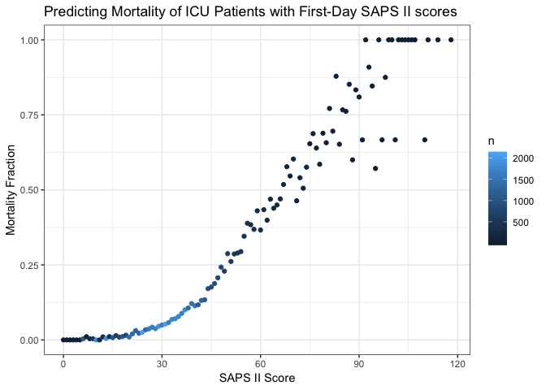

Generating severity scores
================
Laura Cosgrove
11/20/2018

Database Setup
--------------

``` r
# Load configuration settings
dbdriver <- 'PostgreSQL'
host  <- '127.0.0.1'
port  <- '5432'
user  <- 'postgres'
password <- 'postgres'
dbname <- 'mimic'
schema <- 'mimiciii'
# Connect to the database using the configuration settings
con <- dbConnect(dbDriver(dbdriver), dbname = dbname, host = host, port = port, 
                 user = user, password = password)
# Set the default schema
dbExecute(con, paste("SET search_path TO ", schema, sep=" "))
```

    ## [1] 0

Set this database as the connection for all future sql chunks:

``` r
knitr::opts_chunk$set(connection = "con")
```

(Note: The above chunk is most useful if you use knitr to generate the analysis! But in building the analysis it is better to run your query by saving the sql query as a character object then using `dbGetQuery`, since the only way to obtain the SQL output is to use knitr.)

Motivation
----------

The purpose for this portion of the report is to leverage the physiologic data from the EMR in order to estimate likelihood of in-hospital death using severity scores pre-determined in the literature as being a useful proxy for likeliood of mortality. One of these severity scores, or a combination of the scores, will provide us with our base model, after which we will explore whether a model additionally considering factors like insurance coverage, gender, and ethnicity will improve the fit in any meaningful way.

Generating Views
----------------

We will make use of the local Postgres database and the publicly-accessible [https://github.com/MIT-LCP/mimic-code](MIMIC%20code%20repository) from the MIT Computational Physiology lab to make use of biological data in order to obtain computational physiology severity scores.

We need to generate some views into the database before the query to generate the severity scores:

-   1.  uofirstday - generated by urine-output-first-day.sql. This draws from the "outputevents" table measured from CareVue, an ICU vitals monitoring device, to obtain

-   1.  ventdurations - generated by ventilation-durations.sql

-   1.  vitalsfirstday - generated by vitals-first-day.sql

-   1.  gcsfirstday - generated by gcs-first-day.sql

-   1.  labsfirstday - generated by labs-first-day.sql

-   1.  bloodgasarterialfirstday - generated by blood-gas-first-day-arterial.sql

``` r
urine_view <- read_file("./database/mimic-code/concepts/firstday/urine-output-first-day.sql")
ventdurations_view <- read_file("./database/mimic-code/concepts/durations/ventilation-durations.sql")
vitals_view <- read_file("./database/mimic-code/concepts/firstday/vitals-first-day.sql")
gcs_view <- read_file("./database/mimic-code/concepts/firstday/gcs-first-day.sql")
labs_view <- read_file("./database/mimic-code/concepts/firstday/labs-first-day.sql")
bloodgasarterial_view <- read_file("./database/mimic-code/concepts/firstday/blood-gas-first-day-arterial.sql")
sapsii_view <- read_file("./database/mimic-code/concepts/severityscores/sapsii.sql")


#Generate materialized views
dbGetQuery(con, urine_view)
dbGetQuery(con, ventdurations_view)
dbGetQuery(con, vitals_view)
dbGetQuery(con, gcs_view)
dbGetQuery(con, labs_view)
dbGetQuery(con, bloodgasarterial_view)
dbGetQuery(con, sapsii_view)
```

``` r
#View sapsii_data
sapsii_query <- "SELECT *
              FROM sapsii i;"
sapsii_data <- as.tibble(dbGetQuery(con, sapsii_query))
write_csv(sapsii_data, path = "./database/sapsii.csv")
```

Plot distribution:

``` r
sapsii_data %>% 
  ggplot(aes(x = sapsii)) + 
  geom_histogram()
```

    ## `stat_bin()` using `bins = 30`. Pick better value with `binwidth`.


A note in the SQL file is the following: Note:

The score is calculated for *all* ICU patients, with the assumption that the user will subselect appropriate ICUSTAY\_IDs.

For example, the score is calculated for neonates, but it is likely inappropriate to actually use the score values for these patients.

Alternate, for knitting:

``` sql
SELECT *
FROM sapsii i
```

|  subject\_id|  hadm\_id|  icustay\_id|  sapsii|  sapsii\_prob|  age\_score|  hr\_score|  sysbp\_score|  temp\_score|  pao2fio2\_score|  uo\_score|  bun\_score|  wbc\_score|  potassium\_score|  sodium\_score|  bicarbonate\_score|  bilirubin\_score|  gcs\_score|  comorbidity\_score|  admissiontype\_score|
|------------:|---------:|------------:|-------:|-------------:|-----------:|----------:|-------------:|------------:|----------------:|----------:|-----------:|-----------:|-----------------:|--------------:|-------------------:|-----------------:|-----------:|-------------------:|---------------------:|
|        55973|    152234|       200001|      38|     0.2125600|          12|          4|             5|            0|               NA|         11|          NA|           0|                 0|              0|                   0|                 0|           0|                   0|                     6|
|        27513|    163557|       200003|      30|     0.1063982|           7|          4|             5|            0|               NA|          0|           0|           3|                 0|              0|                   3|                 0|           0|                   0|                     8|
|        10950|    189514|       200006|      20|     0.0372047|           7|          2|             5|            0|               NA|          0|           0|           0|                 0|              0|                   0|                NA|           0|                   0|                     6|
|        20707|    129310|       200007|      18|     0.0292952|           7|          0|             5|            0|               NA|          0|           0|           0|                 0|              0|                   0|                NA|           0|                   0|                     6|
|        29904|    129607|       200009|      21|     0.0417535|           7|          0|             5|            0|                6|          0|           0|           0|                 3|              0|                   0|                NA|           0|                   0|                     0|
|        11861|    192256|       200010|       6|     0.0045838|           0|          0|             0|            0|               NA|          0|           0|           0|                 0|              0|                   0|                 0|           0|                   0|                     6|
|        93535|    121562|       200011|      41|     0.2660865|          18|          2|             0|            0|                6|          0|           6|           0|                 3|              0|                   0|                NA|           0|                   0|                     6|
|        28448|    177527|       200012|      11|     0.0112653|           0|          0|             5|            0|               NA|          0|           0|           0|                 0|              0|                   0|                NA|           0|                   0|                     6|
|         9514|    127229|       200014|      43|     0.3055972|          18|          2|             5|            0|                6|          4|           0|           0|                 0|              0|                   0|                 0|           0|                   0|                     8|
|        74032|    117458|       200016|      20|     0.0372047|          12|          2|             5|            0|               NA|          0|           0|           0|                 0|              1|                   0|                NA|           0|                   0|                     0|

### Visualize how fractions of death increase

For a quick validation, we'll visualize how the fractions of deaths increase for the SAPSII scores.

``` r
admissions <- read_csv("./database/data/ADMISSIONS.csv.gz") %>% 
  janitor::clean_names()
```

    ## Parsed with column specification:
    ## cols(
    ##   ROW_ID = col_integer(),
    ##   SUBJECT_ID = col_integer(),
    ##   HADM_ID = col_integer(),
    ##   ADMITTIME = col_datetime(format = ""),
    ##   DISCHTIME = col_datetime(format = ""),
    ##   DEATHTIME = col_datetime(format = ""),
    ##   ADMISSION_TYPE = col_character(),
    ##   ADMISSION_LOCATION = col_character(),
    ##   DISCHARGE_LOCATION = col_character(),
    ##   INSURANCE = col_character(),
    ##   LANGUAGE = col_character(),
    ##   RELIGION = col_character(),
    ##   MARITAL_STATUS = col_character(),
    ##   ETHNICITY = col_character(),
    ##   EDREGTIME = col_datetime(format = ""),
    ##   EDOUTTIME = col_datetime(format = ""),
    ##   DIAGNOSIS = col_character(),
    ##   HOSPITAL_EXPIRE_FLAG = col_integer(),
    ##   HAS_CHARTEVENTS_DATA = col_integer()
    ## )

``` r
patients <- read_csv("./database/data/PATIENTS.csv.gz") %>% 
  janitor::clean_names()
```

    ## Parsed with column specification:
    ## cols(
    ##   ROW_ID = col_integer(),
    ##   SUBJECT_ID = col_integer(),
    ##   GENDER = col_character(),
    ##   DOB = col_datetime(format = ""),
    ##   DOD = col_datetime(format = ""),
    ##   DOD_HOSP = col_datetime(format = ""),
    ##   DOD_SSN = col_datetime(format = ""),
    ##   EXPIRE_FLAG = col_integer()
    ## )

``` r
admissions %>% 
  inner_join(., patients, by = "subject_id") %>% 
  filter(has_chartevents_data == 1) %>% 
  inner_join(., sapsii_data, by = "hadm_id") %>% 
  mutate(target = if_else(deathtime %in% NA, 0, 1),
         predictor = sapsii) %>%
  select(subject_id.x, target, predictor) %>% 
  group_by(predictor) %>% 
  summarize(deaths = sum(target),
            n = n()) %>% 
  mutate(frac_deaths = deaths/n) %>% 
  ggplot(aes(x = predictor, y = frac_deaths)) +
  geom_point(aes(color = n)) + 
  labs(x = "SAPS II Score",
       y = "Mortality Fraction", 
       title = "Predicting Mortality of ICU Patients with First-Day SAPS II scores") +
  theme_bw()
```



Other severity scores
---------------------

(Note: must run document once before knitting, but eval is set to false so the views aren't re-loaded every time you knit.)

``` r
sofa_view <- read_file("./database/mimic-code/concepts/severityscores/sofa.sql")
lods_view <- read_file("./database/mimic-code/concepts/severityscores/lods.sql")
saps_view <- read_file("./database/mimic-code/concepts/severityscores/saps.sql")
apsiii_view <- read_file("./database/mimic-code/concepts/severityscores/apsiii.sql")
oasis_view <- read_file("./database/mimic-code/concepts/severityscores/oasis.sql")

#SOFA needs echo data 
echodata_view <- read_file("./database/mimic-code/concepts/echo-data.sql")

dbGetQuery(con, echodata_view)
dbGetQuery(con, sofa_view)

#LODS
dbGetQuery(con, lods_view)

#SAPS needs ventilated first day
ventfirstday_view <- read_file("./database/mimic-code/concepts/firstday/ventilation-first-day.sql")
dbGetQuery(con, ventfirstday_view)
dbGetQuery(con, saps_view)

# APSIII  
dbGetQuery(con, apsiii_view)

# OASIS  
dbGetQuery(con, oasis_view)
```

As before, read all the data from the generated materialized views into tibbles:

``` r
#SOFA
sofa_query <- "SELECT *
              FROM sofa i;"
sofa_data <- as.tibble(dbGetQuery(con, sofa_query))

#LODS
lods_query <- "SELECT *
              FROM lods i;"
lods_data <- as.tibble(dbGetQuery(con, lods_query))

#SAPS
saps_query <- "SELECT *
              FROM saps i;"
saps_data <- as.tibble(dbGetQuery(con, saps_query))

# APSIII  
apsiii_query <- "SELECT *
              FROM apsiii i;"
apsiii_data <- as.tibble(dbGetQuery(con, apsiii_query))

#OASIS
oasis_query <- "SELECT *
              FROM oasis i;"
oasis_data <- as.tibble(dbGetQuery(con, oasis_query))
```

Plot curves for all other scores

### Analysis with admissions data

``` r
icu_detail <- read_csv("./database/icu_detail.csv") %>% 
  janitor::clean_names()
```

    ## Parsed with column specification:
    ## cols(
    ##   subject_id = col_integer(),
    ##   hadm_id = col_integer(),
    ##   icustay_id = col_integer(),
    ##   gender = col_character(),
    ##   dod = col_datetime(format = ""),
    ##   admittime = col_datetime(format = ""),
    ##   dischtime = col_datetime(format = ""),
    ##   los_hospital = col_double(),
    ##   admission_age = col_double(),
    ##   ethnicity = col_character(),
    ##   admission_type = col_character(),
    ##   hospital_expire_flag = col_integer(),
    ##   hospstay_seq = col_integer(),
    ##   first_hosp_stay = col_logical(),
    ##   intime = col_datetime(format = ""),
    ##   outtime = col_datetime(format = ""),
    ##   los_icu = col_double(),
    ##   icustay_seq = col_integer(),
    ##   first_icu_stay = col_logical()
    ## )

``` r
# TO IMPROVE: I should create a nested df where I can map the inner join and generate multiple plots in the same code chunk
# Make a big datasheet?
predictor_detail_data <- icu_detail %>% 
  inner_join(., sapsii_data, by = "hadm_id") %>% 
  inner_join(., sofa_data, by = "hadm_id") %>% 
  inner_join(., lods_data, by = "hadm_id") %>% 
  inner_join(., saps_data, by = "hadm_id") %>% 
  inner_join(., apsiii_data, by = "hadm_id") %>% 
  inner_join(., oasis_data, by = "hadm_id") %>% 
  select(hadm_id, subject_id, icustay_id, gender, ethnicity, admission_type, admission_age, los_hospital, los_icu, dod, hospital_expire_flag.y, hospstay_seq, first_hosp_stay, icustay_seq, first_icu_stay, sapsii, sofa, lods, saps, apsiii, oasis, respiration, coagulation, liver, cardiovascular.y, cns, renal.y, ends_with("score")) %>% 
  rename(death_bin = hospital_expire_flag.y) %>% 
    filter(admission_type != "NEWBORN")


write_csv(predictor_detail_data, "./database/predictor_detail_data.csv")

#Correlation of aggregate scores for distinct ICU stays (to remove confusion due to readmission)
predictor_detail_data %>% 
  distinct(icustay_id, .keep_all = TRUE) %>% 
  select(sapsii:oasis) %>% 
  cor()
```

    ##           sapsii      sofa      lods      saps    apsiii     oasis
    ## sapsii 1.0000000 0.6838641 0.8021351 0.7417353 0.7558680 0.6600098
    ## sofa   0.6838641 1.0000000 0.7351709 0.5986570 0.7025452 0.4945946
    ## lods   0.8021351 0.7351709 1.0000000 0.6846753 0.7509069 0.5936155
    ## saps   0.7417353 0.5986570 0.6846753 1.0000000 0.6562129 0.6457071
    ## apsiii 0.7558680 0.7025452 0.7509069 0.6562129 1.0000000 0.5838826
    ## oasis  0.6600098 0.4945946 0.5936155 0.6457071 0.5838826 1.0000000

``` r
predictor_detail_data %>% 
#Select for single admission
  distinct(icustay_id, .keep_all = TRUE) %>% 
  gather(key = score, value, sapsii, saps, sofa, lods, apsiii, oasis) %>% 
  group_by(score, value) %>% 
  summarize(deaths = sum(death_bin), 
            n = n()) %>% 
  mutate(frac_deaths = deaths/n) %>% 
  ggplot(aes(x = value, y = frac_deaths)) + 
  geom_point(aes(color = n)) +
  facet_grid(~score)
```


Individual mortality prediction
-------------------------------

It's fine just as a quick gut check to see how fraction of deaths increase over the distributions of the various severity scores. But how do the scores perform based on their original authored likelihoods?

### SAPS II

We'll start with the SAPS II score.

Individual mortality prediction for the SAPS II score is defined by its authors to be:

log(\[pr(death)\]\[1 - pr(death)\]) = -7.7631 + 0.07237*SAPSII + 0.9971*log(1 + SAPSII)

A mortality prediction algorithm is said to have adequate discrimination if it tends to assign higher severity scores to patients that died in the hospital compared to those that did not. To evaluate discrimination, we'll visualize the probability of death as predicted by the SAPSII score versus the actual proportion of patients who died with that SAPSII score.

Because I suspect I may want the information to do subgroup analyses, I'm going to start by using the large datasheet from the `predictor_detail_data`.

``` r
#Joining admissions and length of stay, and adding probability of death
predictor_detail_data %>% 
  distinct(hadm_id, .keep_all = TRUE) %>% 
  select(hadm_id, sapsii, death_bin) %>% 
  mutate(prob_death = exp(-7.7631 + 0.07237*sapsii + 0.9971*log(1 + sapsii))/(1 + exp(-7.7631 + 0.07237*sapsii + 0.9971*log(1 + sapsii)))) %>% 
  group_by(sapsii) %>% 
  add_tally(death_bin) %>% 
  rename(tot_death_by_group = n) %>% 
  add_tally() %>% 
  mutate(prop_death = tot_death_by_group/n) %>% 
  select(sapsii, prob_death, prop_death) %>% 
  ggplot(aes(x = prob_death, y = prop_death)) + 
  geom_point() +
  geom_abline(slope = 1, intercept = 0) +
  labs(title = "SAPSII",
      x = "Probability of Death from Literature",
       y = "True Proportion of Deaths") + 
  theme_bw()
```


Although the authors of the SAPS score publish a non-linear in parameters regression for association with likelihood of death, I'll fit a main-term logistic regression to obtain mortality prediction based on a linear-in-parameters assumption.

``` r
fit_sapsii <- predictor_detail_data %>% 
  distinct(icustay_id, .keep_all = TRUE) %>% 
  select(sapsii, death_bin) %>% 
  glm(death_bin ~ sapsii, family = binomial, data = .) 

fit_sapsii %>% 
  broom::tidy()
```

    ## # A tibble: 2 x 5
    ##   term        estimate std.error statistic p.value
    ##   <chr>          <dbl>     <dbl>     <dbl>   <dbl>
    ## 1 (Intercept)  -5.22     0.0489     -107.        0
    ## 2 sapsii        0.0803   0.00104      77.0       0

``` r
fit_sapsii %>% 
  broom::tidy(conf.int = TRUE, exponentiate = TRUE)
```

    ## # A tibble: 2 x 7
    ##   term        estimate std.error statistic p.value conf.low conf.high
    ##   <chr>          <dbl>     <dbl>     <dbl>   <dbl>    <dbl>     <dbl>
    ## 1 (Intercept)  0.00541   0.0489     -107.        0  0.00491   0.00595
    ## 2 sapsii       1.08      0.00104      77.0       0  1.08      1.09

The regression fits a parameter estimate of log(\[pr(death)\]\[1 - pr(death)\]) = -5.22 + 0.0803\*SAPSII; or, for every unit increase in SOFA score, you can expect to have 1.08x the odds of death.

I'll refit the plot based on the mainterm regression:

``` r
predictor_detail_data %>% 
  distinct(icustay_id, .keep_all = TRUE) %>% 
  select(hadm_id, sapsii, death_bin) %>% 
  mutate(prob_death = exp( -5.22 + 0.0803*sapsii)/(1 + exp(-5.22 + 0.0803*sapsii))) %>% 
  group_by(sapsii) %>% 
  add_tally(death_bin) %>% 
  rename(tot_death_by_group = n) %>% 
  add_tally() %>% 
  mutate(prop_death = tot_death_by_group/n) %>% 
  select(sapsii, prob_death, prop_death) %>% 
  ggplot(aes(x = prob_death, y = prop_death)) + 
  geom_point() +
  geom_abline(slope = 1, intercept = 0) +
  labs(title = "SAPSII",
      x = "Probability of Death from Mainterm Regression",
       y = "True Proportion of Deaths") + 
  theme_bw()
```


We see a better fit with the mainterm logistic regression, which makes sense given that the literature value was an externally-generated prediction, while our regression is internally-generated. Keep that caveat in mind as we continue with algorithm comparison for other scores, because no direct external value exists for predictive capability of the other severity scores; rather, they're used in practive as clinical decision support rather than giving probability determination.

SOFA Score
----------

Authors of the SOFA score do not publish a base probability calculation for likelihood of death, so I'll use a main-term logistic regression to obtain mortality prediction based on the SOFA score.

``` r
fit_sofa <- predictor_detail_data %>% 
  distinct(icustay_id, .keep_all = TRUE) %>% 
  select(sofa, death_bin) %>% 
  glm(death_bin ~ sofa, family = binomial, data = .) 

fit_sofa %>% 
  broom::tidy()
```

    ## # A tibble: 2 x 5
    ##   term        estimate std.error statistic p.value
    ##   <chr>          <dbl>     <dbl>     <dbl>   <dbl>
    ## 1 (Intercept)   -3.36    0.0280     -120.        0
    ## 2 sofa           0.273   0.00409      66.7       0

``` r
fit_sofa %>% 
  broom::tidy(conf.int = TRUE, exponentiate = TRUE)
```

    ## # A tibble: 2 x 7
    ##   term        estimate std.error statistic p.value conf.low conf.high
    ##   <chr>          <dbl>     <dbl>     <dbl>   <dbl>    <dbl>     <dbl>
    ## 1 (Intercept)   0.0347   0.0280     -120.        0   0.0328    0.0366
    ## 2 sofa          1.31     0.00409      66.7       0   1.30      1.32

The regression fits a parameter estimate of log(\[pr(death)\]\[1 - pr(death)\]) = -3.36 + 0.273\*SOFA; for every unit increase in SOFA score, you can expect to have 1.31x the odds of death.

``` r
predictor_detail_data %>% 
  distinct(icustay_id, .keep_all = TRUE) %>% 
  select(hadm_id, sofa, death_bin) %>% 
  mutate(prob_death = exp(-3.36 + 0.273*sofa)/(1 + exp(-3.36 + 0.273*sofa))) %>% 
  group_by(sofa) %>% 
  add_tally(death_bin) %>% 
  rename(tot_death_by_group = n) %>% 
  add_tally() %>% 
  mutate(prop_death = tot_death_by_group/n) %>% 
  select(sofa, prob_death, prop_death)%>% 
  ggplot(aes(x = prob_death, y = prop_death)) + 
  geom_point() +
  geom_abline(slope = 1, intercept = 0) +
  labs(x = "Probability of Death from Mainterm Regression",
       y = "True Proportion of Deaths") + 
  theme_bw()
```


This regression obtains a good fit, which makes sense because the probability was obtained from our data rather than a literature value.

Area under curves
-----------------

To plot the area under the curve for the SAPSII and SOFA scores, I need to calculate the respective TPR and FPR for each score.

``` r
for_roc <- predictor_detail_data %>% 
  distinct(icustay_id, .keep_all = TRUE) %>% 
  select(icustay_id, sapsii, sofa, death_bin) %>% 
  mutate(prob_death_sofa = exp(-3.36 + 0.273*sofa)/(1 + exp(-3.36 + 0.273*sofa))) %>%
  mutate(prob_death_sapsii = exp( -5.22 + 0.0803*sapsii)/(1 + exp(-5.22 + 0.0803*sapsii))) %>%  
  select(icustay_id, death_bin, sapsii, prob_death_sapsii, sofa, prob_death_sofa) 

###############ROC AUC Functions#############################

roc_log_fcn <- function(result, y_prob){
  probs <- seq(0,1, by = 0.005)
  roc_log <- matrix(0, nrow = length(probs), ncol=2)
  i <- 1
  for(p in probs){
    pred <- y_prob > p
    ##False positive rate
    FPR <- sum(!result & pred)/sum(!result)
    ##True positive rate
    TPR <- sum(result & pred)/sum(result)
    roc_log[i,] <- c(FPR, TPR)
    i <- i + 1
  }
  return(roc_log)
}

roc_log_sapsii <- roc_log_fcn(for_roc$death_bin, for_roc$prob_death_sapsii)

roc_log_sofa <- roc_log_fcn(for_roc$death_bin, for_roc$prob_death_sofa)

for_roc_2 <- for_roc %>% 
  select(death_bin, prob_death_sapsii, prob_death_sofa) %>% 
  rename(sapsii = prob_death_sapsii, sofa = prob_death_sofa) %>% 
  gather(key = score, value = prob_death, sapsii, sofa) %>% 
  select(score, death_bin, prob_death) %>% 
  group_by(score) %>% 
  nest() %>% 
  mutate(roc_log_sapsii = list(roc_log_sapsii)) %>% 
  mutate(roc_log_sofa = list(roc_log_sofa))


tibble(FPR_sapsii = roc_log_sapsii[,1], TPR_sapsii = roc_log_sapsii[,2],
       FPR_sofa = roc_log_sofa[,1], TPR_sofa = roc_log_sofa[,2]) %>% 
  gather(key = score, value = FPR, FPR_sapsii, FPR_sofa) %>% 
  gather(key = score2, value = TPR, TPR_sapsii, TPR_sofa) %>% 
  mutate(score = if_else(score == "FPR_sapsii", 
                         if_else(score2 == "TPR_sapsii", "sapsii", "NA"),
                         if_else(score2 == "TPR_sofa", "sofa", "NA")
                         )) %>% 
  filter(score != "NA") %>% 
  select(score, FPR, TPR) %>% 
  ggplot(aes(x = FPR, y = TPR, color = score)) +
  geom_point() +
  geom_step() +
  labs(title = "ROC Curves") +
  theme_bw() +
  scale_color_viridis_d()
```


``` r
auc <- function(roc){
  len <- nrow(roc)
  ##The "delta X" values
  delta <- roc[-1,1]-roc[-len,1]
  ##The "heights" the rectangle (drop the first or last).
  hgt <- roc[-1,2]
  ##The Riemann Sum
  sum(-delta*hgt)
}
```
